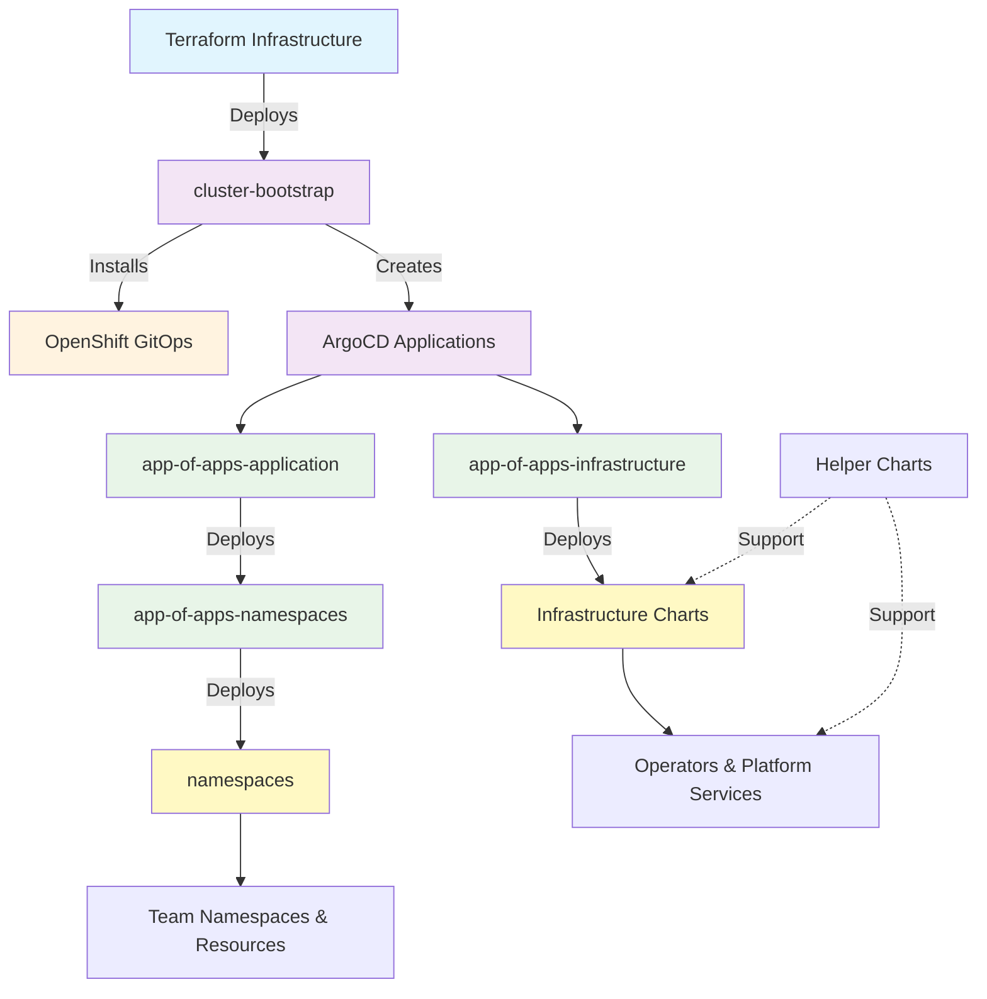

# ROSA HCP Dedicated VPC Helm Charts

This repository contains a comprehensive collection of Helm charts designed for deploying and managing OpenShift clusters in AWS using the ROSA (Red Hat OpenShift Service on AWS) HCP (Hosted Control Plane) architecture with dedicated VPC configurations.

## Architecture Overview



## Chart Categories

### 🚀 Bootstrap Charts
**Purpose**: Foundation charts deployed by Terraform to establish GitOps infrastructure

| Chart | Version | Description | Deployment Method |
|-------|---------|-------------|-------------------|
| [cluster-bootstrap](./cluster-bootstrap/README.md) | 0.4.0 | Core GitOps infrastructure and ArgoCD setup | Terraform via `bootstrap.tftpl` |
| [cluster-bootstrap-acm-spoke](./cluster-bootstrap-acm-spoke/README.md) | 0.4.0 | ACM spoke cluster bootstrap variant | Terraform via `bootstrap.tftpl` |

**Key Features**:
- OpenShift GitOps operator installation
- ArgoCD instance configuration with vault plugin
- Initial repository setup (Git and Helm)
- KMS storage class creation
- Console integration and RBAC setup

---

### 🔄 App of Apps Charts
**Purpose**: GitOps orchestration using ArgoCD "App of Apps" pattern

| Chart | Version | Description | Deployment Method |
|-------|---------|-------------|-------------------|
| [app-of-apps-infrastructure](./app-of-apps-infrastructure/README.md) | 0.1.2 | Infrastructure component orchestration | ArgoCD via cluster-bootstrap |
| [app-of-apps-application](./app-of-apps-application/README.md) | 1.5.4 | Team application namespace orchestration | ArgoCD via cluster-bootstrap |
| [app-of-apps-namespaces](./app-of-apps-namespaces/README.md) | 0.3.2 | Individual namespace deployment coordination | ArgoCD via app-of-apps-application |

**GitOps Flow**:
1. **Infrastructure Layer**: Deploys platform components (storage, logging, security)
2. **Application Layer**: Creates team-specific ArgoCD applications and projects
3. **Namespace Layer**: Deploys actual team namespaces with resources

**Configuration Sources**:
- `cluster-config/*/infrastructure.yaml` - Infrastructure component definitions
- `cluster-config/*/applications-ns.yaml` - Team application configurations
- `cluster-config/*/namespaces/*.yaml` - Individual team namespace configurations

---

### 🛠️ Helper Charts
**Purpose**: Utility charts that assist with operator installations and cluster operations

| Chart | Version | Description | Usage |
|-------|---------|-------------|-------|
| [helper-operator](./helper-operator/README.md) | 1.0.26 | OpenShift operator installation automation | Sub-chart dependency |
| [helper-status-checker](./helper-status-checker/README.md) | 1.0.7 | Operator readiness verification | Sub-chart dependency |
| [helper-installplan-approver](./helper-installplan-approver/README.md) | 0.1.2 | InstallPlan approval automation | Standalone or sub-chart |

**Common Pattern**:
Most infrastructure charts use helper-operator + helper-status-checker as dependencies:
```yaml
dependencies:
  - name: helper-operator
    version: "1.0.26"
  - name: helper-status-checker  
    version: "1.0.7"
```

---

### 🏗️ Infrastructure Charts
**Purpose**: Platform-level components deployed via app-of-apps-infrastructure

#### Storage & Persistence
| Chart | Version | Description | Namespace |
|-------|---------|-------------|-----------|
| [cluster-efs](./cluster-efs/README.md) | 0.3.0 | AWS EFS storage classes and CSI driver | openshift-cluster-csi-drivers |

#### Security & Compliance
| Chart | Version | Description | Namespace |
|-------|---------|-------------|-----------|
| [compliance-operator](./compliance-operator/README.md) | 1.0.47 | OpenShift compliance scanning | openshift-compliance |
| [rhacs-operator](./rhacs-operator/README.md) | 0.0.4 | Red Hat Advanced Cluster Security | rhacs-operator |
| [aws-privateca-issuer](./aws-privateca-issuer/README.md) | 1.0.2 | AWS Private CA certificate issuer | cert-manager |

#### Logging & Monitoring
| Chart | Version | Description | Namespace |
|-------|---------|-------------|-----------|
| [cluster-logging](./cluster-logging/README.md) | 0.4.0 | Centralized logging with CloudWatch | openshift-logging |

#### Management & Operations
| Chart | Version | Description | Namespace |
|-------|---------|-------------|-----------|
| [advanced-cluster-management](./advanced-cluster-management/README.md) | 0.1.3 | Multi-cluster management hub | open-cluster-management |
| [overprovisioning](./overprovisioning/README.md) | 0.0.6 | Pod overprovisioning for autoscaling | overprovisioning |

#### AI/ML Platform
| Chart | Version | Description | Namespace |
|-------|---------|-------------|-----------|
| [rhods-operator](./rhods-operator/README.md) | 1.0.3 | Red Hat OpenShift Data Science | redhat-ods-operator |

#### Network & Ingress
| Chart | Version | Description | Namespace |
|-------|---------|-------------|-----------|
| [cluster-ingress](./cluster-ingress/README.md) | 0.2.0 | Custom ingress controllers and certificates | openshift-ingress-operator |

---

### 👥 Application & Namespace Charts
**Purpose**: Team-level resources and namespace management

| Chart | Version | Description | Deployment Method |
|-------|---------|-------------|-------------------|
| [namespaces](./namespaces/README.md) | 1.4.9 | Kubernetes namespace creation with governance | ArgoCD via app-of-apps-namespaces |
| [application-gitops](./application-gitops/README.md) | 1.3.8 | Team-specific ArgoCD instance setup | ArgoCD or sub-chart dependency |

**Namespace Chart Features**:
- Namespace creation with labels and annotations
- Resource quotas and limits
- Network policies for security
- RBAC with Active Directory integration
- Service accounts for CI/CD pipelines
- ECR access automation via CronJobs

---

## Deployment Patterns

### 1. Terraform-Driven Bootstrap
```bash
# Infrastructure provisioning triggers bootstrap
terraform apply -target=shell_script.bootstrap
```

**Flow**: Terraform → cluster-bootstrap → OpenShift GitOps → ArgoCD Applications

### 2. GitOps-Driven Infrastructure
```yaml
# cluster-config/nonprod/np-hub/infrastructure.yaml
infrastructure:
  - chart: cluster-efs
    targetRevision: 0.3.0
    namespace: openshift-cluster-csi-drivers
```

**Flow**: app-of-apps-infrastructure → Infrastructure Charts → Platform Components

### 3. Team-Driven Applications
```yaml
# cluster-config/nonprod/np-hub/applications-ns.yaml
applications:
  - name: payments
    gitPath: nonprod/np-hub/namespaces/payments-1234.yaml
    gitopsCreate: true  # Creates team ArgoCD project
```

**Flow**: app-of-apps-application → app-of-apps-namespaces → namespaces → Team Resources

## Configuration Management

### Repository Structure
```
cluster-config/
├── nonprod/
│   ├── np-hub/
│   │   ├── infrastructure.yaml      # Infrastructure components
│   │   ├── applications-ns.yaml     # Team applications
│   │   └── namespaces/
│   │       ├── accounting-abcd.yaml # Team namespace config
│   │       └── payments-1234.yaml   # Team namespace config
│   ├── np-app-1/
│   ├── np-os-ai/
│   └── np-os-virt/
```

### Environment Separation
- **np-hub**: Hub cluster with ACM and shared services
- **np-app-1**: Application workload cluster
- **np-os-ai**: AI/ML workload cluster with RHODS
- **np-os-virt**: Virtualization workload cluster

## Security & RBAC

### Multi-Layered Security
1. **Infrastructure Level**: Platform operators and security tools
2. **Application Level**: Team ArgoCD projects with restricted access
3. **Namespace Level**: Resource quotas, network policies, RBAC

### Active Directory Integration
```yaml
appProject:
  adGroup: PFAUTHAD  # AD group for team access
  repos:
    - 'https://rosa-hcp-dedicated-vpc.github.io/helm-repository'
    - 'https://github.com/rosa-hcp-dedicated-vpc/cluster-config.git'
```

### AWS Integration
- **IAM Roles**: Service-specific roles for EFS, CloudWatch, etc.
- **Secrets Manager**: Vault plugin integration for secure secret access
- **KMS**: Encrypted storage classes for data at rest

## Development & Testing

### Local Testing
```bash
# Test chart templating
helm template <chart-name> ./charts/<chart-name> \
  -f ../cluster-config/nonprod/np-hub/<config-file>.yaml

# Validate with cluster-config values
helm template test-app ./charts/app-of-apps-application \
  -f ../cluster-config/nonprod/np-hub/applications-ns.yaml
```

### Chart Dependencies
```bash
# Update chart dependencies
helm dependency update ./charts/<chart-name>

# Build chart packages
helm package ./charts/<chart-name>
```

## Troubleshooting

### Common Issues

1. **Chart Not Syncing**
   ```bash
   oc get applications -n openshift-gitops
   oc describe application <app-name> -n openshift-gitops
   ```

2. **Operator Installation Issues**
   ```bash
   oc get csv -A | grep <operator-name>
   oc get installplan -A
   ```

3. **RBAC Problems**
   ```bash
   oc get appprojects -n openshift-gitops
   oc describe appproject <project-name> -n openshift-gitops
   ```

### Verification Commands
```bash
# Check ArgoCD applications
oc get applications -n openshift-gitops

# Verify operators
oc get csv -A

# Check namespaces
oc get namespaces | grep -E "(accounting|payments)"

# Verify storage classes
oc get storageclass
```

## Contributing

### Chart Development Guidelines
1. **Use Helper Charts**: Leverage helper-operator and helper-status-checker for operators
2. **Follow Naming Conventions**: Use consistent naming patterns
3. **Include READMEs**: Comprehensive documentation for each chart
4. **Version Appropriately**: Semantic versioning for all changes
5. **Test Thoroughly**: Template testing with real cluster-config values

### Chart Structure
```
charts/<chart-name>/
├── Chart.yaml          # Chart metadata
├── README.md           # Comprehensive documentation
├── values.yaml         # Default configuration
└── templates/
    ├── _helpers.tpl    # Template helpers
    └── *.yaml          # Kubernetes resources
```

## Version Management

Charts are automatically versioned and tagged when changes are merged. The CI/CD pipeline:
1. Builds and packages charts
2. Creates GitHub releases with chart packages
3. Updates the Helm repository index
4. Publishes to GitHub Pages

## Support & Documentation

- **Individual Chart READMEs**: Detailed documentation for each chart
- **Architecture Diagrams**: Mermaid diagrams showing relationships
- **Configuration Examples**: Real-world cluster-config examples
- **Troubleshooting Guides**: Common issues and solutions

For specific chart documentation, see the individual README files in each chart directory.
