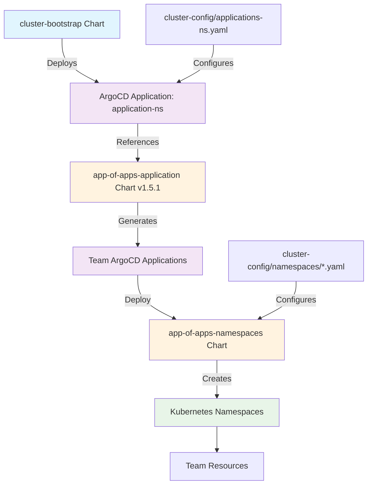

# App of Apps Application Chart

## Overview

The `app-of-apps-application` chart implements the ArgoCD "App of Apps" pattern for logically grouping and managing all namespaces configured for a single application or team. This chart allows you to split out application/team configurations into individual files in the namespaces directory, enabling teams to manage all their namespace configurations in one place while maintaining separation between different applications/teams.

Each application/team gets their own configuration file (e.g., `accounting-abcd.yaml`, `payments-1234.yaml`) that contains all the namespaces and resources for that specific application, providing logical organization and management boundaries.

Additionally, this chart can optionally set up dedicated ArgoCD AppProjects and namespaces for each team, enabling them to manage their own applications using ArgoCD within the cluster's application ArgoCD instance. This provides teams with self-service GitOps capabilities while maintaining proper RBAC boundaries.

## Architecture



## Bootstrap Integration

This chart is deployed through the **cluster-bootstrap** pattern:

### 1. Bootstrap Chart Configuration
The `cluster-bootstrap` chart includes this application in its values:
```yaml
# charts/cluster-bootstrap/values.yaml
applications:
  - name: application-ns
    chart: app-of-apps-application
    targetRevision: 1.5.1
    gitPathFile: /applications-ns.yaml
```

### 2. Cluster Config Reference
Each environment has an `applications-ns.yaml` file that configures the teams:
- `cluster-config/nonprod/np-hub/applications-ns.yaml`
- `cluster-config/nonprod/np-app-1/applications-ns.yaml`
- `cluster-config/nonprod/np-os-ai/applications-ns.yaml`
- `cluster-config/nonprod/np-os-virt/applications-ns.yaml`

## Configuration

### Applications Configuration
Each team/application is defined in the cluster-config `applications-ns.yaml`:

```yaml
teamName: platform
applications:
  - name: payments
    apmnum: "1234"
    appserviceNumber: "5678"
    gitopsCreate: true
    gitRepoUrl: 'https://github.com/rosa-hcp-dedicated-vpc/cluster-config.git'
    gitPath: nonprod/np-hub/namespaces/payments-1234.yaml  # Single file for all payments namespaces
    appProject:
      adGroup: PFAUTHAD
      repos:
      - 'https://rosa-hcp-dedicated-vpc.github.io/helm-repository'
      - 'https://github.com/rosa-hcp-dedicated-vpc/cluster-config.git'
  - name: accounting
    apmnum: "abcd"
    appserviceNumber: "efgh"
    gitopsCreate: false
    gitRepoUrl: 'https://github.com/rosa-hcp-dedicated-vpc/cluster-config.git'
    gitPath: nonprod/np-hub/namespaces/accounting-abcd.yaml  # Single file for all accounting namespaces
```

### Logical Organization Benefits
- **Single File per Application**: All namespaces for one application/team are managed in one configuration file
- **Team Autonomy**: Each team manages their own namespace configuration independently
- **Clear Boundaries**: Separation between different applications prevents configuration conflicts
- **Simplified Management**: Teams only need to modify their specific configuration file
- **Consistent Structure**: All application files follow the same structure and patterns
- **Optional GitOps Self-Service**: Teams can optionally get their own ArgoCD project for managing applications

### Key Parameters
- **name**: Application/team name
- **apmnum**: APM number for identification
- **appserviceNumber**: Application service number
- **gitopsCreate**: Whether to create GitOps resources and team ArgoCD capabilities
- **gitRepoUrl**: Git repository containing namespace configs
- **gitPath**: Path to the namespace configuration file
- **appProject**: ArgoCD project configuration with RBAC and repository access
  - **adGroup**: Active Directory group for team access control
  - **repos**: List of repositories the team can access for their applications

## Generated Resources

This chart generates:
1. **ArgoCD Applications** - One per team/application pointing to their specific namespace configuration file
2. **ArgoCD AppProjects** - RBAC and repository access control per team (when `gitopsCreate: true`)
3. **Team GitOps Namespaces** - Dedicated namespaces for teams to deploy their applications (when `gitopsCreate: true`)
4. **Namespace Applications** - References to `app-of-apps-namespaces` chart with team-specific values

### Team GitOps Capabilities (Optional)
When `gitopsCreate: true` is configured for a team:
- **Dedicated AppProject**: Teams get their own ArgoCD project with restricted access
- **RBAC Integration**: Uses Active Directory groups (`adGroup`) for access control
- **Repository Access**: Teams can only access their designated repositories
- **Self-Service GitOps**: Teams can create and manage their own ArgoCD Applications
- **Namespace Isolation**: Team applications deploy to their designated namespaces

Each generated Application manages all namespaces for that specific team/application, creating a logical grouping that matches the organizational structure.

## Installation

### Via Bootstrap (Recommended)
This chart is automatically deployed through the cluster-bootstrap process:

```bash
# Bootstrap deploys this automatically
terraform apply -target=shell_script.bootstrap
```

### Manual Installation (Development/Testing)
```bash
# Install with cluster-config values
helm install app-of-apps-application ./charts/app-of-apps-application \
  -f ../cluster-config/nonprod/np-hub/applications-ns.yaml \
  -n openshift-gitops
```

## Troubleshooting

### Template Testing
Test the chart with actual cluster-config values:

```bash
# Template with specific environment values
helm template app-of-apps-application ./charts/app-of-apps-application \
  -f ../cluster-config/nonprod/np-hub/applications-ns.yaml

# Test with specific team configuration
helm template test-app ./charts/app-of-apps-application \
  -f ../cluster-config/nonprod/np-hub/applications-ns.yaml \
  --set applications[0].name=accounting \
  --set applications[0].apmnum=abcd \
  --set applications[0].appserviceNumber=efgh
```

### Verify ArgoCD Applications
```bash
# Check generated applications
oc get applications -n openshift-gitops | grep -E "(payments|accounting)"

# Check application status
oc describe application payments-platform-ns -n openshift-gitops

# Check team AppProjects (if gitopsCreate: true)
oc get appprojects -n openshift-gitops | grep -E "(payments|accounting)"

# Verify team can access their ArgoCD project
oc describe appproject payments-platform-project -n openshift-gitops
```

### Common Issues
1. **Application not syncing**: Check repository access in AppProject
2. **Missing namespace config**: Verify gitPath points to existing file
3. **RBAC errors**: Confirm adGroup is correct in appProject

## Related Charts

- **[cluster-bootstrap](../cluster-bootstrap/README.md)** - Deploys this chart
- **[app-of-apps-namespaces](../app-of-apps-namespaces/README.md)** - Creates actual namespaces
- **[app-of-apps-infrastructure](../app-of-apps-infrastructure/README.md)** - Infrastructure-level GitOps

## Version History

- **v1.5.1** - Current version with updated documentation
- **v1.5.0** - Renamed from gitops-application-payload
- **v1.4.4** - Legacy version before rename

## ArgoCD App of Apps Pattern

This chart implements the ArgoCD "App of Apps" pattern where:
1. A parent Application manages child Applications
2. Each child Application manages specific team resources
3. Configuration is externalized to Git repositories
4. RBAC is enforced through AppProjects

For more information, see the [ArgoCD App of Apps documentation](https://argo-cd.readthedocs.io/en/stable/operator-manual/cluster-bootstrapping/).
