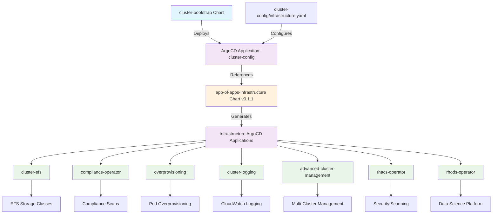

# App of Apps Infrastructure Chart

## Overview

The `app-of-apps-infrastructure` chart is the foundation layer of the GitOps "App of Apps" pattern, responsible for deploying platform-wide infrastructure components. This chart creates ArgoCD Applications for essential cluster infrastructure like storage, logging, compliance, security, and management tools.

## Architecture



## Bootstrap Integration

This chart is the **first** infrastructure layer deployed by the cluster-bootstrap:

### 1. Bootstrap Chart Configuration
The `cluster-bootstrap` chart includes this as the primary infrastructure application:
```yaml
# charts/cluster-bootstrap/values.yaml
applications:
  - name: cluster-config
    chart: app-of-apps-infrastructure
    targetRevision: 0.1.1
    gitPathFile: /infrastructure.yaml
    project: cluster-config-project
```

### 2. Cluster Config Reference
Each environment has an `infrastructure.yaml` file that defines the infrastructure stack:
- `cluster-config/nonprod/np-hub/infrastructure.yaml`
- `cluster-config/nonprod/np-app-1/infrastructure.yaml`
- `cluster-config/nonprod/np-os-ai/infrastructure.yaml`
- `cluster-config/nonprod/np-os-virt/infrastructure.yaml`

## Configuration

### Infrastructure Configuration
Each infrastructure component is defined in the cluster-config `infrastructure.yaml`:

```yaml
teamName: cluster-config
defaults:
  finalizers: resources-finalizer.argocd.argoproj.io
  gitopsNamespace: openshift-gitops
  helmRepoUrl: https://rosa-hcp-dedicated-vpc.github.io/helm-repository/
  plugin: true
  AWS_REGION: "ap-southeast-2"
  AVP_TYPE: "awssecretsmanager"

infrastructure:
  - chart: cluster-efs
    targetRevision: 0.3.0
    namespace: openshift-cluster-csi-drivers
    values:
      roleArn: arn:aws:iam::808082629126:role/np-hub-rosa-efs-csi-role-iam
      fileSystemId: fs-0718beb50be783f1e
      helper-operator:
        startingCSV: aws-efs-csi-driver-operator.v4.19.0-202506020913

  - chart: compliance-operator
    targetRevision: 1.0.47
    namespace: openshift-compliance
    values:
      helper-operator:
        startingCSV: compliance-operator.v1.6.1

  - chart: cluster-logging
    targetRevision: 0.4.0
    namespace: openshift-logging
    values:
      roleArn: arn:aws:iam::808082629126:role/np-hub-rosa-cloudwatch-role-iam
      region: ap-southeast-2
      helper-operator:
        startingCSV: cluster-logging.v6.2.3

  - chart: advanced-cluster-management
    targetRevision: 0.1.2
    namespace: open-cluster-management
    values:
      helper-operator:
        startingCSV: advanced-cluster-management.v2.13.3

  - chart: rhacs-operator
    targetRevision: 0.0.4
    namespace: rhacs-operator
    values:
      helper-operator:
        startingCSV: rhacs-operator.v4.7.4

  - chart: overprovisioning
    targetRevision: 0.0.6
    namespace: overprovisioning
```

## Infrastructure Components

### Storage
- **[cluster-efs](../cluster-efs/README.md)** - AWS EFS storage classes and CSI driver

### Security & Compliance
- **[compliance-operator](../compliance-operator/README.md)** - OpenShift compliance scanning
- **[rhacs-operator](../rhacs-operator/README.md)** - Red Hat Advanced Cluster Security

### Logging & Monitoring
- **[cluster-logging](../cluster-logging/README.md)** - Centralized logging with CloudWatch integration

### Management & Operations
- **[advanced-cluster-management](../advanced-cluster-management/README.md)** - Multi-cluster management hub
- **[overprovisioning](../overprovisioning/README.md)** - Pod overprovisioning for autoscaling

### AI/ML Platform
- **[rhods-operator](../rhods-operator/README.md)** - Red Hat OpenShift Data Science (some environments)

## Generated Resources

This chart generates:
1. **ArgoCD Applications** - One per infrastructure component
2. **Namespace Management** - Target namespaces for each component
3. **Value Passthrough** - Environment-specific configurations
4. **Dependency Ordering** - Proper deployment sequence

## Installation

### Via Bootstrap (Recommended)
This chart is automatically deployed first during cluster bootstrap:

```bash
# Bootstrap deploys this automatically as the foundation
terraform apply -target=shell_script.bootstrap
```

### Manual Installation (Development/Testing)
```bash
# Install with environment-specific infrastructure values
helm install app-of-apps-infrastructure ./charts/app-of-apps-infrastructure \
  -f ../cluster-config/nonprod/np-hub/infrastructure.yaml \
  -n openshift-gitops
```

## Troubleshooting

### Template Testing
Test the chart with actual cluster-config values:

```bash
# Template with specific environment infrastructure
helm template app-of-apps-infrastructure ./charts/app-of-apps-infrastructure \
  -f ../cluster-config/nonprod/np-hub/infrastructure.yaml

# Test specific infrastructure component
helm template test-infra ./charts/app-of-apps-infrastructure \
  -f ../cluster-config/nonprod/np-hub/infrastructure.yaml \
  --set infrastructure[0].chart=cluster-efs \
  --set infrastructure[0].targetRevision=0.3.0
```

### Verify Infrastructure Applications
```bash
# Check all infrastructure applications
oc get applications -n openshift-gitops | grep -E "(cluster-|compliance|rhacs|advanced|overprovisioning)"

# Check specific infrastructure application
oc describe application cluster-efs-cluster-config -n openshift-gitops

# Verify application sync status
oc get applications -n openshift-gitops -o custom-columns=NAME:.metadata.name,SYNC:.status.sync.status,HEALTH:.status.health.status
```

### Check Infrastructure Components
```bash
# Verify operators are installed
oc get csv -A | grep -E "(efs|compliance|logging|rhacs|cluster-management)"

# Check operator pods
oc get pods -n openshift-cluster-csi-drivers | grep efs
oc get pods -n openshift-compliance | grep compliance
oc get pods -n openshift-logging | grep -E "(collector|forwarder)"

# Verify storage classes
oc get storageclass | grep efs
```

### Common Issues
1. **Application not syncing**: Check Helm repository connectivity and chart versions
2. **Operator installation fails**: Verify CSV versions in helper-operator configuration
3. **AWS IAM errors**: Confirm roleArn values are correct for the environment
4. **Secret access issues**: Check AWS Secrets Manager permissions and vault plugin config

## Environment-Specific Configuration

### Development/Test Environments
- Reduced resource quotas
- Basic compliance profiles
- Development-grade logging retention

### Production Environments
- Enhanced security scanning
- Full compliance scanning
- Extended log retention
- Additional monitoring components

## Related Charts

- **[cluster-bootstrap](../cluster-bootstrap/README.md)** - Deploys this chart
- **[app-of-apps-application](../app-of-apps-application/README.md)** - Team-level applications (deployed after)
- **Individual Infrastructure Charts** - Actual component implementations

## Configuration Parameters

### Defaults Section
- **teamName**: ArgoCD application naming prefix
- **finalizers**: ArgoCD finalizer configuration
- **gitopsNamespace**: Target namespace for ArgoCD applications
- **helmRepoUrl**: Helm repository URL for charts
- **plugin**: Enable/disable ArgoCD vault plugin
- **AWS_REGION**: AWS region for cloud integrations
- **AVP_TYPE**: Vault plugin type (awssecretsmanager)

### Infrastructure Section
Array of infrastructure components, each with:
- **chart**: Helm chart name
- **targetRevision**: Chart version to deploy
- **namespace**: Target namespace for the component
- **values**: Component-specific configuration values

## Version History

- **v0.1.1** - Current version with updated documentation
- **v0.1.0** - Renamed from gitops-payload
- **v0.0.4** - Legacy version before rename

## GitOps Deployment Pattern

This chart implements the foundation layer of the GitOps architecture:

```
Bootstrap → Infrastructure → Applications → Namespaces
    ↓           ↓              ↓            ↓
terraform → app-of-apps-   → app-of-apps- → namespaces
           infrastructure   application
```

**Key Characteristics:**
- **First to Deploy**: Infrastructure components must be ready before applications
- **Environment Agnostic**: Same chart, different values per environment  
- **Operator Management**: Handles OpenShift operator lifecycle
- **AWS Integration**: Manages cloud resource dependencies
- **Security First**: Deploys security scanning and compliance tools early

This foundational approach ensures that all platform capabilities are available before teams deploy their applications.
