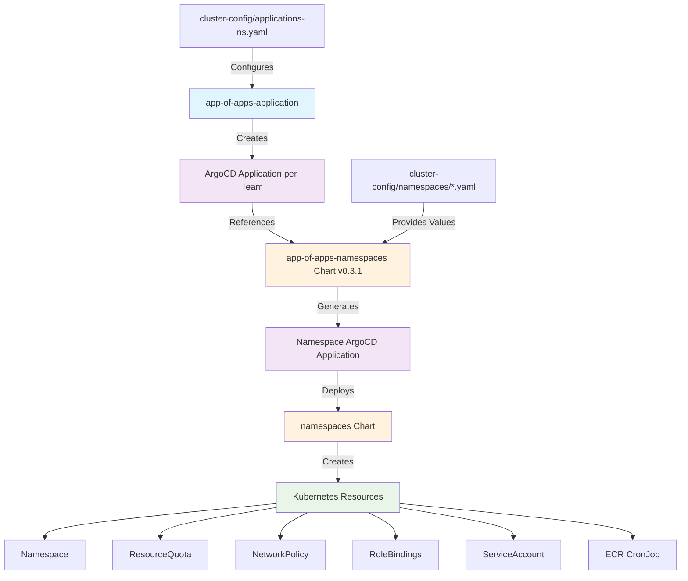

# App of Apps Namespaces Chart

## Overview

The `app-of-apps-namespaces` chart is a GitOps orchestration layer that creates ArgoCD Applications for individual namespace deployments. This chart is invoked by the `app-of-apps-application` chart for each team/application and is responsible for deploying the actual namespace configurations using the `namespaces` chart.

## Architecture



## Bootstrap Integration

This chart is deployed indirectly through the **cluster-bootstrap** → **app-of-apps-application** chain:

### 1. Bootstrap Chain
```
cluster-bootstrap → app-of-apps-application → app-of-apps-namespaces → namespaces
```

### 2. Configuration Flow
1. **cluster-bootstrap** deploys **app-of-apps-application**
2. **app-of-apps-application** reads team configs from `applications-ns.yaml`
3. For each team, **app-of-apps-application** creates an ArgoCD Application
4. Each Application references **app-of-apps-namespaces** with team-specific values
5. **app-of-apps-namespaces** creates namespace Applications using the **namespaces** chart

## Configuration

### Cluster Config Structure
Each team has namespace configuration files in cluster-config:
```
cluster-config/nonprod/np-hub/namespaces/
├── accounting-abcd.yaml    # Accounting team namespaces
└── payments-1234.yaml     # Payments team namespaces
```

### Example Namespace Configuration
```yaml
# cluster-config/nonprod/np-hub/namespaces/accounting-abcd.yaml
apmnum: "abcd"
defaults:
  chart: namespaces
  targetRevision: 1.4.9
  ecrUpdateRole: arn:aws:iam:::role/rosa-ecr-access-role
  primary-owner: pafoster@redhat.com
  zone: test
  annotations:
    comments: "accounting teams namespaces dev only"
    description: "accounting namespaces"
    display_name: "accounting template"
  labels:
    domain: "Infrastructure_and_Cloud"
    primary-owner: pafoster@redhat.com
    quota: "resourcequota"
    region: "NoNodeSelector"
  groupname:
    admin_group: pa_admins
  resourceQuota: {}
  serviceAccount:
    create: true
    automount: true
    name: "pipeline"

namespaces:
- name: accounting-ns-dev
  labels:
    dynatrace: true
  resourceQuota:
    limits_cpu: "250m"
    limits_memory: "1Gi"
    requests_cpu: "200m"
    requests_memory: "500Mi"
    persistentvolumeclaims: "5"
    limits_ephemeral_storage: "4Gi"
    pods: "50"
- name: accounting-ns-test
  # ... similar configuration
```

## Generated Resources

This chart generates:
1. **ArgoCD Application** - References the `namespaces` chart
2. **Application Configuration** - Team-specific namespace deployments
3. **Value Passthrough** - Forwards configuration to the `namespaces` chart

## Installation

### Via App of Apps (Recommended)
This chart is automatically deployed through the app-of-apps pattern:

```bash
# Deploy through bootstrap (automatic)
terraform apply -target=shell_script.bootstrap
```

### Manual Installation (Development/Testing)
```bash
# Install with team-specific namespace values
helm install app-of-apps-namespaces ./charts/app-of-apps-namespaces \
  -f ../cluster-config/nonprod/np-hub/namespaces/accounting-abcd.yaml \
  -n openshift-gitops
```

## Troubleshooting

### Template Testing
Test the chart with actual cluster-config values:

```bash
# Template with specific team namespace configuration
helm template app-of-apps-namespaces ./charts/app-of-apps-namespaces \
  -f ../cluster-config/nonprod/np-hub/namespaces/accounting-abcd.yaml

# Test the underlying namespaces chart deployment
helm template test-namespaces ./charts/namespaces \
  -f ../cluster-config/nonprod/np-hub/namespaces/accounting-abcd.yaml

# Verify generated application
helm template test-app ./charts/app-of-apps-namespaces \
  -f ../cluster-config/nonprod/np-hub/namespaces/payments-1234.yaml \
  --set defaults.targetRevision=1.4.9
```

### Verify ArgoCD Applications
```bash
# Check namespace applications
oc get applications -n openshift-gitops | grep -E "(accounting|payments)"

# Check specific team namespace application
oc describe application accounting-abcd-ns -n openshift-gitops

# Verify namespaces were created
oc get namespaces | grep -E "(accounting|payments)"
```

### Check Namespace Resources
```bash
# Verify namespace resources
oc get resourcequota -n accounting-ns-dev
oc get networkpolicy -n accounting-ns-dev
oc get rolebindings -n accounting-ns-dev
oc get serviceaccounts -n accounting-ns-dev

# Check ECR access cronjob
oc get cronjobs -n accounting-ns-dev
```

### Common Issues
1. **Namespace not created**: Check if `namespaces` chart targetRevision is correct
2. **Resource quota not applied**: Verify resourceQuota configuration in namespace config
3. **RBAC issues**: Confirm admin_group and groupname settings
4. **ECR access problems**: Check ecrUpdateRole ARN and cronjob status

## Related Charts

- **[app-of-apps-application](../app-of-apps-application/README.md)** - Parent chart that invokes this chart
- **[namespaces](../namespaces/README.md)** - Actual namespace creation chart
- **[cluster-bootstrap](../cluster-bootstrap/README.md)** - Bootstrap orchestration
- **[app-of-apps-infrastructure](../app-of-apps-infrastructure/README.md)** - Infrastructure-level GitOps

## Configuration Parameters

### Defaults Section
- **chart**: Target chart name (usually "namespaces")
- **targetRevision**: Version of the namespaces chart to deploy
- **ecrUpdateRole**: AWS IAM role for ECR access
- **primary-owner**: Owner email for labeling
- **zone**: Environment zone (test, prod, etc.)
- **annotations**: Project-level annotations
- **labels**: Project-level labels
- **groupname**: RBAC group configuration
- **resourceQuota**: Default resource limits
- **serviceAccount**: Service account configuration

### Namespaces Section
Array of namespace definitions, each with:
- **name**: Namespace name
- **annotations**: Namespace-specific annotations
- **labels**: Namespace-specific labels
- **resourceQuota**: Namespace-specific resource limits
- **groupname**: Namespace-specific RBAC overrides

## Version History

- **v0.3.1** - Current version with updated documentation
- **v0.3.0** - Renamed from gitops-namespaces-payload
- **v0.2.1** - Legacy version before rename

## GitOps Pattern

This chart implements the second layer of the GitOps "App of Apps" pattern:
1. **Layer 1**: app-of-apps-application (team orchestration)
2. **Layer 2**: app-of-apps-namespaces (namespace orchestration) ← **This Chart**
3. **Layer 3**: namespaces (actual resource creation)

Each layer provides increasing specificity and configuration granularity for namespace management at scale.
