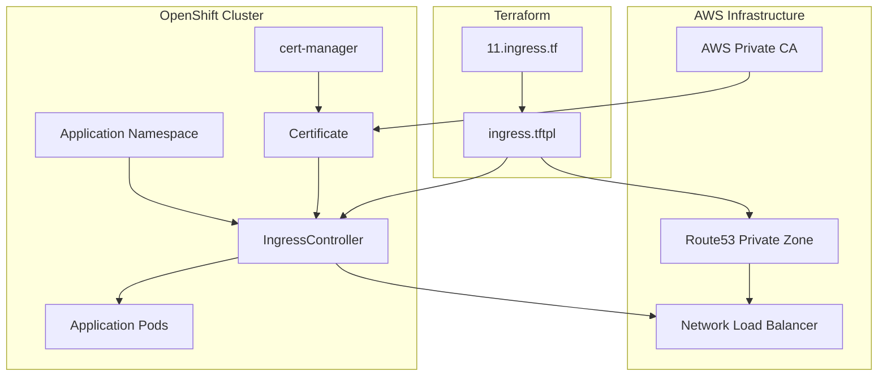

# Cluster Ingress Helm Chart

This Helm chart creates additional ingress controllers for OpenShift clusters, enabling custom domain routing and SSL certificate management. The chart provisions secondary ingress controllers with private DNS zones and AWS Private CA certificates, allowing applications to be exposed on custom subdomains. This chart is designed for deployment via Terraform and integrates with the rosa-hcp-dedicated-vpc infrastructure.

## Overview

The Cluster Ingress chart enables the creation of additional ingress controllers beyond the default OpenShift ingress. Each ingress controller operates on a custom subdomain with its own SSL certificate issued by AWS Private CA, providing secure and isolated routing for different application tiers or environments. The chart integrates with private Route53 zones for internal DNS resolution.

## Prerequisites

- OpenShift Container Platform 4.10 or later
- AWS Private CA issuer configured (via `aws-privateca-issuer` chart)
- Private Route53 hosted zone provisioned via Terraform
- cert-manager operator installed and configured
- Terraform deployment (this chart is not deployed via ArgoCD)
- Sufficient cluster resources (see [Resource Requirements](#resource-requirements))

### Terraform Infrastructure Setup

This chart is designed to work with the ingress infrastructure provisioned by the rosa-hcp-dedicated-vpc project. The required AWS Route53 and ingress deployment resources are automatically created by the Terraform configuration in [`11.ingress.tf`](/Users/redhat/rosa-hcp-dedicated-vpc/rosa-hcp-dedicated-vpc/terraform/11.ingress.tf).

The Terraform file creates:

1. **Private Route53 Zone** (`aws_route53_zone.cluster`):
   - Private hosted zone for the cluster's base domain
   - Associated with the cluster VPC
   - Used for internal DNS resolution

2. **Shell Script Resource** (`shell_script.ingress`):
   - Executes the ingress deployment script for each configured subdomain
   - Manages Helm chart installation and DNS record creation
   - Handles both creation and deletion workflows

3. **DNS Management**:
   - Creates CNAME records pointing to the ingress controller load balancer
   - Manages Route53 record lifecycle (create/update/delete)
   - Integrates with AWS Network Load Balancer endpoints

### Terraform Deployment Script

The chart is deployed via the Terraform script template [`ingress.tftpl`](/Users/redhat/rosa-hcp-dedicated-vpc/rosa-hcp-dedicated-vpc/terraform/scripts/ingress.tftpl), which:

1. **Authenticates to OpenShift**: Uses credentials from AWS Secrets Manager
2. **Installs Helm Chart**: Deploys the cluster-ingress chart with custom parameters
3. **Waits for Load Balancer**: Monitors the creation of the AWS Network Load Balancer
4. **Creates DNS Records**: Updates Route53 with CNAME records pointing to the load balancer
5. **Configures Namespace Selectors**: Updates the default ingress controller to exclude the new subdomain

## Chart Components

### Core Resources
- **IngressController**: Custom ingress controller for the specified subdomain
- **Certificate**: SSL certificate issued by AWS Private CA
- **DNS Integration**: Automatic Route53 CNAME record management
- **Load Balancer**: AWS Network Load Balancer with internal scope

### Certificate Management
- **AWS Private CA Integration**: Certificates issued by AWS Private Certificate Authority
- **Automatic Renewal**: cert-manager handles certificate lifecycle
- **Wildcard Certificates**: Supports wildcard SSL certificates for subdomains
- **RSA 2048-bit Keys**: Standard RSA key size for compatibility

### Network Configuration
- **Internal Load Balancer**: AWS Network Load Balancer with internal scope
- **DNS Management Policy**: Unmanaged (handled by Terraform script)
- **Namespace Selector**: Routes traffic based on namespace labels

## Architecture



## Installation

This chart is designed for deployment via Terraform, not ArgoCD.

### Terraform Deployment

The cluster-ingress chart is deployed automatically by Terraform when ingress configurations are defined in the cluster configuration files. The deployment is managed by the [`11.ingress.tf`](/Users/redhat/rosa-hcp-dedicated-vpc/rosa-hcp-dedicated-vpc/terraform/11.ingress.tf) file and executed via the [`ingress.tftpl`](/Users/redhat/rosa-hcp-dedicated-vpc/rosa-hcp-dedicated-vpc/terraform/scripts/ingress.tftpl) script.

#### Terraform Configuration

```hcl
# Private Route53 zone for internal DNS
resource "aws_route53_zone" "cluster" {
  count = var.enable-destroy == false ? 1 : 0
  name  = local.baseDomain
  vpc {
    vpc_id = var.vpc_id
  }
  tags = {
    Environment = local.baseDomain
  }
}

# Ingress deployment via shell script
resource "shell_script" "ingress" {
  for_each = local.ingress

  lifecycle_commands {
    create = templatefile(
      "./scripts/ingress.tftpl",
      {
        secret             = "${var.cluster_name}-credentials"
        helm_chart         = var.ingress.helm_chart
        helm_chart_version = var.ingress.helm_chart_version
        baseDomain         = local.baseDomain
        subDomain          = try(each.value.subDomain, null)
        hosted_zone_id     = resource.aws_route53_zone.cluster[0].zone_id
        enable             = true
      }
    )
    delete = templatefile(
      "./scripts/ingress.tftpl",
      {
        secret             = "${var.cluster_name}-credentials"
        helm_chart         = var.ingress.helm_chart
        helm_chart_version = var.ingress.helm_chart_version
        baseDomain         = local.baseDomain
        subDomain          = try(each.value.subDomain, null)
        hosted_zone_id     = resource.aws_route53_zone.cluster[0].zone_id
        enable             = false
      }
    )
  }
}
```

#### Cluster Configuration Example

To enable additional ingress controllers, configure them in your cluster configuration file (e.g., `clusters/np-app-1.json`):

```json
{
  "ingress": {
    "helm_chart": "cluster-ingress",
    "helm_chart_version": "0.0.7",
    "subdomains": {
      "api": {
        "subDomain": "api"
      },
      "internal": {
        "subDomain": "internal"
      }
    }
  }
}
```

### Direct Helm Installation (Not Recommended)

```bash
# Add the repository
helm repo add rosa-hcp-dedicated-vpc https://rosa-hcp-dedicated-vpc.github.io/helm-repository/

# Install the chart
helm install cluster-ingress rosa-hcp-dedicated-vpc/cluster-ingress \
  --namespace openshift-ingress-operator \
  --set baseDomain="apps.cluster-abc123.abc123.p3.openshiftapps.com" \
  --set ingressSubdomain="api" \
  --set issuerRef="aws-pca-cluster-issuer" \
  --set replicas=3
```

**Note**: Direct Helm installation requires manual DNS configuration and load balancer setup.

## Configuration

### Required Values

| Parameter | Description | Required | Example |
|-----------|-------------|----------|---------|
| `baseDomain` | Base domain of the OpenShift cluster | Yes | `apps.cluster-abc123.abc123.p3.openshiftapps.com` |
| `ingressSubdomain` | Subdomain for the ingress controller | Yes | `api`, `internal`, `staging` |
| `issuerRef` | Name of the AWS PCA ClusterIssuer | Yes | `aws-pca-cluster-issuer` |

### Optional Values

| Parameter | Description | Default | Example |
|-----------|-------------|---------|---------|
| `replicas` | Number of ingress controller replicas | `3` | `2`, `5` |

### Example Production Values

```yaml
# Production API ingress
baseDomain: "apps.prod-cluster.p3.openshiftapps.com"
ingressSubdomain: "api"
issuerRef: "aws-pca-cluster-issuer"
replicas: 3
```

```yaml
# Staging ingress
baseDomain: "apps.staging-cluster.p3.openshiftapps.com"
ingressSubdomain: "staging"
issuerRef: "aws-pca-cluster-issuer"
replicas: 2
```

## Resource Requirements

### Minimum Requirements

- **CPU**: 100m per ingress controller replica
- **Memory**: 128Mi per ingress controller replica
- **Network**: AWS Network Load Balancer capacity

### Recommended for Production

- **CPU**: 200m per ingress controller replica
- **Memory**: 256Mi per ingress controller replica
- **Replicas**: 3 for high availability
- **Load Balancer**: Sufficient capacity for expected traffic

## Features

### Ingress Capabilities
- **Custom Subdomains**: Create ingress controllers for specific subdomains
- **SSL Termination**: Automatic SSL certificate provisioning and renewal
- **Internal Load Balancing**: AWS Network Load Balancer with internal scope
- **Namespace Isolation**: Route traffic based on namespace labels
- **High Availability**: Multiple replicas for fault tolerance

### Certificate Management
- **AWS Private CA**: Integration with AWS Private Certificate Authority
- **Wildcard Certificates**: Support for `*.subdomain.domain.com` certificates
- **Automatic Renewal**: cert-manager handles certificate lifecycle
- **RSA Encryption**: 2048-bit RSA keys for security

### DNS Integration
- **Private DNS**: Integration with Route53 private hosted zones
- **Automatic Records**: CNAME records created automatically
- **Load Balancer Discovery**: Automatic detection of load balancer endpoints
- **Lifecycle Management**: DNS records created and deleted with ingress controllers

## Post-Installation

### Verify Installation

```bash
# Check ingress controller status
oc get ingresscontroller <subdomain> -n openshift-ingress-operator

# Check certificate status
oc get certificate <subdomain>.<baseDomain> -n openshift-ingress

# Check ingress controller service
oc get svc -n openshift-ingress | grep router-<subdomain>

# Check certificate secret
oc get secret <subdomain>.<baseDomain> -n openshift-ingress

# Verify DNS resolution (from within cluster)
nslookup api.<subdomain>.<baseDomain>
```

### Test Ingress Controller

Create a test application to verify the ingress controller:

```yaml
# test-namespace.yaml
apiVersion: v1
kind: Namespace
metadata:
  name: test-api
  labels:
    ingress: api  # This label routes traffic to the 'api' ingress controller
---
# test-deployment.yaml
apiVersion: apps/v1
kind: Deployment
metadata:
  name: test-app
  namespace: test-api
spec:
  replicas: 1
  selector:
    matchLabels:
      app: test-app
  template:
    metadata:
      labels:
        app: test-app
    spec:
      containers:
      - name: nginx
        image: nginx:latest
        ports:
        - containerPort: 80
---
# test-service.yaml
apiVersion: v1
kind: Service
metadata:
  name: test-app-service
  namespace: test-api
spec:
  selector:
    app: test-app
  ports:
  - port: 80
    targetPort: 80
---
# test-route.yaml
apiVersion: route.openshift.io/v1
kind: Route
metadata:
  name: test-app-route
  namespace: test-api
spec:
  host: test.api.<baseDomain>
  to:
    kind: Service
    name: test-app-service
  tls:
    termination: edge
```

```bash
# Apply test resources
oc apply -f test-namespace.yaml
oc apply -f test-deployment.yaml
oc apply -f test-service.yaml
oc apply -f test-route.yaml

# Test the route (from within the VPC)
curl -k https://test.api.<baseDomain>
```

## Usage Examples

### API Gateway Ingress

```yaml
# API namespace with custom ingress
apiVersion: v1
kind: Namespace
metadata:
  name: api-gateway
  labels:
    ingress: api
---
apiVersion: route.openshift.io/v1
kind: Route
metadata:
  name: api-gateway-route
  namespace: api-gateway
spec:
  host: gateway.api.apps.cluster.p3.openshiftapps.com
  to:
    kind: Service
    name: api-gateway-service
  tls:
    termination: edge
```

### Internal Services Ingress

```yaml
# Internal services namespace
apiVersion: v1
kind: Namespace
metadata:
  name: internal-services
  labels:
    ingress: internal
---
apiVersion: route.openshift.io/v1
kind: Route
metadata:
  name: monitoring-route
  namespace: internal-services
spec:
  host: monitoring.internal.apps.cluster.p3.openshiftapps.com
  to:
    kind: Service
    name: monitoring-service
  tls:
    termination: edge
```

### Multi-Tier Application

```yaml
# Frontend (default ingress)
apiVersion: v1
kind: Namespace
metadata:
  name: frontend
  # No ingress label = uses default ingress controller
---
# Backend API (custom API ingress)
apiVersion: v1
kind: Namespace
metadata:
  name: backend-api
  labels:
    ingress: api
---
# Internal services (internal ingress)
apiVersion: v1
kind: Namespace
metadata:
  name: backend-internal
  labels:
    ingress: internal
```

## Troubleshooting

### Common Issues

#### Ingress Controller Not Starting
```bash
# Check ingress controller status
oc describe ingresscontroller <subdomain> -n openshift-ingress-operator

# Check operator logs
oc logs -n openshift-ingress-operator deployment/ingress-operator

# Check for resource conflicts
oc get ingresscontroller -A
```

#### Certificate Not Issued
```bash
# Check certificate status
oc describe certificate <subdomain>.<baseDomain> -n openshift-ingress

# Check cert-manager logs
oc logs -n cert-manager deployment/cert-manager

# Check AWS PCA issuer status
oc describe awspcaclusterissuer <issuer-name>

# Check certificate request
oc get certificaterequest -n openshift-ingress
```

#### Load Balancer Not Created
```bash
# Check service status
oc describe svc router-<subdomain> -n openshift-ingress

# Check AWS load balancer
aws elbv2 describe-load-balancers --region <region>

# Check security groups
aws ec2 describe-security-groups --group-ids <security-group-id>
```

#### DNS Resolution Issues
```bash
# Check Route53 records
aws route53 list-resource-record-sets --hosted-zone-id <zone-id>

# Test DNS resolution from cluster
oc run test-pod --image=busybox --rm -it -- nslookup <subdomain>.<baseDomain>

# Check private hosted zone association
aws route53 get-hosted-zone --id <zone-id>
```

#### Namespace Selector Issues
```bash
# Check namespace labels
oc get namespace <namespace> --show-labels

# Check ingress controller namespace selector
oc get ingresscontroller <subdomain> -n openshift-ingress-operator -o yaml

# Test route creation
oc get routes -n <namespace>
```

### Logs and Diagnostics

```bash
# Ingress controller logs
oc logs -n openshift-ingress deployment/router-<subdomain>

# Ingress operator logs
oc logs -n openshift-ingress-operator deployment/ingress-operator

# Certificate manager logs
oc logs -n cert-manager deployment/cert-manager

# Check events
oc get events -n openshift-ingress --sort-by='.lastTimestamp'
oc get events -n openshift-ingress-operator --sort-by='.lastTimestamp'

# Export configuration for support
oc get ingresscontroller <subdomain> -n openshift-ingress-operator -o yaml > ingress-config.yaml
oc get certificate <subdomain>.<baseDomain> -n openshift-ingress -o yaml > certificate-config.yaml
```

## Performance Optimization

### Load Balancer Configuration

1. **Network Load Balancer**:
   - Layer 4 load balancing for better performance
   - Lower latency compared to Application Load Balancer
   - Better suited for high-throughput applications

2. **Internal Scope**:
   - Traffic stays within the VPC
   - Reduced latency and improved security
   - Lower data transfer costs

### Ingress Controller Tuning

```yaml
# High-performance configuration
spec:
  replicas: 5
  tuningOptions:
    reloadInterval: 5s
    threadCount: 4
  resources:
    requests:
      cpu: 200m
      memory: 256Mi
    limits:
      cpu: 1000m
      memory: 512Mi
```

### Certificate Optimization

- Use appropriate certificate renewal periods
- Monitor certificate expiration
- Implement certificate rotation strategies
- Use RSA 2048-bit keys for balance of security and performance

## Best Practices

### Security
- Use internal load balancers for internal services
- Implement proper namespace isolation with labels
- Regularly rotate SSL certificates
- Monitor certificate expiration dates
- Use least-privilege IAM roles for AWS integration

### High Availability
- Deploy multiple ingress controller replicas
- Distribute replicas across availability zones
- Monitor load balancer health
- Implement proper health checks

### DNS Management
- Use consistent naming conventions for subdomains
- Document DNS record mappings
- Monitor DNS resolution performance
- Implement DNS caching strategies

### Monitoring
- Monitor ingress controller metrics
- Track certificate expiration dates
- Monitor load balancer performance
- Set up alerts for ingress failures

## Upgrading

### Terraform Upgrade

Update the ingress configuration through Terraform:

```bash
# Update cluster configuration
vim clusters/<cluster-name>.json

# Plan and apply changes
terraform plan
terraform apply
```

### Manual Helm Upgrade

```bash
# Update repository
helm repo update

# Upgrade release
helm upgrade ingress-<subdomain> rosa-hcp-dedicated-vpc/cluster-ingress \
  --namespace openshift-ingress-operator \
  --reuse-values
```

## Uninstallation

### Terraform Uninstallation

Remove ingress configuration from cluster configuration file and run:

```bash
terraform plan
terraform apply
```

### Manual Uninstallation

```bash
# Delete Route53 records first
aws route53 change-resource-record-sets \
  --hosted-zone-id <zone-id> \
  --change-batch file://delete-record.json

# Uninstall Helm release
helm uninstall ingress-<subdomain> -n openshift-ingress-operator

# Clean up remaining resources
oc delete ingresscontroller <subdomain> -n openshift-ingress-operator
oc delete certificate <subdomain>.<baseDomain> -n openshift-ingress
oc delete secret <subdomain>.<baseDomain> -n openshift-ingress
```

**Warning**: Always delete DNS records before removing ingress controllers to prevent DNS resolution issues.

## Security Considerations

- **Internal Load Balancers**: Use internal scope for security
- **Certificate Management**: Implement proper certificate lifecycle management
- **Namespace Isolation**: Use namespace selectors for traffic isolation
- **DNS Security**: Secure private hosted zones and DNS records
- **IAM Permissions**: Use least-privilege access for AWS resources

## Support

- **OpenShift Ingress Documentation**: [OpenShift Ingress Operator](https://docs.openshift.com/container-platform/latest/networking/ingress-operator.html)
- **AWS Load Balancer Documentation**: [Network Load Balancers](https://docs.aws.amazon.com/elasticloadbalancing/latest/network/)
- **cert-manager Documentation**: [cert-manager](https://cert-manager.io/docs/)

## Contributing

This chart is part of the rosa-hcp-dedicated-vpc project. Please refer to the main repository for contribution guidelines.

## License

This chart is licensed under the Apache License 2.0. See the LICENSE file for details.

## Changelog

### Version 0.0.7
- Current stable release
- AWS Network Load Balancer integration
- Private Route53 zone support
- AWS Private CA certificate integration
- Namespace selector-based routing
- Internal load balancer scope
- Terraform deployment automation
- DNS record lifecycle management
