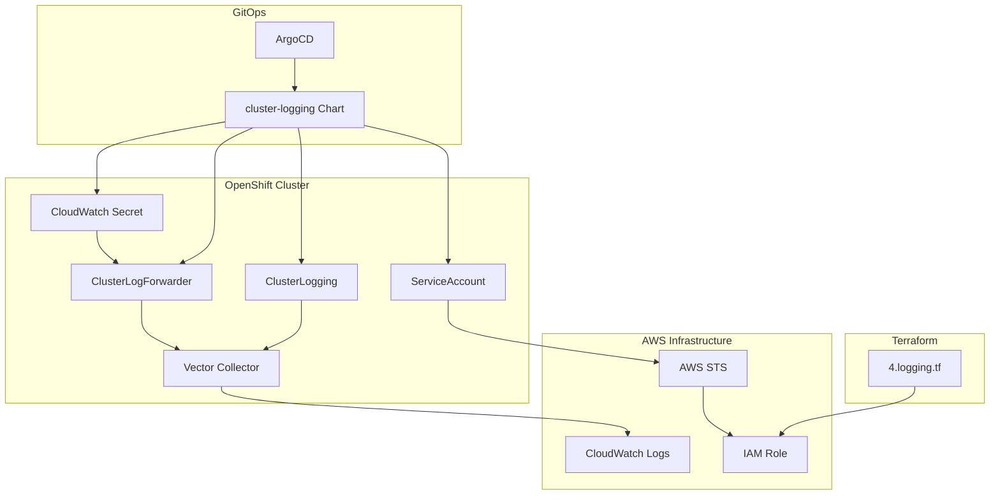

# Cluster Logging Helm Chart

This Helm chart deploys OpenShift Logging 6.x on ROSA clusters with CloudWatch log forwarding capabilities. The chart configures Vector-based log collection and forwards application, infrastructure, and audit logs to AWS CloudWatch using IAM role-based authentication. This chart is designed for deployment via GitOps (ArgoCD) and integrates with the rosa-hcp-dedicated-vpc infrastructure.

## Overview

The Cluster Logging chart provides enterprise-grade log management for ROSA clusters by implementing OpenShift Logging 6.x with CloudWatch integration. Unlike traditional logging solutions that require local log storage, this chart focuses exclusively on log forwarding to AWS CloudWatch, providing:

- **Vector Log Collection**: Modern, high-performance log collector replacing Fluentd
- **CloudWatch Integration**: Direct log forwarding to AWS CloudWatch with structured log groups
- **IAM Role Authentication**: Secure authentication using AWS STS and pre-provisioned IAM roles
- **Comprehensive Log Coverage**: Collects application, infrastructure, and audit logs
- **GitOps Deployment**: Designed for ArgoCD-based deployment with proper sync wave ordering

This approach enables organizations to leverage AWS-native logging capabilities while maintaining centralized log management and monitoring through CloudWatch.

## Prerequisites

- OpenShift Container Platform 4.14 or later (ROSA HCP)
- OpenShift Logging 6.x support (required for ROSA HCP)
- AWS CloudWatch access with appropriate permissions
- IAM role pre-provisioned via Terraform for CloudWatch access
- GitOps deployment via ArgoCD
- Sufficient cluster resources (see [Resource Requirements](#resource-requirements))

### Terraform Infrastructure Setup

This chart is designed to work with the logging infrastructure provisioned by the rosa-hcp-dedicated-vpc project. The required AWS IAM role for CloudWatch access is automatically created by the Terraform configuration in [`4.logging.tf`](/Users/redhat/rosa-hcp-dedicated-vpc/rosa-hcp-dedicated-vpc/terraform/4.logging.tf).

The Terraform file creates:

1. **CloudWatch IAM Policy** (`rosa_cloudwatch_policy_iam`):
   - Grants permissions for CloudWatch log operations:
     - `logs:CreateLogGroup`
     - `logs:CreateLogStream`
     - `logs:DescribeLogGroups`
     - `logs:DescribeLogStreams`
     - `logs:PutLogEvents`
     - `logs:PutRetentionPolicy`

2. **IAM Role** (`rosa_cloudwatch_iam`):
   - Configured with OIDC trust relationship for logging service accounts
   - Allows assumption by `system:serviceaccount:openshift-logging:logging-collector`
   - Integrated with cluster's OIDC provider

3. **OIDC Trust Policy**:
   - Enables secure authentication between OpenShift service accounts and AWS
   - Uses cluster-specific OIDC endpoint for identity federation
   - Implements least-privilege access principles

## Chart Components

### Core Resources
- **ClusterLogging**: Configures Vector-based log collection
- **ClusterLogForwarder**: Defines CloudWatch log forwarding rules
- **Secret**: Contains IAM role ARN for authentication
- **ServiceAccount**: Logging collector service account with IAM role annotation
- **ClusterRoleBindings**: RBAC permissions for log collection

### AWS Integration
- **IAM Role Integration**: Uses OpenShift service account token for AWS authentication
- **CloudWatch Integration**: Direct integration with AWS CloudWatch Logs
- **Structured Log Groups**: Organized by log type and cluster name
- **STS Authentication**: Secure token-based authentication with AWS

## Architecture



## Installation

This chart is designed for deployment via GitOps (ArgoCD), not direct Helm installation.

### GitOps Deployment

The cluster-logging chart is deployed via ArgoCD as part of the GitOps workflow. The underlying IAM infrastructure is provisioned by Terraform, while the chart deployment is managed through the GitOps pipeline.

#### ArgoCD Application Example

```yaml
apiVersion: argoproj.io/v1alpha1
kind: Application
metadata:
  name: cluster-logging
  namespace: openshift-gitops
  annotations:
    argocd.argoproj.io/sync-wave: '3'
spec:
  destination:
    namespace: openshift-logging
    server: https://kubernetes.default.svc
  project: default
  sources:
    - repoURL: https://rosa-hcp-dedicated-vpc.github.io/helm-repository/
      chart: cluster-logging
      targetRevision: 0.4.0
      helm:
        valueFiles:
        - $values/cluster-config/nonprod/np-app-1/infrastructure.yaml
        values: |
          appTeam: cluster-logging
    - repoURL: https://github.com/rosa-hcp-dedicated-vpc/rosa-hcp-dedicated-vpc.git
      targetRevision: HEAD
      ref: values
  syncPolicy:
    automated:
      prune: false
      selfHeal: true
    syncOptions:
    - ApplyOutOfSyncOnly=true
    - CreateNamespace=true
```

### Terraform IAM Infrastructure

The IAM role for CloudWatch access is created by the [`4.logging.tf`](/Users/redhat/rosa-hcp-dedicated-vpc/rosa-hcp-dedicated-vpc/terraform/4.logging.tf) file:

```hcl
# CloudWatch IAM Policy
resource "aws_iam_policy" "rosa_cloudwatch_policy_iam" {
  count       = var.enable-destroy == false ? 1 : 0
  name        = "${var.cluster_name}-rosa-cloudwatch"
  path        = "/"
  description = "AWS CloudWatch Logs Policy for ROSA Logging"

  policy = jsonencode({
    Version = "2012-10-17"
    Statement = [
      {
        Effect = "Allow"
        Action = [
          "logs:CreateLogGroup",
          "logs:CreateLogStream",
          "logs:DescribeLogGroups",
          "logs:DescribeLogStreams",
          "logs:PutLogEvents",
          "logs:PutRetentionPolicy"
        ]
        Resource = "arn:aws:logs:${var.region}:${data.aws_caller_identity.current.account_id}:log-group:logging-${var.cluster_name}*"
      }
    ]
  })
}

# IAM Role for CloudWatch access
resource "aws_iam_role" "rosa_cloudwatch_iam" {
  count = var.enable-destroy == false ? 1 : 0
  name  = "${var.cluster_name}-rosa-cloudwatch-role"

  assume_role_policy = jsonencode({
    Version = "2012-10-17"
    Statement = [
      {
        Effect = "Allow"
        Principal = {
          Federated = "arn:aws:iam::${data.aws_caller_identity.current.account_id}:oidc-provider/${module.oidc_config_and_provider.oidc_endpoint_url}"
        }
        Action = "sts:AssumeRoleWithWebIdentity"
        Condition = {
          StringEquals = {
            "${module.oidc_config_and_provider.oidc_endpoint_url}:sub" = "system:serviceaccount:openshift-logging:logging-collector"
          }
        }
      }
    ]
  })
}

# Attach policy to role
resource "aws_iam_role_policy_attachment" "rosa_cloudwatch_role_attachment" {
  count      = var.enable-destroy == false ? 1 : 0
  role       = aws_iam_role.rosa_cloudwatch_iam[0].name
  policy_arn = aws_iam_policy.rosa_cloudwatch_policy_iam[0].arn
}
```

## Configuration

### Required Values

| Parameter | Description | Required | Example |
|-----------|-------------|----------|---------|
| `roleArn` | IAM role ARN for CloudWatch access (from Terraform) | Yes | `arn:aws:iam::123456789012:role/cluster-rosa-cloudwatch-role` |
| `rosaClusterName` | ROSA cluster name for log group naming | Yes | `np-app-1` |
| `region` | AWS region for CloudWatch logs | Yes | `us-east-1` |

### Optional Values

| Parameter | Description | Default | Options |
|-----------|-------------|---------|---------|
| `cloudwatch.groupPrefix` | Prefix for CloudWatch log groups | `logging` | Any string |
| `cloudwatch.compression` | Log compression algorithm | `zstd` | `none`, `gzip`, `zstd` |
| `cloudwatch.delivery` | Delivery guarantee mode | `atMostOnce` | `atMostOnce`, `atLeastOnce` |
| `syncwave` | ArgoCD sync wave for deployment ordering | `3` | Any integer |

### Helper Chart Configuration

| Parameter | Description | Default |
|-----------|-------------|---------|
| `helper-operator.enabled` | Enable operator installation helper | `true` |
| `helper-operator.operators.cluster-logging.subscription.channel` | Operator subscription channel | `stable-6.2` |
| `helper-operator.operators.cluster-logging.subscription.approval` | Install plan approval mode | `Manual` |
| `helper-status-checker.enabled` | Enable operator status checking | `true` |
| `helper-status-checker.approver` | Enable install plan approval | `true` |

### Example Production Values

```yaml
# Production CloudWatch logging configuration
roleArn: "arn:aws:iam::123456789012:role/prod-cluster-rosa-cloudwatch-role"
rosaClusterName: "prod-cluster"
region: "us-east-1"

# CloudWatch configuration
cloudwatch:
  groupPrefix: "logging"
  compression: "zstd"
  delivery: "atMostOnce"

# Sync wave for proper deployment ordering
syncwave: 3

# Operator configuration
helper-operator:
  operators:
    cluster-logging:
      subscription:
        channel: stable-6.2
        approval: Automatic  # For production automation

# Status checker configuration
helper-status-checker:
  enabled: true
  approver: true
```

## Resource Requirements

### Minimum Requirements

- **CPU**: 100m for Vector collector pods
- **Memory**: 128Mi for Vector collector pods
- **Storage**: Minimal (logs are forwarded, not stored locally)

### Recommended for Production

- **CPU**: 200m for Vector collector pods
- **Memory**: 512Mi for Vector collector pods
- **Network**: Sufficient bandwidth for log forwarding to CloudWatch
- **CloudWatch**: Appropriate log retention and storage configuration

## Features

### Logging Capabilities
- **Vector Collection**: High-performance, modern log collector
- **Comprehensive Coverage**: Application, infrastructure, and audit logs
- **Real-time Forwarding**: Immediate log forwarding to CloudWatch
- **Structured Logging**: Organized log groups by type and cluster
- **Scalable Architecture**: Handles high-volume log ingestion

### Security Features
- **IAM Role Authentication**: Secure AWS authentication using STS
- **OIDC Integration**: OpenShift service account to AWS role mapping
- **Least Privilege**: Minimal required permissions for CloudWatch access
- **Encrypted Transit**: Secure log transmission to AWS
- **Audit Trail**: Complete audit log forwarding for compliance

### Performance Features
- **Compression**: Configurable log compression (zstd, gzip, none)
- **Delivery Guarantees**: Configurable delivery semantics
- **Retry Logic**: Automatic retry with configurable parameters
- **Resource Limits**: Configurable resource constraints for collectors

## Post-Installation

### Verify Installation

```bash
# Check cluster logging operator status
oc get csv -n openshift-logging | grep cluster-logging

# Check ClusterLogging instance
oc get clusterlogging instance -n openshift-logging

# Check ClusterLogForwarder
oc get clusterlogforwarder cloudwatch -n openshift-logging

# Check Vector collector pods
oc get pods -n openshift-logging | grep collector

# Verify CloudWatch secret
oc get secret cloudwatch-credentials -n openshift-logging

# Check service account
oc get serviceaccount logging-collector -n openshift-logging
```

### Verify CloudWatch Integration

```bash
# Check Vector collector logs
oc logs -n openshift-logging -l component=collector

# Verify AWS authentication
oc logs -n openshift-logging -l component=collector | grep -i cloudwatch

# Check for any authentication errors
oc logs -n openshift-logging -l component=collector | grep -i error
```

### Verify CloudWatch Log Groups

```bash
# List CloudWatch log groups (requires AWS CLI)
aws logs describe-log-groups --log-group-name-prefix logging-${CLUSTER_NAME}

# Check log streams in a specific group
aws logs describe-log-streams --log-group-name logging-${CLUSTER_NAME}.application

# View recent log events
aws logs get-log-events --log-group-name logging-${CLUSTER_NAME}.application --log-stream-name ${LOG_STREAM_NAME}
```

## CloudWatch Log Organization

The chart creates structured CloudWatch log groups based on the cluster name and log type:

### Log Group Structure
- **Application Logs**: `logging-{cluster_name}.application`
- **Infrastructure Logs**: `logging-{cluster_name}.infrastructure`
- **Audit Logs**: `logging-{cluster_name}.audit`
- **Untyped Logs**: `logging-{cluster_name}.none-typed-logs`

### Example Log Groups
For a cluster named `np-app-1`:
- `logging-np-app-1.application`
- `logging-np-app-1.infrastructure`
- `logging-np-app-1.audit`

## Usage Examples

### Basic Log Forwarding

The chart automatically forwards all log types to CloudWatch. No additional configuration is required for basic log forwarding.

### Custom Log Filtering

To implement custom log filtering, you can extend the ClusterLogForwarder configuration:

```yaml
# Custom values for selective log forwarding
apiVersion: observability.openshift.io/v1
kind: ClusterLogForwarder
metadata:
  name: cloudwatch
  namespace: openshift-logging
spec:
  pipelines:
  - name: application-only
    inputRefs:
    - application
    outputRefs:
    - cloudwatch
  - name: critical-infrastructure
    inputRefs:
    - infrastructure
    filterRefs:
    - critical-filter
    outputRefs:
    - cloudwatch
```

### Monitoring Application Logs

```bash
# Monitor application logs in real-time
aws logs tail logging-${CLUSTER_NAME}.application --follow

# Search for specific patterns
aws logs filter-log-events \
  --log-group-name logging-${CLUSTER_NAME}.application \
  --filter-pattern "ERROR"

# Get logs from specific time range
aws logs filter-log-events \
  --log-group-name logging-${CLUSTER_NAME}.application \
  --start-time $(date -d '1 hour ago' +%s)000
```

## Troubleshooting

### Common Issues

#### Operator Installation Fails
```bash
# Check subscription status
oc get subscription cluster-logging -n openshift-logging -o yaml

# Check install plan
oc get installplan -n openshift-logging

# Check operator logs
oc logs -n openshift-logging deployment/cluster-logging-operator
```

#### Vector Collector Not Starting
```bash
# Check ClusterLogging status
oc describe clusterlogging instance -n openshift-logging

# Check collector pod status
oc get pods -n openshift-logging | grep collector
oc describe pod -n openshift-logging -l component=collector

# Check collector logs
oc logs -n openshift-logging -l component=collector
```

#### CloudWatch Authentication Issues
```bash
# Check service account annotations
oc get serviceaccount logging-collector -n openshift-logging -o yaml

# Verify IAM role ARN in secret
oc get secret cloudwatch-credentials -n openshift-logging -o yaml

# Check OIDC trust relationship
aws iam get-role --role-name ${CLUSTER_NAME}-rosa-cloudwatch-role

# Verify collector authentication logs
oc logs -n openshift-logging -l component=collector | grep -i "auth\|credential\|token"
```

#### Log Forwarding Issues
```bash
# Check ClusterLogForwarder status
oc describe clusterlogforwarder cloudwatch -n openshift-logging

# Check Vector configuration
oc logs -n openshift-logging -l component=collector | grep -i "cloudwatch\|output"

# Verify CloudWatch connectivity
oc logs -n openshift-logging -l component=collector | grep -i "connection\|network"
```

#### CloudWatch Log Groups Not Created
```bash
# Check AWS permissions
aws logs describe-log-groups --log-group-name-prefix logging-${CLUSTER_NAME}

# Verify IAM policy permissions
aws iam get-policy-version \
  --policy-arn arn:aws:iam::${ACCOUNT_ID}:policy/${CLUSTER_NAME}-rosa-cloudwatch \
  --version-id v1

# Check collector CloudWatch output logs
oc logs -n openshift-logging -l component=collector | grep -i "log-group\|create"
```

### Logs and Diagnostics

```bash
# Comprehensive logging diagnostics
oc get all -n openshift-logging

# Check all logging-related custom resources
oc get clusterlogging,clusterlogforwarder -A

# Export configuration for support
oc get clusterlogging instance -n openshift-logging -o yaml > clusterlogging-config.yaml
oc get clusterlogforwarder cloudwatch -n openshift-logging -o yaml > clusterlogforwarder-config.yaml

# Check events
oc get events -n openshift-logging --sort-by='.lastTimestamp'

# Vector collector detailed logs
oc logs -n openshift-logging -l component=collector --tail=100
```

## Performance Optimization

### Vector Configuration Tuning

The chart includes optimized Vector configuration for CloudWatch:

1. **Compression**: Uses `zstd` compression for optimal performance
2. **Delivery**: Configured for `atMostOnce` delivery for better throughput
3. **Retry Logic**: Balanced retry parameters for reliability
4. **Resource Limits**: Appropriate memory and CPU limits

### CloudWatch Optimization

1. **Log Group Organization**: Structured log groups for efficient querying
2. **Retention Policies**: Configure appropriate retention periods
3. **Cost Management**: Monitor CloudWatch costs and adjust retention
4. **Query Performance**: Use structured log group naming for better queries

### Best Practices

- Monitor Vector collector resource usage
- Set appropriate CloudWatch log retention policies
- Use log filtering to reduce unnecessary log volume
- Implement log sampling for high-volume applications
- Monitor CloudWatch costs and usage patterns

## Upgrading

### GitOps Upgrade

Update the chart version in your ArgoCD Application:

```yaml
spec:
  sources:
    - repoURL: https://rosa-hcp-dedicated-vpc.github.io/helm-repository/
      chart: cluster-logging
      targetRevision: 0.4.1  # Updated version
```

### Terraform Infrastructure Upgrade

Update the logging infrastructure through Terraform:

```bash
# Update Terraform configuration
terraform plan
terraform apply
```

## Uninstallation

### GitOps Uninstallation

Remove the ArgoCD Application or set it to not sync:

```bash
# Delete the ArgoCD application
oc delete application cluster-logging -n openshift-gitops
```

### Manual Cleanup

```bash
# Delete ClusterLogForwarder
oc delete clusterlogforwarder cloudwatch -n openshift-logging

# Delete ClusterLogging instance
oc delete clusterlogging instance -n openshift-logging

# Uninstall operator
oc delete subscription cluster-logging -n openshift-logging
oc delete csv -n openshift-logging -l operators.coreos.com/cluster-logging.openshift-logging

# Clean up remaining resources
oc delete secret cloudwatch-credentials -n openshift-logging
oc delete serviceaccount logging-collector -n openshift-logging
oc delete clusterrolebinding collect-infrastructure-logs collect-application-logs
```

**Warning**: Ensure you have alternative log collection in place before uninstalling to avoid log data loss.

## Security Considerations

- **IAM Permissions**: Use least-privilege IAM roles for CloudWatch access
- **OIDC Trust**: Implement proper OIDC trust relationships
- **Network Security**: Ensure secure communication to AWS endpoints
- **Log Content**: Be aware of sensitive data in logs forwarded to CloudWatch
- **Access Control**: Implement proper CloudWatch access controls

## Compliance and Audit

- **Audit Logs**: Complete audit log forwarding for compliance requirements
- **Log Retention**: Configure appropriate retention periods for compliance
- **Access Logging**: Monitor access to CloudWatch log groups
- **Data Residency**: Ensure logs are stored in appropriate AWS regions

## Cost Management

- **Log Volume**: Monitor and optimize log volume to control costs
- **Retention Policies**: Set appropriate retention periods
- **Compression**: Use compression to reduce storage costs
- **Filtering**: Implement log filtering to reduce unnecessary logs

## Support

- **ROSA Logging Documentation**: [ROSA Logging 6.0](https://docs.redhat.com/en/documentation/red_hat_openshift_service_on_aws/4/html/logging/logging-6-0)
- **ROSA HCP Logging Guide**: [OpenShift Logging 6 on ROSA HCP](https://cloud.redhat.com/experts/o11y/openshift-logging6-rosa-hcp/)
- **AWS CloudWatch Documentation**: [Amazon CloudWatch Logs](https://docs.aws.amazon.com/AmazonCloudWatch/latest/logs/)
- **Vector Documentation**: [Vector Log Collector](https://vector.dev/)

## Contributing

This chart is part of the rosa-hcp-dedicated-vpc project. Please refer to the main repository for contribution guidelines.

## License

This chart is licensed under the Apache License 2.0. See the LICENSE file for details.

## Changelog

### Version 0.4.0
- Updated for OpenShift Logging 6.x compatibility
- Implemented Vector-based log collection
- Added CloudWatch-only configuration (no LokiStack)
- Enhanced IAM role integration with Terraform
- Improved sync wave ordering for GitOps deployment
- Added comprehensive CloudWatch tuning parameters
- Updated to stable-6.2 operator channel
- Enhanced security with proper OIDC trust relationships
