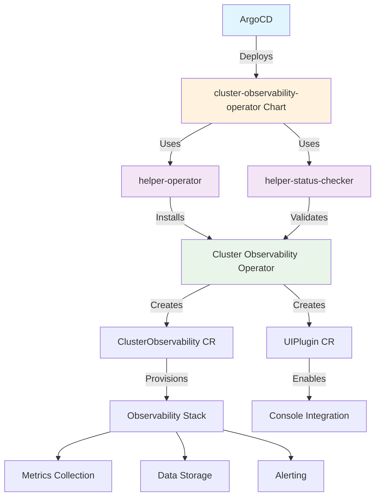

# Cluster Observability Operator Chart

## Overview

The `cluster-observability-operator` chart deploys the OpenShift Cluster Observability Operator, which provides comprehensive monitoring and observability capabilities for OpenShift clusters. This operator enables advanced cluster monitoring, metrics collection, and observability features beyond the standard OpenShift monitoring stack.

## Prerequisites

- OpenShift Container Platform 4.12 or later
- Cluster administrator privileges
- Sufficient cluster resources for observability workloads
- Storage class available for persistent volumes

## Architecture



## Installation

### Via ArgoCD (Recommended)
This chart is designed to be deployed through ArgoCD as part of the GitOps infrastructure pattern:

```yaml
# Add to cluster-config/*/infrastructure.yaml
infrastructure:
  - chart: cluster-observability-operator
    targetRevision: 0.1.0
    namespace: openshift-cluster-observability-operator
    values:
      clusterObservability:
        storage:
          size: "100Gi"
          storageClass: "gp3-csi"
        retention:
          days: 90
      helper-operator:
        operators:
          cluster-observability-operator:
            subscription:
              channel: development
              startingCSV: cluster-observability-operator.v0.1.0
```

### Manual Installation
```bash
# Add Helm repository
helm repo add rosa-hcp https://rosa-hcp-dedicated-vpc.github.io/helm-repository/
helm repo update

# Install the chart
helm install cluster-observability-operator rosa-hcp/cluster-observability-operator \
  --namespace openshift-cluster-observability-operator \
  --create-namespace \
  --set clusterObservability.storage.size=50Gi
```

## Configuration

### Chart Dependencies
This chart uses the following helper charts:
- **helper-operator** (~1.1.0): Manages operator installation and lifecycle
- **helper-status-checker** (~4.1.2): Validates operator deployment status

### Key Configuration Parameters

#### Cluster Observability Settings
```yaml
clusterObservability:
  enabled: true                    # Enable/disable observability stack
  storage:
    size: "50Gi"                  # Storage size for observability data
    storageClass: "gp3-csi"       # Storage class for persistent volumes
  retention:
    days: 30                      # Data retention period in days
  resources:
    limits:
      cpu: "1000m"                # CPU limit for observability components
      memory: "2Gi"               # Memory limit for observability components
    requests:
      cpu: "500m"                 # CPU requests for observability components
      memory: "1Gi"               # Memory requests for observability components
```

#### Operator Configuration
```yaml
helper-operator:
  operators:
    cluster-observability-operator:
      enabled: true
      namespace:
        name: openshift-cluster-observability-operator
        create: true
      subscription:
        channel: development        # Operator channel (development/stable)
        approval: Manual           # InstallPlan approval mode
        operatorName: cluster-observability-operator
        source: redhat-operators
```

#### Status Checker Configuration
```yaml
helper-status-checker:
  enabled: true
  approver: true                  # Enable InstallPlan approval
  checks:
    - operatorName: cluster-observability-operator
      subscriptionName: cluster-observability-operator
      namespace:
        name: openshift-cluster-observability-operator
      syncwave: 3
```

## Generated Resources

This chart creates the following Kubernetes resources:

### Operator Resources (via helper-operator)
- **Namespace**: `openshift-cluster-observability-operator`
- **OperatorGroup**: For operator installation scope
- **Subscription**: Cluster Observability Operator subscription
- **InstallPlan**: Operator installation plan (auto-approved if configured)

### Observability Resources
- **ClusterObservability**: Main custom resource for observability configuration
- **UIPlugin**: Console plugin for observability UI integration

### RBAC Resources (via helper-status-checker)
- **ServiceAccount**: For status checking operations
- **ClusterRole**: Permissions for operator validation
- **ClusterRoleBinding**: Binding service account to cluster role

## Features

### Observability Capabilities
- **Enhanced Metrics Collection**: Beyond standard OpenShift monitoring
- **Custom Dashboards**: Specialized observability dashboards
- **Advanced Alerting**: Custom alerting rules and notifications
- **Data Retention**: Configurable retention policies for observability data
- **Storage Management**: Persistent storage for metrics and logs
- **Console Integration**: Native OpenShift console integration

### Operator Management
- **Automated Installation**: Via helper-operator chart
- **Status Validation**: Via helper-status-checker chart
- **Version Management**: Controlled operator version deployment
- **InstallPlan Approval**: Automated or manual approval workflows

## Monitoring & Verification

### Check Operator Status
```bash
# Verify operator installation
oc get csv -n openshift-cluster-observability-operator

# Check operator pods
oc get pods -n openshift-cluster-observability-operator

# Verify subscription status
oc get subscription cluster-observability-operator -n openshift-cluster-observability-operator
```

### Verify Observability Stack
```bash
# Check ClusterObservability resource
oc get clusterobservability -n openshift-cluster-observability-operator

# Verify UIPlugin
oc get uiplugin -n openshift-cluster-observability-operator

# Check observability components
oc get pods -n openshift-cluster-observability-operator -l app.kubernetes.io/part-of=cluster-observability
```

### Console Access
1. Navigate to OpenShift Console
2. Look for "Observability" section in the navigation menu
3. Access cluster observability dashboards and metrics

## Troubleshooting

### Common Issues

#### Operator Installation Failures
```bash
# Check InstallPlan status
oc get installplan -n openshift-cluster-observability-operator

# View operator logs
oc logs -n openshift-cluster-observability-operator deployment/cluster-observability-operator-controller-manager

# Check subscription events
oc describe subscription cluster-observability-operator -n openshift-cluster-observability-operator
```

#### Storage Issues
```bash
# Verify storage class exists
oc get storageclass

# Check PVC status
oc get pvc -n openshift-cluster-observability-operator

# Verify storage provisioning
oc describe pvc -n openshift-cluster-observability-operator
```

#### Resource Constraints
```bash
# Check resource usage
oc top pods -n openshift-cluster-observability-operator

# Verify resource limits
oc describe clusterobservability cluster-observability -n openshift-cluster-observability-operator

# Check node resources
oc describe nodes | grep -A 5 "Allocated resources"
```

### Configuration Validation
```bash
# Test chart templating
helm template cluster-observability-operator ./charts/cluster-observability-operator \
  --set clusterObservability.storage.size=100Gi

# Validate with custom values
helm template test-observability ./charts/cluster-observability-operator \
  -f custom-values.yaml
```

## Upgrade Process

### Chart Upgrade
```bash
# Update Helm repository
helm repo update

# Upgrade chart
helm upgrade cluster-observability-operator rosa-hcp/cluster-observability-operator \
  --namespace openshift-cluster-observability-operator \
  --reuse-values
```

### Operator Upgrade
```bash
# Check available operator versions
oc get packagemanifest cluster-observability-operator -o yaml

# Update subscription channel if needed
oc patch subscription cluster-observability-operator \
  -n openshift-cluster-observability-operator \
  --type merge -p '{"spec":{"channel":"stable"}}'
```

## Resource Requirements

### Minimum Requirements
- **CPU**: 2 cores
- **Memory**: 4 GiB
- **Storage**: 20 GiB

### Recommended Requirements
- **CPU**: 4 cores
- **Memory**: 8 GiB
- **Storage**: 100 GiB (depending on retention period)

### Storage Considerations
- Use fast storage classes (SSD-based) for better performance
- Size storage based on cluster size and retention requirements
- Consider backup strategies for observability data

## Security Considerations

### RBAC
- Operator requires cluster-admin privileges for installation
- Observability components run with minimal required permissions
- Console plugin integration follows OpenShift security model

### Network Policies
- Configure network policies if cluster uses network segmentation
- Ensure observability components can communicate with monitored resources
- Allow console access to observability UI components

## Related Charts

- **[helper-operator](../helper-operator/README.md)**: Operator installation automation
- **[helper-status-checker](../helper-status-checker/README.md)**: Operator status validation
- **[cluster-logging](../cluster-logging/README.md)**: Complementary logging solution
- **[cluster-bootstrap](../cluster-bootstrap/README.md)**: Bootstrap orchestration

## Version History

- **v0.1.0**: Initial release with basic observability operator deployment

## Support

For issues related to:
- **Chart functionality**: Create issues in the helm-repository
- **Operator functionality**: Consult Red Hat OpenShift documentation
- **Configuration**: Review this README and chart values documentation

## References

- [OpenShift Cluster Observability Operator Documentation](https://docs.openshift.com/)
- [Cluster Observability Operator GitHub](https://github.com/abavage/openshift-logging/tree/main/cluster-observability-operator)
- [OpenShift Monitoring Documentation](https://docs.openshift.com/container-platform/latest/monitoring/index.html)

