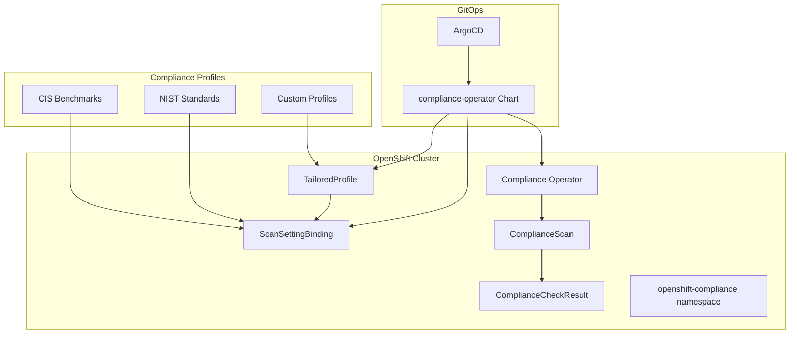

# Compliance Operator Helm Chart

This Helm chart deploys and configures the Red Hat Compliance Operator on OpenShift clusters, providing automated security compliance scanning and reporting capabilities. The chart installs the operator and configures compliance profiles for CIS benchmarks, NIST standards, and other security frameworks. This chart is designed for deployment via ArgoCD and integrates with the rosa-hcp-dedicated-vpc infrastructure.

## Overview

The Compliance Operator chart provides enterprise-grade security compliance capabilities for OpenShift clusters by implementing automated compliance scanning and reporting. Unlike manual compliance auditing, this chart enables continuous compliance monitoring through:

- **Automated Compliance Scanning**: Continuous scanning against industry-standard compliance profiles
- **CIS Benchmark Integration**: Built-in support for CIS OpenShift and Kubernetes benchmarks
- **NIST Framework Support**: Compliance scanning for NIST 800-53 and other federal standards
- **Custom Profile Creation**: Ability to create tailored compliance profiles for specific requirements
- **Remediation Guidance**: Automated remediation suggestions and manual fix recommendations
- **ArgoCD Integration**: Designed for GitOps deployment with proper sync wave ordering

This approach enables organizations to maintain continuous compliance posture, automate security auditing, and generate compliance reports for regulatory requirements.

## Deployment Workflow

This Helm Chart installs and configures the Compliance Operator using the following workflow:

1. **Create Required Namespace**: Establishes the `openshift-compliance` namespace
2. **Install Compliance Operator**: Deploys the operator via Subscription and OperatorGroup objects
3. **Verify Operator Readiness**: Uses helper-status-checker to ensure operator is ready
4. **Configure Compliance Scanning**: Applies ScanSettingBinding and optionally TailoredProfile resources
5. **Enable Continuous Monitoring**: Configures scheduled compliance scans

## Prerequisites

- OpenShift Container Platform 4.10 or later
- Cluster administrator privileges
- ArgoCD deployment (this chart is designed for GitOps deployment)
- Sufficient cluster resources for compliance scanning workloads
- Worker nodes for compliance scan execution

## Chart Dependencies

This chart depends on the following sub-charts:

- **helper-operator** (v1.1.0): Manages Compliance Operator subscription and installation
- **helper-status-checker** (v4.1.2): Validates operator readiness and health

| Repository | Name | Version |
|------------|------|---------|
| https://rosa-hcp-dedicated-vpc.github.io/helm-repository/ | helper-operator | 1.1.0 |
| https://rosa-hcp-dedicated-vpc.github.io/helm-repository/ | helper-status-checker | 4.1.2 |

## Architecture



## Installation

This chart is designed for deployment via ArgoCD as part of a GitOps workflow.

### ArgoCD Deployment

The compliance-operator chart is deployed via ArgoCD as part of the GitOps workflow, providing automated compliance scanning and reporting capabilities.

#### ArgoCD Application Example

```yaml
apiVersion: argoproj.io/v1alpha1
kind: Application
metadata:
  name: compliance-operator
  namespace: openshift-gitops
  annotations:
    argocd.argoproj.io/sync-wave: '2'
spec:
  destination:
    namespace: openshift-compliance
    server: https://kubernetes.default.svc
  project: default
  sources:
    - repoURL: https://rosa-hcp-dedicated-vpc.github.io/helm-repository/
      chart: compliance-operator
      targetRevision: 1.0.46
      helm:
        valueFiles:
        - $values/cluster-config/nonprod/np-app-1/infrastructure.yaml
        values: |
          appTeam: compliance-operator
    - repoURL: https://github.com/rosa-hcp-dedicated-vpc/rosa-hcp-dedicated-vpc.git
      targetRevision: HEAD
      ref: values
  syncPolicy:
    automated:
      prune: false
      selfHeal: true
    syncOptions:
    - ApplyOutOfSyncOnly=true
    - CreateNamespace=true
```

## Configuration

### Core Configuration Parameters

| Parameter | Description | Default | Required |
|-----------|-------------|---------|----------|
| `helper-operator.operators.compliance-operator.enabled` | Enable compliance operator installation | `true` | Yes |
| `helper-operator.operators.compliance-operator.subscription.channel` | Operator subscription channel | `stable` | Yes |
| `helper-operator.operators.compliance-operator.subscription.approval` | Install plan approval mode | `Manual` | No |
| `compliance.scansettingbinding.enabled` | Enable compliance scanning configuration | `true` | Yes |
| `compliance.scansettingbinding.profiles` | List of compliance profiles to scan | `[ocp4-cis-node]` | Yes |

### Helper Chart Configuration

| Parameter | Description | Default |
|-----------|-------------|---------|
| `helper-operator.enabled` | Enable operator installation helper | `true` |
| `helper-status-checker.enabled` | Enable operator status checking | `true` |
| `helper-status-checker.approver` | Enable install plan approval | `true` |

### Compliance Scanning Configuration

| Parameter | Description | Default | Options |
|-----------|-------------|---------|---------|
| `compliance.scansetting.schedule` | Cron schedule for compliance scans | `*/5 * * * *` | Valid cron expression |
| `compliance.scansetting.pvcSize` | Storage size for scan results | `2Gi` | Kubernetes storage size |
| `compliance.scansettingbinding.scansetting` | ScanSetting to use | `default` | `default` or custom |
| `compliance.scansettingbinding.syncwave` | ArgoCD sync wave | `3` | Integer |

### Available Compliance Profiles

| Profile Name | Description | Framework |
|--------------|-------------|-----------|
| `ocp4-cis` | CIS OpenShift Container Platform 4 Benchmark | CIS |
| `ocp4-cis-node` | CIS OpenShift Container Platform 4 Node Benchmark | CIS |
| `ocp4-moderate` | NIST 800-53 Moderate-Impact Baseline for OpenShift | NIST |
| `ocp4-nerc-cip` | North American Electric Reliability Corporation (NERC) Critical Infrastructure Protection (CIP) | NERC |
| `ocp4-pci-dss` | Payment Card Industry Data Security Standard (PCI DSS) | PCI |
| `rhcos4-moderate` | NIST 800-53 Moderate-Impact Baseline for Red Hat Enterprise Linux CoreOS | NIST |

## Features

### Compliance Capabilities
- **Automated Scanning**: Continuous compliance scanning against industry standards
- **Multiple Frameworks**: Support for CIS, NIST, PCI DSS, NERC CIP, and custom profiles
- **Scheduled Scans**: Configurable scan scheduling with cron expressions
- **Result Storage**: Persistent storage of scan results and compliance reports
- **Remediation Guidance**: Automated suggestions for compliance violations

### Security Features
- **Node-Level Scanning**: Deep inspection of OpenShift nodes and configurations
- **Platform Scanning**: OpenShift platform-level compliance checks
- **Custom Profiles**: Ability to create tailored compliance profiles
- **Rule Customization**: Disable specific rules with documented rationale
- **Audit Trail**: Complete audit trail of compliance scan results

### Integration Features
- **ArgoCD Integration**: Native GitOps deployment with sync wave support
- **OpenShift Console**: Built-in compliance dashboard and reporting
- **API Access**: Programmatic access to compliance results via Kubernetes APIs
- **Alert Integration**: Integration with monitoring and alerting systems

## Example Configuration

### Basic CIS Compliance Scanning

```yaml
# Basic compliance operator configuration with CIS benchmarks
helper-operator:
  operators:
    compliance-operator:
      enabled: true
      syncwave: '0'
      namespace:
        name: openshift-compliance
        create: true
      subscription:
        channel: stable
        approval: Manual
        operatorName: compliance-operator
        source: redhat-operators
        sourceNamespace: openshift-marketplace
      operatorgroup:
        create: true
        notownnamespace: true

helper-status-checker:
  enabled: true
  approver: true
  checks:
    - operatorName: compliance-operator
      namespace:
        name: openshift-compliance
      syncwave: 3
      serviceAccount:
        name: "sa-compliance"

compliance:
  namespace:
    name: openshift-compliance
  scansetting:
    schedule: "0 1 * * 0"  # Weekly scans on Sunday at 1 AM
    pvcSize: 2Gi
  scansettingbinding:
    enabled: true
    syncwave: '3'
    scansetting: default
    profiles:
      - name: ocp4-cis-node
        kind: Profile
      - name: ocp4-cis
        kind: Profile
```

### Advanced Configuration with Custom Profiles

```yaml
# Advanced compliance configuration with tailored profiles
helper-operator:
  operators:
    compliance-operator:
      enabled: true
      syncwave: '0'
      namespace:
        name: openshift-compliance
        create: true
      subscription:
        channel: stable
        approval: Automatic  # For production automation
        operatorName: compliance-operator
        source: redhat-operators
        sourceNamespace: openshift-marketplace
        config:
          nodeSelector:
            key: node-role.kubernetes.io/worker
            value: ""
      operatorgroup:
        create: true
        notownnamespace: true

helper-status-checker:
  enabled: true
  approver: true
  checks:
    - operatorName: compliance-operator
      namespace:
        name: openshift-compliance
      syncwave: 3
      serviceAccount:
        name: "sa-compliance"

compliance:
  namespace:
    name: openshift-compliance
  scansetting:
    schedule: "0 2 * * *"  # Daily scans at 2 AM
    pvcSize: 5Gi
  scansettingbinding:
    enabled: true
    syncwave: '3'
    scansetting: default
    # Custom tailored profile example
    tailored:
      enabled: true
      modified_profiles:
      - name: tailoredprofile-ocp4-cis
        description: Modified ocp4-cis profile for production environment
        title: Production Tailored Profile of ocp4-cis
        extends: ocp4-cis
        disableRule:
        - name: ocp4-scc-limit-container-allowed-capabilities
          rationale: Disabling CIS-OCP 5.2.8 due to custom CSI driver requirements
        - name: ocp4-kubelet-configure-tls-cipher-suites
          rationale: Using organization-approved cipher suites
    profiles:
      - name: ocp4-cis-node
        kind: Profile
      - name: tailoredprofile-ocp4-cis
        kind: TailoredProfile
      - name: ocp4-moderate
        kind: Profile
```

## Post-Installation

### Verify Installation

```bash
# Check compliance operator status
oc get csv -n openshift-compliance | grep compliance-operator

# Check compliance operator pods
oc get pods -n openshift-compliance

# Check available compliance profiles
oc get profiles.compliance -n openshift-compliance

# Check scan setting bindings
oc get scansettingbinding -n openshift-compliance

# Check compliance scans
oc get compliancescans -n openshift-compliance
```

### Monitor Compliance Scans

```bash
# Watch compliance scan progress
oc get compliancescans -n openshift-compliance -w

# Check scan results
oc get compliancecheckresults -n openshift-compliance

# View compliance scan logs
oc logs -n openshift-compliance -l compliance-scan=ocp4-cis

# Check compliance remediation suggestions
oc get complianceremediations -n openshift-compliance
```

## Usage Examples

### Viewing Compliance Results

```bash
# Get all compliance check results
oc get compliancecheckresults -n openshift-compliance

# Filter failed compliance checks
oc get compliancecheckresults -n openshift-compliance \
  --field-selector=status.result=FAIL

# Get detailed information about a specific check
oc describe compliancecheckresult <check-name> -n openshift-compliance

# Export compliance results to JSON
oc get compliancecheckresults -n openshift-compliance -o json > compliance-results.json
```

### Managing Compliance Scans

```bash
# Trigger a manual compliance scan
oc annotate compliancescans/<scan-name> compliance.openshift.io/rescan=

# Check scan status
oc get compliancescans -n openshift-compliance -o wide

# View scan events
oc get events -n openshift-compliance --sort-by='.lastTimestamp'
```

### Working with Tailored Profiles

```bash
# List available tailored profiles
oc get tailoredprofiles -n openshift-compliance

# View tailored profile details
oc describe tailoredprofile <profile-name> -n openshift-compliance

# Create a new tailored profile
oc apply -f - <<EOF
apiVersion: compliance.openshift.io/v1alpha1
kind: TailoredProfile
metadata:
  name: custom-ocp4-cis
  namespace: openshift-compliance
spec:
  extends: ocp4-cis
  title: "Custom CIS Profile"
  description: "Customized CIS profile for our environment"
  disableRules:
  - name: ocp4-scc-limit-container-allowed-capabilities
    rationale: "Custom CSI driver requirements"
EOF
```

## Troubleshooting

### Common Issues

#### Operator Installation Fails
```bash
# Check subscription status
oc get subscription compliance-operator -n openshift-compliance -o yaml

# Check install plan
oc get installplan -n openshift-compliance

# Check operator logs
oc logs -n openshift-compliance deployment/compliance-operator
```

#### Compliance Scans Not Starting
```bash
# Check scan setting binding
oc describe scansettingbinding <binding-name> -n openshift-compliance

# Check if profiles exist
oc get profiles.compliance -n openshift-compliance

# Check operator logs
oc logs -n openshift-compliance -l name=compliance-operator
```

#### Scan Results Not Available
```bash
# Check scan pod status
oc get pods -n openshift-compliance | grep scanner

# Check scan pod logs
oc logs -n openshift-compliance <scanner-pod-name>

# Check PVC status for result storage
oc get pvc -n openshift-compliance
```

#### Node Scanning Issues
```bash
# Check if scanner pods can schedule on nodes
oc describe pod <scanner-pod> -n openshift-compliance

# Check node labels and taints
oc get nodes --show-labels

# Check if privileged containers are allowed
oc get scc privileged -o yaml
```

### Logs and Diagnostics

```bash
# Compliance operator logs
oc logs -n openshift-compliance deployment/compliance-operator

# Scanner pod logs
oc logs -n openshift-compliance -l compliance-scan=<scan-name>

# Check all compliance-related events
oc get events -n openshift-compliance --sort-by='.lastTimestamp'

# Export configuration for support
oc get scansettingbinding -n openshift-compliance -o yaml > scansettingbinding.yaml
oc get compliancescans -n openshift-compliance -o yaml > compliancescans.yaml
```

## Performance Considerations

### Resource Requirements

- **CPU**: 100m per scanner pod (scales with node count)
- **Memory**: 256Mi per scanner pod
- **Storage**: 2-10Gi for scan results (depends on scan frequency and retention)
- **Network**: Minimal bandwidth for result collection

### Optimization Tips

- Schedule scans during low-usage periods
- Use appropriate PVC sizes for result storage
- Consider node selectors for scanner pod placement
- Implement log rotation for scan results
- Monitor storage usage for compliance results

## Security Considerations

- **Privileged Access**: Scanner pods require privileged access to nodes
- **Result Storage**: Secure storage of compliance scan results
- **Access Control**: Implement RBAC for compliance resources
- **Audit Trail**: Maintain audit logs of compliance activities
- **Data Retention**: Implement appropriate data retention policies

## Compliance Frameworks

### CIS Benchmarks
- **ocp4-cis**: OpenShift Container Platform 4 CIS Benchmark
- **ocp4-cis-node**: Node-level CIS benchmark checks
- **rhcos4-cis**: Red Hat Enterprise Linux CoreOS CIS benchmark

### NIST Standards
- **ocp4-moderate**: NIST 800-53 Moderate-Impact Baseline
- **rhcos4-moderate**: RHEL CoreOS NIST 800-53 Moderate-Impact Baseline

### Industry Standards
- **ocp4-pci-dss**: Payment Card Industry Data Security Standard
- **ocp4-nerc-cip**: North American Electric Reliability Corporation Critical Infrastructure Protection

## Support

- **OpenShift Compliance Documentation**: [OpenShift Compliance Operator](https://docs.openshift.com/container-platform/latest/security/compliance_operator/compliance-operator-understanding.html)
- **Red Hat Knowledge Base**: [Compliance Operator Articles](https://access.redhat.com/solutions/compliance-operator)
- **Upstream Project**: [ComplianceAsCode](https://github.com/ComplianceAsCode/content)

## Contributing

This chart is part of the rosa-hcp-dedicated-vpc project. Please refer to the main repository for contribution guidelines.

## License

This chart is licensed under the Apache License 2.0. See the LICENSE file for details.

## Maintainers

| Name | Email | Url |
| ---- | ------ | --- |
| Paul Foster | <pafoster@redhat.com> | <https://github.com/rosa-hcp-dedicated-vpc> |

## Changelog

### Version 1.0.46
- Updated dependencies to rosa-hcp-dedicated-vpc repository
- Enhanced README with GitOps deployment focus
- Added comprehensive troubleshooting section
- Updated configuration examples
- Added compliance framework documentation
