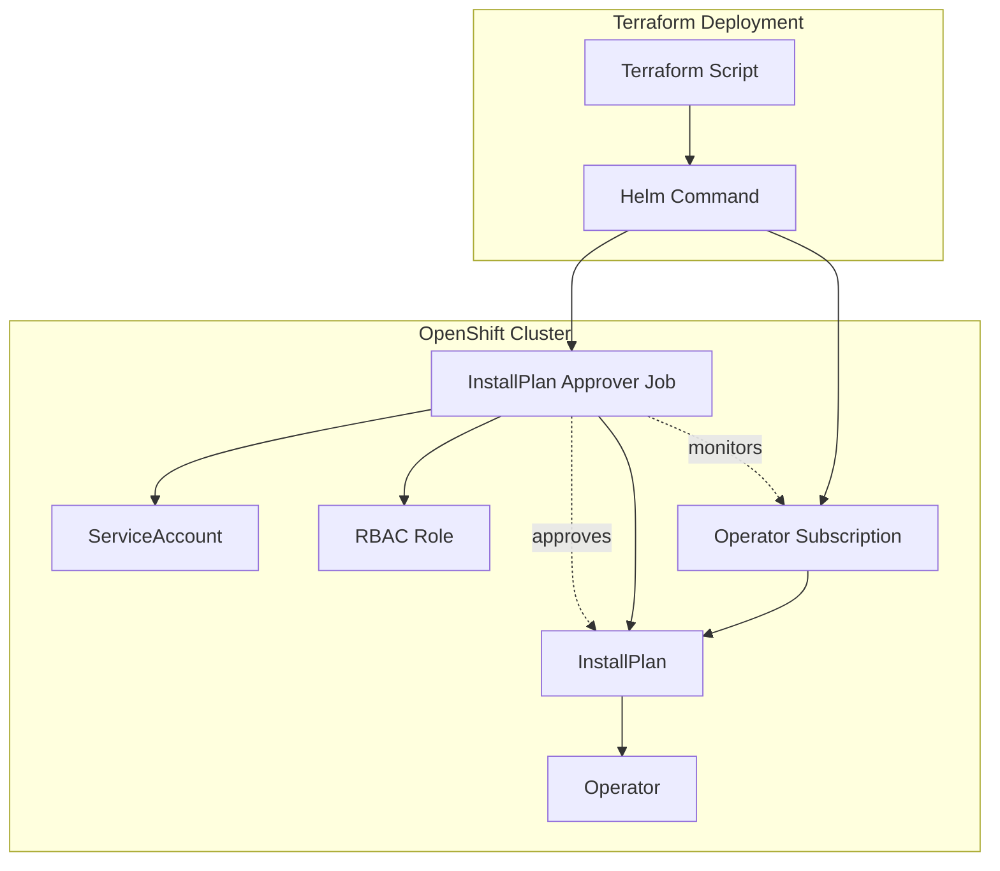

# Helper InstallPlan Approver Chart

This is a dependency Helm chart that automatically approves OpenShift Operator InstallPlans during Terraform-based deployments. The chart creates a Kubernetes Job that monitors and approves manual InstallPlans, enabling automated operator installations in environments where ArgoCD is not used for deployment. This chart is specifically designed for Terraform-driven Helm deployments and should not be used directly.

## Overview

The Helper InstallPlan Approver chart provides automated InstallPlan approval capabilities for OpenShift operators deployed via Terraform using Helm commands. Unlike ArgoCD deployments that can handle InstallPlan approval through sync policies, Terraform-based Helm deployments require a separate mechanism to approve operator installations when manual approval is configured.

This dependency chart addresses the challenge by:

- **Automated InstallPlan Approval**: Monitors and automatically approves pending InstallPlans
- **Terraform Integration**: Designed specifically for Terraform-driven Helm deployments
- **Pre-Install Hook**: Executes before the main chart installation to ensure operators are ready
- **Dependency Pattern**: Functions as a sub-chart dependency, not a standalone deployment
- **Manual Approval Handling**: Converts manual InstallPlan approvals to automatic for automation workflows

This approach enables fully automated operator deployments in Terraform environments while maintaining the security and control of manual InstallPlan approval policies.

## Use Cases

### Terraform-Based Operator Deployment
This chart is used as a dependency when deploying operators via Terraform using Helm commands, particularly in scenarios where:

- Operators are configured with `Manual` InstallPlan approval
- Terraform needs to automate the entire deployment process
- ArgoCD is not available or not used for the specific deployment
- Infrastructure-as-Code requires fully automated operator installations

### Integration with rosa-hcp-dedicated-vpc
In the rosa-hcp-dedicated-vpc project, this chart is used as a dependency for operator charts that are deployed via Terraform scripts, such as:

- Bootstrap processes that install operators before ArgoCD is available
- Infrastructure operators that need to be installed during cluster provisioning
- Operators deployed via Terraform `shell_script` resources with Helm commands

## Architecture



## Chart Components

### Core Resources
- **Job**: Kubernetes Job that monitors and approves InstallPlans
- **ServiceAccount**: Service account for the approval job with necessary permissions
- **Role**: RBAC role with permissions to get, list, and patch InstallPlans and Subscriptions
- **RoleBinding**: Binds the role to the service account

### Job Functionality
The InstallPlan approver job performs the following workflow:

1. **Wait Period**: Initial sleep to allow subscriptions to be created
2. **Monitor Subscriptions**: Checks for subscription creation and InstallPlan generation
3. **Detect Manual Approval**: Identifies InstallPlans requiring manual approval
4. **Automatic Approval**: Patches InstallPlans to set `approved: true`
5. **Retry Logic**: Implements retry mechanism with timeout for reliability

## Configuration

### Required Values

| Parameter | Description | Default | Required |
|-----------|-------------|---------|----------|
| `namespace` | Target namespace for InstallPlan approval | `nothing` | Yes |
| `sleep` | Sleep interval between checks (seconds) | `20` | No |
| `image` | Container image for the approval job | `registry.redhat.io/openshift4/ose-cli:latest` | No |

### Example Configuration

```yaml
# Basic configuration for InstallPlan approval
namespace: "openshift-operators"
sleep: 30
image: "registry.redhat.io/openshift4/ose-cli:latest"
```

## Usage as Dependency

This chart is designed to be used as a dependency in other Helm charts, not deployed directly.

### Adding as Dependency

In your main chart's `Chart.yaml`:

```yaml
apiVersion: v2
name: my-operator-chart
version: 1.0.0
dependencies:
  - name: helper-installplan-approver
    version: 0.1.0
    repository: https://rosa-hcp-dedicated-vpc.github.io/helm-repository/
    condition: helper-installplan-approver.enabled
```

### Values Configuration

In your main chart's `values.yaml`:

```yaml
# Enable InstallPlan approval for Terraform deployments
helper-installplan-approver:
  enabled: true
  namespace: "openshift-operators"
  sleep: 20
  image: "registry.redhat.io/openshift4/ose-cli:latest"

# Your operator configuration
myOperator:
  subscription:
    approval: Manual  # This will be automatically approved
    channel: stable
    # ... other operator settings
```

### Template Integration

In your main chart templates, reference the dependency:

```yaml
{{- if .Values.helper-installplan-approver.enabled }}
# The helper chart will automatically handle InstallPlan approval
{{- end }}

# Your operator subscription with manual approval
apiVersion: operators.coreos.com/v1alpha1
kind: Subscription
metadata:
  name: my-operator
  namespace: {{ .Values.helper-installplan-approver.namespace }}
spec:
  installPlanApproval: Manual  # Will be auto-approved by helper
  # ... rest of subscription
```

## Terraform Integration

### Example Terraform Usage

```hcl
# Terraform script deploying operator with InstallPlan approval
resource "shell_script" "deploy_operator" {
  lifecycle_commands {
    create = templatefile("./scripts/deploy-operator.tftpl", {
      namespace = "openshift-operators"
      chart_name = "my-operator-chart"
      chart_version = "1.0.0"
    })
  }
}
```

### Terraform Script Template

```bash
#!/bin/bash
# deploy-operator.tftpl

# Deploy operator chart with InstallPlan approver dependency
helm upgrade --install my-operator helm-repo/my-operator-chart \
  --version ${chart_version} \
  --namespace ${namespace} \
  --create-namespace \
  --set helper-installplan-approver.enabled=true \
  --set helper-installplan-approver.namespace=${namespace} \
  --wait --timeout=10m
```

## Job Execution Flow

### Pre-Install Hook Sequence

1. **Hook Weight -4**: ServiceAccount creation
2. **Hook Weight -3**: Role and RoleBinding creation  
3. **Hook Weight 1**: InstallPlan Approver Job execution
4. **Main Installation**: Operator subscription and other resources

### Approval Logic

```bash
# Simplified approval logic from the job
for namespace in $NAMESPACES; do
  # Wait for subscription to create InstallPlan
  while ! installplan_ready; do
    sleep $SLEEP
    check_timeout
  done
  
  # Get InstallPlan details
  INSTALLPLAN=$(oc get subscription -n $namespace -o jsonpath='{.items[0].status.installplan.name}')
  APPROVAL=$(oc get installplan $INSTALLPLAN -n $namespace -o jsonpath='{.spec.approval}')
  APPROVED=$(oc get installplan $INSTALLPLAN -n $namespace -o jsonpath='{.spec.approved}')
  
  # Approve if manual and not yet approved
  if [[ "$APPROVAL" == "Manual" && "$APPROVED" == "false" ]]; then
    oc patch installplan $INSTALLPLAN -n $namespace --type='merge' -p '{"spec": {"approved": true}}'
  fi
done
```

## Resource Requirements

### Minimum Requirements
- **CPU**: 100m (job runs briefly)
- **Memory**: 128Mi (minimal memory footprint)
- **RBAC**: Role permissions for InstallPlans and Subscriptions
- **Network**: Access to Kubernetes API server

### Job Specifications
- **Active Deadline**: 240 seconds (4 minutes maximum runtime)
- **Restart Policy**: OnFailure
- **DNS Policy**: ClusterFirst
- **Termination Grace Period**: 30 seconds

## Troubleshooting

### Common Issues

#### Job Fails to Approve InstallPlan
```bash
# Check job status
oc get job installplan-approver -n <namespace>

# Check job logs
oc logs job/installplan-approver -n <namespace>

# Check InstallPlan status
oc get installplan -n <namespace>
oc describe installplan <installplan-name> -n <namespace>
```

#### RBAC Permission Issues
```bash
# Check service account
oc get serviceaccount installplan-approver-job -n <namespace>

# Check role and rolebinding
oc get role installplan-approver -n <namespace>
oc get rolebinding installplan-approver -n <namespace>

# Test permissions
oc auth can-i get installplans --as=system:serviceaccount:<namespace>:installplan-approver-job -n <namespace>
oc auth can-i patch installplans --as=system:serviceaccount:<namespace>:installplan-approver-job -n <namespace>
```

#### Subscription Not Found
```bash
# Check if subscription exists
oc get subscription -n <namespace>

# Check subscription status
oc describe subscription <subscription-name> -n <namespace>

# Verify namespace is correct
oc get namespace <namespace>
```

#### Job Timeout Issues
```bash
# Check job events
oc describe job installplan-approver -n <namespace>

# Check pod events
oc get pods -l job-name=installplan-approver -n <namespace>
oc describe pod <pod-name> -n <namespace>

# Increase sleep time if needed
# Update values.yaml: sleep: 30
```

### Debugging Commands

```bash
# Monitor job execution
oc logs -f job/installplan-approver -n <namespace>

# Check InstallPlan approval status
oc get installplan -n <namespace> -o yaml

# Verify subscription InstallPlan reference
oc get subscription -n <namespace> -o jsonpath='{.items[0].status.installplan}'

# Manual InstallPlan approval (if job fails)
INSTALLPLAN=$(oc get subscription -n <namespace> -o jsonpath='{.items[0].status.installplan.name}')
oc patch installplan $INSTALLPLAN -n <namespace> --type='merge' -p '{"spec": {"approved": true}}'
```

## Best Practices

### Configuration
- Set appropriate sleep intervals based on operator installation time
- Use specific namespaces rather than broad permissions
- Configure reasonable job timeouts for your environment
- Test approval logic in development environments first

### Security
- Limit RBAC permissions to specific namespaces
- Use least-privilege service accounts
- Monitor job execution logs for security events
- Implement proper cleanup of completed jobs

### Reliability
- Implement proper error handling in parent charts
- Set appropriate job deadlines and retry policies
- Monitor job success/failure rates
- Have fallback manual approval procedures

## Integration Examples

### With Compliance Operator

```yaml
# Chart.yaml
dependencies:
  - name: helper-installplan-approver
    version: 0.1.0
    repository: https://rosa-hcp-dedicated-vpc.github.io/helm-repository/

# values.yaml
helper-installplan-approver:
  enabled: true
  namespace: "openshift-compliance"
  sleep: 25

compliance-operator:
  subscription:
    approval: Manual
    channel: stable
```

### With Custom Operator

```yaml
# Chart.yaml
dependencies:
  - name: helper-installplan-approver
    version: 0.1.0
    repository: https://rosa-hcp-dedicated-vpc.github.io/helm-repository/

# values.yaml
helper-installplan-approver:
  enabled: true
  namespace: "custom-operators"
  sleep: 30

custom-operator:
  subscription:
    approval: Manual
    channel: alpha
    source: certified-operators
```

## Limitations

### Scope Limitations
- **Single Namespace**: Approves InstallPlans in one namespace per chart instance
- **Subscription Dependency**: Requires subscription to exist before job execution
- **Manual Approval Only**: Only handles Manual approval mode InstallPlans
- **Timeout Constraints**: Limited by Kubernetes Job activeDeadlineSeconds

### Environment Limitations
- **Terraform/Helm Only**: Not suitable for ArgoCD deployments
- **Pre-Install Hook**: Cannot be used for post-installation approval
- **RBAC Requirements**: Requires cluster permissions for InstallPlan management
- **Image Dependencies**: Requires access to OpenShift CLI container image

## Alternatives

### ArgoCD Deployments
For ArgoCD-based deployments, use ArgoCD sync policies instead:

```yaml
apiVersion: argoproj.io/v1alpha1
kind: Application
spec:
  syncPolicy:
    automated:
      prune: false
      selfHeal: true
    syncOptions:
    - ApplyOutOfSyncOnly=true
    - ServerSideApply=true
```

### Manual Approval
For environments requiring manual oversight:

```bash
# Manual InstallPlan approval
oc get installplan -n <namespace>
oc patch installplan <installplan-name> -n <namespace> --type='merge' -p '{"spec": {"approved": true}}'
```

## Support

- **OpenShift Operator Documentation**: [Managing Operators](https://docs.openshift.com/container-platform/latest/operators/admin/olm-managing-operators.html)
- **InstallPlan Documentation**: [InstallPlan Approval](https://docs.openshift.com/container-platform/latest/operators/understanding/olm/olm-understanding-installplans.html)
- **Helm Hooks Documentation**: [Helm Hooks](https://helm.sh/docs/topics/charts_hooks/)

## Contributing

This chart is part of the rosa-hcp-dedicated-vpc project. Please refer to the main repository for contribution guidelines.

## License

This chart is licensed under the Apache License 2.0. See the LICENSE file for details.

## Changelog

### Version 0.1.0
- Initial release of InstallPlan approver dependency chart
- Kubernetes Job-based InstallPlan approval automation
- RBAC configuration for InstallPlan and Subscription access
- Pre-install hook integration for Terraform deployments
- Configurable sleep intervals and timeout handling
