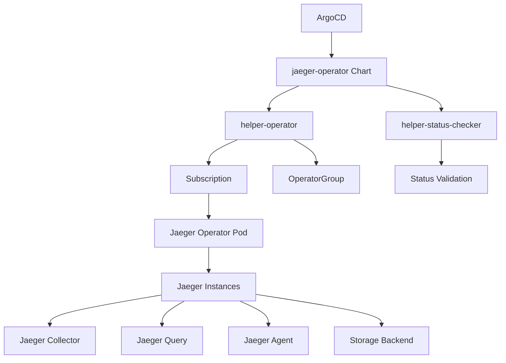

# Jaeger Operator

## Overview

The **Jaeger Operator** Helm chart deploys the Red Hat OpenShift Jaeger Operator, which provides distributed tracing capabilities for microservices architectures. This operator enables the deployment and management of Jaeger instances with enterprise-grade features for observability and performance monitoring.

## Introduction

Jaeger is an open-source, end-to-end distributed tracing system that helps monitor and troubleshoot transactions in complex distributed systems. The Red Hat OpenShift Jaeger Operator simplifies the deployment and management of Jaeger on OpenShift, providing:

- **Distributed Tracing**: End-to-end request tracing across microservices
- **Performance Monitoring**: Identify bottlenecks and optimize service performance
- **Service Dependency Mapping**: Visualize service interactions and dependencies
- **Root Cause Analysis**: Quickly identify the source of performance issues
- **Sampling Strategies**: Configurable sampling to balance observability and performance

## Prerequisites

- OpenShift cluster with cluster-admin privileges
- ArgoCD or OpenShift GitOps installed
- Sufficient cluster resources for Jaeger workloads
- Optional: Elasticsearch for trace storage (for production deployments)

## Deployment

This chart is deployed via **ArgoCD** as part of the GitOps infrastructure pattern.

### ArgoCD Application Example

```yaml
apiVersion: argoproj.io/v1alpha1
kind: Application
metadata:
  name: jaeger-operator
  namespace: openshift-gitops
  annotations:
    argocd.argoproj.io/sync-wave: '1'
spec:
  destination:
    namespace: openshift-distributed-tracing
    server: https://kubernetes.default.svc
  project: default
  sources:
    - repoURL: https://rosa-hcp-dedicated-vpc.github.io/helm-repository/
      chart: jaeger-operator
      targetRevision: 0.1.0
      helm:
        valueFiles:
        - $values/cluster-config/nonprod/np-app-1/infrastructure.yaml
        values: |
          appTeam: jaeger-operator
    - repoURL: https://github.com/rosa-hcp-dedicated-vpc/cluster-config.git
      targetRevision: HEAD
      ref: values
  syncPolicy:
    automated:
      prune: false
      selfHeal: true
    syncOptions:
    - CreateNamespace=true
    - SkipDryRunOnMissingResource=true
```

## Configuration

### Key Configuration Options

| Parameter | Description | Default |
|-----------|-------------|---------|
| `operatorChannel` | Operator subscription channel | `stable` |
| `operatorNamespace` | Target namespace for operator | `openshift-distributed-tracing` |
| `operatorInstallPlanApproval` | InstallPlan approval mode | `Automatic` |
| `helper-status-checker.enabled` | Enable status checking | `true` |
| `syncwave` | ArgoCD sync wave | `1` |

### Example Values

```yaml
# Jaeger Operator Configuration
jaeger-operator:
  operatorChannel: stable
  operatorNamespace: openshift-distributed-tracing
  helper-status-checker:
    enabled: true
    maxWaitTime: 600
```

## Dependencies

This chart includes the following dependencies:

- **helper-operator** (~1.1.0): Manages operator subscription and installation
- **helper-status-checker** (~4.1.2): Validates operator deployment status

## Architecture



## Usage

After deployment, you can create Jaeger instances using the provided CRDs:

### Simple Jaeger Instance (Development)

```yaml
apiVersion: jaegertracing.io/v1
kind: Jaeger
metadata:
  name: simple-jaeger
  namespace: observability
spec:
  strategy: allInOne
  allInOne:
    image: jaegertracing/all-in-one:latest
    options:
      memory:
        max-traces: 50000
```

### Production Jaeger Instance with Elasticsearch

```yaml
apiVersion: jaegertracing.io/v1
kind: Jaeger
metadata:
  name: production-jaeger
  namespace: observability
spec:
  strategy: production
  storage:
    type: elasticsearch
    elasticsearch:
      nodeCount: 3
      storage:
        size: 50Gi
        storageClassName: gp3-csi
      redundancyPolicy: SingleRedundancy
  collector:
    replicas: 3
    resources:
      limits:
        memory: 1Gi
      requests:
        memory: 512Mi
  query:
    replicas: 2
    resources:
      limits:
        memory: 512Mi
      requests:
        memory: 256Mi
```

## Monitoring

The operator provides comprehensive monitoring capabilities:

- **Trace Analytics**: Analyze request patterns and performance
- **Service Performance**: Monitor service response times and error rates
- **Dependency Graphs**: Visualize service dependencies
- **Custom Dashboards**: Create custom views for specific use cases

## Troubleshooting

### Common Issues

1. **Operator Installation Failed**
   ```bash
   oc get subscription jaeger-product -n openshift-distributed-tracing
   oc get installplan -n openshift-distributed-tracing
   ```

2. **Jaeger Instance Creation Issues**
   ```bash
   oc get jaeger -n observability
   oc describe jaeger simple-jaeger -n observability
   ```

3. **Storage Issues**
   ```bash
   oc get pvc -n observability
   oc describe pvc <pvc-name> -n observability
   ```

### Logs

```bash
# Operator logs
oc logs -n openshift-distributed-tracing -l name=jaeger-operator

# Jaeger instance logs
oc logs -n observability -l app.kubernetes.io/name=jaeger
```

## Integration

### Service Mesh Integration

Jaeger integrates seamlessly with OpenShift Service Mesh:

```yaml
apiVersion: install.istio.io/v1alpha1
kind: ServiceMeshControlPlane
metadata:
  name: basic
  namespace: istio-system
spec:
  tracing:
    type: Jaeger
    sampling: 10000  # 100% sampling
```

### Application Integration

Applications can send traces to Jaeger using various client libraries:

```yaml
# Environment variables for application pods
env:
- name: JAEGER_AGENT_HOST
  value: "simple-jaeger-agent.observability.svc.cluster.local"
- name: JAEGER_AGENT_PORT
  value: "6831"
```

## Security

The Jaeger Operator integrates with OpenShift security features:

- **RBAC Integration**: Role-based access control for Jaeger resources
- **Network Policies**: Secure communication between components
- **TLS Encryption**: Secure data transmission
- **Authentication**: Integration with OpenShift authentication

## Performance Tuning

### Sampling Configuration

```yaml
apiVersion: jaegertracing.io/v1
kind: Jaeger
metadata:
  name: jaeger-with-sampling
spec:
  strategy: production
  sampling:
    options:
      default_strategy:
        type: probabilistic
        param: 0.1  # 10% sampling
      per_service_strategies:
      - service: "critical-service"
        type: probabilistic
        param: 1.0  # 100% sampling
```

## Support

For issues and support:

- Check operator and Jaeger instance logs
- Review Red Hat OpenShift distributed tracing documentation
- Contact Red Hat support for enterprise customers
- Community support through Jaeger project forums

## Version History

| Version | Changes |
|---------|---------|
| 0.1.0 | Initial release with basic operator deployment |
