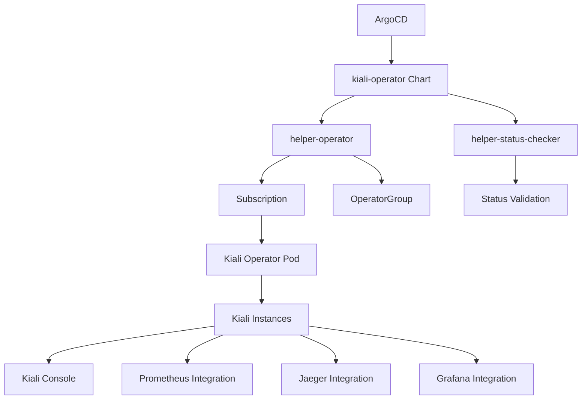

# Kiali Operator

## Overview

The **Kiali Operator** Helm chart deploys the Red Hat OpenShift Kiali Operator, which provides service mesh observability and management capabilities. Kiali offers a comprehensive console for visualizing, monitoring, and managing service mesh deployments with real-time insights into service topology and performance.

## Introduction

Kiali is a management console for Istio-based service mesh deployments. The Red Hat OpenShift Kiali Operator simplifies the deployment and management of Kiali on OpenShift, providing:

- **Service Mesh Visualization**: Interactive topology graphs showing service relationships
- **Traffic Flow Analysis**: Real-time traffic patterns and metrics visualization
- **Configuration Management**: Validate and manage Istio configurations
- **Security Insights**: Monitor mTLS status and security policies
- **Performance Monitoring**: Service performance metrics and health indicators

## Prerequisites

- OpenShift cluster with cluster-admin privileges
- ArgoCD or OpenShift GitOps installed
- OpenShift Service Mesh (Istio) installed and configured
- Sufficient cluster resources for Kiali workloads

## Deployment

This chart is deployed via **ArgoCD** as part of the GitOps infrastructure pattern.

### ArgoCD Application Example

```yaml
apiVersion: argoproj.io/v1alpha1
kind: Application
metadata:
  name: kiali-operator
  namespace: openshift-gitops
  annotations:
    argocd.argoproj.io/sync-wave: '1'
spec:
  destination:
    namespace: openshift-operators
    server: https://kubernetes.default.svc
  project: default
  sources:
    - repoURL: https://rosa-hcp-dedicated-vpc.github.io/helm-repository/
      chart: kiali-operator
      targetRevision: 0.1.0
      helm:
        valueFiles:
        - $values/cluster-config/nonprod/np-app-1/infrastructure.yaml
        values: |
          appTeam: kiali-operator
    - repoURL: https://github.com/rosa-hcp-dedicated-vpc/cluster-config.git
      targetRevision: HEAD
      ref: values
  syncPolicy:
    automated:
      prune: false
      selfHeal: true
    syncOptions:
    - CreateNamespace=true
    - SkipDryRunOnMissingResource=true
```

## Configuration

### Key Configuration Options

| Parameter | Description | Default |
|-----------|-------------|---------|
| `operatorChannel` | Operator subscription channel | `stable` |
| `operatorNamespace` | Target namespace for operator | `openshift-operators` |
| `operatorInstallPlanApproval` | InstallPlan approval mode | `Automatic` |
| `helper-status-checker.enabled` | Enable status checking | `true` |
| `syncwave` | ArgoCD sync wave | `1` |

### Example Values

```yaml
# Kiali Operator Configuration
kiali-operator:
  operatorChannel: stable
  operatorNamespace: openshift-operators
  helper-status-checker:
    enabled: true
    maxWaitTime: 600
```

## Dependencies

This chart includes the following dependencies:

- **helper-operator** (~1.1.0): Manages operator subscription and installation
- **helper-status-checker** (~4.1.2): Validates operator deployment status

## Architecture



## Usage

After deployment, you can create Kiali instances using the provided CRDs:

### Basic Kiali Instance

```yaml
apiVersion: kiali.io/v1alpha1
kind: Kiali
metadata:
  name: kiali
  namespace: istio-system
spec:
  installation_tag: "v1.73"
  istio_namespace: "istio-system"
  auth:
    strategy: "openshift"
  deployment:
    accessible_namespaces:
    - "**"
    image_pull_policy: "IfNotPresent"
    ingress_enabled: false
    namespace: "istio-system"
    resources:
      requests:
        cpu: "10m"
        memory: "64Mi"
      limits:
        memory: "1Gi"
  external_services:
    prometheus:
      url: "https://prometheus-k8s.openshift-monitoring.svc.cluster.local:9091"
    grafana:
      enabled: true
      in_cluster_url: "http://grafana.istio-system:3000"
    jaeger:
      enabled: true
      in_cluster_url: "http://jaeger-query.istio-system:16686"
```

### Production Kiali Instance

```yaml
apiVersion: kiali.io/v1alpha1
kind: Kiali
metadata:
  name: kiali-production
  namespace: istio-system
spec:
  installation_tag: "v1.73"
  istio_namespace: "istio-system"
  auth:
    strategy: "openshift"
  deployment:
    accessible_namespaces:
    - "production"
    - "staging"
    - "istio-system"
    replicas: 2
    resources:
      requests:
        cpu: "100m"
        memory: "256Mi"
      limits:
        cpu: "500m"
        memory: "1Gi"
    hpa:
      api_version: "autoscaling/v2"
      spec:
        maxReplicas: 5
        minReplicas: 2
        targetCPUUtilizationPercentage: 80
  external_services:
    prometheus:
      url: "https://prometheus-k8s.openshift-monitoring.svc.cluster.local:9091"
      health_check_url: "https://prometheus-k8s.openshift-monitoring.svc.cluster.local:9091/-/healthy"
    grafana:
      enabled: true
      in_cluster_url: "http://grafana.istio-system:3000"
      url: "https://grafana-route-istio-system.apps.cluster.example.com"
    jaeger:
      enabled: true
      in_cluster_url: "http://jaeger-query.istio-system:16686"
      url: "https://jaeger-route-istio-system.apps.cluster.example.com"
```

## Features

### Service Topology

Kiali provides interactive service topology graphs showing:

- **Service Dependencies**: Visual representation of service relationships
- **Traffic Flow**: Real-time traffic patterns with success/error rates
- **Response Times**: Performance metrics for each service
- **Protocol Information**: HTTP, gRPC, TCP traffic visualization

### Configuration Validation

- **Istio Configuration**: Validate VirtualServices, DestinationRules, etc.
- **Policy Validation**: Check security and traffic policies
- **Best Practices**: Recommendations for optimal configurations

### Security Features

- **mTLS Status**: Monitor mutual TLS configuration across services
- **Security Policies**: Visualize and manage authorization policies
- **Certificate Management**: Monitor certificate expiration and rotation

## Monitoring

Kiali integrates with various monitoring tools:

### Prometheus Integration

```yaml
external_services:
  prometheus:
    url: "https://prometheus-k8s.openshift-monitoring.svc.cluster.local:9091"
    custom_metrics_url: "https://prometheus-k8s.openshift-monitoring.svc.cluster.local:9091"
```

### Grafana Integration

```yaml
external_services:
  grafana:
    enabled: true
    in_cluster_url: "http://grafana.istio-system:3000"
    dashboards:
    - name: "Istio Service Dashboard"
      variables:
        namespace: "var-namespace"
        service: "var-service"
```

## Troubleshooting

### Common Issues

1. **Operator Installation Failed**
   ```bash
   oc get subscription kiali-ossm -n openshift-operators
   oc get installplan -n openshift-operators
   ```

2. **Kiali Instance Creation Issues**
   ```bash
   oc get kiali -n istio-system
   oc describe kiali kiali -n istio-system
   ```

3. **Authentication Issues**
   ```bash
   oc get route kiali -n istio-system
   oc logs -n istio-system -l app=kiali
   ```

### Logs

```bash
# Operator logs
oc logs -n openshift-operators -l name=kiali-operator

# Kiali instance logs
oc logs -n istio-system -l app=kiali
```

## Integration

### Service Mesh Control Plane Integration

Kiali is typically configured as part of the Service Mesh Control Plane:

```yaml
apiVersion: maistra.io/v2
kind: ServiceMeshControlPlane
metadata:
  name: basic
  namespace: istio-system
spec:
  addons:
    kiali:
      enabled: true
      name: kiali
    jaeger:
      name: jaeger
    grafana:
      enabled: true
```

### OpenShift Console Integration

Kiali can be integrated with the OpenShift console:

```yaml
apiVersion: console.openshift.io/v1
kind: ConsoleLink
metadata:
  name: kiali-console-link
spec:
  href: "https://kiali-istio-system.apps.cluster.example.com"
  location: ApplicationMenu
  text: "Kiali Service Mesh Console"
  applicationMenu:
    section: "Observability"
    imageURL: "data:image/svg+xml;base64,..."
```

## Security

The Kiali Operator integrates with OpenShift security features:

- **OpenShift Authentication**: Uses OpenShift OAuth for user authentication
- **RBAC Integration**: Respects OpenShift role-based access control
- **Network Policies**: Secure communication between components
- **TLS Encryption**: Secure data transmission

## Performance Tuning

### Resource Optimization

```yaml
deployment:
  resources:
    requests:
      cpu: "100m"
      memory: "256Mi"
    limits:
      cpu: "500m"
      memory: "1Gi"
  hpa:
    api_version: "autoscaling/v2"
    spec:
      maxReplicas: 5
      minReplicas: 2
      targetCPUUtilizationPercentage: 80
```

### Namespace Filtering

```yaml
deployment:
  accessible_namespaces:
  - "production"
  - "staging"
  - "development"
```

## Support

For issues and support:

- Check operator and Kiali instance logs
- Review Red Hat OpenShift Service Mesh documentation
- Contact Red Hat support for enterprise customers
- Community support through Kiali project forums

## Version History

| Version | Changes |
|---------|---------|
| 0.1.0 | Initial release with basic operator deployment |
