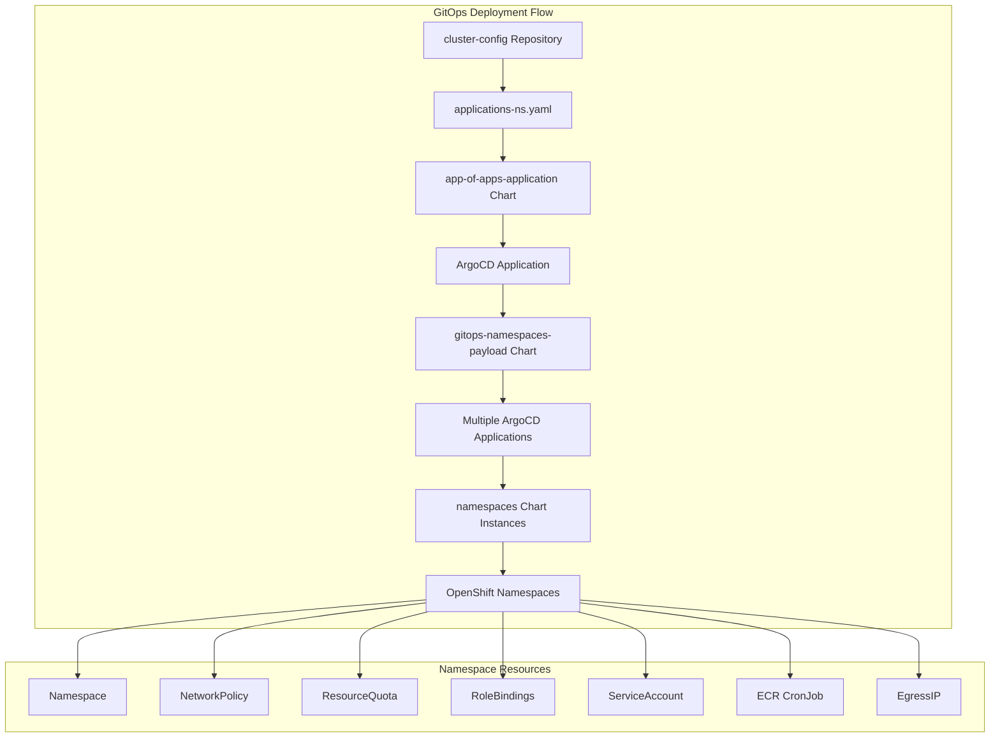

# Namespaces Helm Chart

A foundational Helm chart for creating and managing OpenShift namespaces with comprehensive security, resource management, and governance controls. This chart is deployed via ArgoCD using a GitOps approach in combination with the `gitops-namespaces-payload` and `app-of-apps-application` charts.

## Overview

The Namespaces chart provides enterprise-grade namespace provisioning with built-in security policies, resource quotas, RBAC controls, and AWS ECR integration. It creates fully configured namespaces that include network policies, resource quotas, service accounts, and egress IP assignments. The chart is designed to work as part of a multi-chart GitOps deployment pattern where configuration is managed through Git repositories and deployed via ArgoCD.

This chart serves as the core namespace template that is consumed by the GitOps payload charts, which handle the orchestration and multi-namespace deployments across different environments and teams.

## Architecture



## Prerequisites

- OpenShift 4.x cluster
- ArgoCD/OpenShift GitOps operator installed
- AWS ECR access role configured (for ECR integration)
- Network policies enabled on the cluster
- Egress IP configuration (if using egress IP assignment)

## Installation

This chart is **only deployed via ArgoCD** using the GitOps payload pattern. It is not intended for direct Helm installation.

### GitOps Deployment Pattern

1. **Configuration**: Define namespace requirements in `cluster-config` repository
2. **Orchestration**: Use `app-of-apps-application` chart to create ArgoCD applications
3. **Payload**: `gitops-namespaces-payload` chart creates multiple namespace applications
4. **Execution**: Each namespace application deploys this chart with specific values

### Example ArgoCD Application (Generated by GitOps Payload)

```yaml
apiVersion: argoproj.io/v1alpha1
kind: Application
metadata:
  name: abcd-efgh-accounting-ns-dev
  namespace: openshift-gitops
  annotations:
    argocd.argoproj.io/sync-wave: "0"
spec:
  project: default
  sources:
    - repoURL: https://rosa-hcp-dedicated-vpc.github.io/helm-repository
      chart: namespaces
      targetRevision: 1.4.8
      helm:
        valueFiles:
        - $values/nonprod/np-hub/namespaces/accounting-abcd.yaml
    - repoURL: https://github.com/rosa-hcp-dedicated-vpc/cluster-config.git
      targetRevision: HEAD
      ref: values
  destination:
    namespace: openshift-gitops
    server: https://kubernetes.default.svc
  syncPolicy:
    automated:
      prune: false
      selfHeal: true
    syncOptions:
    - ApplyOutOfSyncOnly=true
```

### Configuration Files Structure

```
cluster-config/
├── nonprod/
│   └── np-hub/
│       ├── applications-ns.yaml          # GitOps application definitions
│       └── namespaces/
│           ├── accounting-abcd.yaml      # Namespace-specific values
│           └── payments-1234.yaml       # Namespace-specific values
```

## Configuration

### Core Values

| Parameter | Description | Default | Required |
|-----------|-------------|---------|----------|
| `project.name` | Namespace name | `""` | ✅ |
| `project.apmnum` | APM number identifier | `""` | ✅ |
| `project.appserviceNumber` | Application service number | `""` | ✅ |
| `project.ecrUpdateRole` | AWS IAM role ARN for ECR access | `""` | ✅ |

### Annotations

| Parameter | Description | Default |
|-----------|-------------|---------|
| `project.annotations.comments` | Namespace comments | `""` |
| `project.annotations.description` | Namespace description | `""` |
| `project.annotations.display_name` | Display name in OpenShift console | `""` |

### Labels

| Parameter | Description | Default |
|-----------|-------------|---------|
| `project.labels.domain` | Business domain | `""` |
| `project.labels.egressip` | Egress IP assignment | `""` |
| `project.labels.ingress` | Ingress controller assignment | `""` |
| `project.labels.primary_owner` | Primary owner email | `""` |
| `project.labels.zone` | Deployment zone | `""` |
| `project.labels.apm_number` | APM number label | `""` |

### RBAC Groups

| Parameter | Description | Default |
|-----------|-------------|---------|
| `groupname.admin_group` | Admin group name | `""` |
| `groupname.edit_group` | Edit group name | `""` |
| `groupname.view_group` | View group name | `""` |

### Resource Quotas

| Parameter | Description | Default |
|-----------|-------------|---------|
| `resourceQuota.limits_cpu` | CPU limits | `"250m"` |
| `resourceQuota.limits_memory` | Memory limits | `"1Gi"` |
| `resourceQuota.requests_cpu` | CPU requests | `"200m"` |
| `resourceQuota.requests_memory` | Memory requests | `"500Mi"` |
| `resourceQuota.persistentvolumeclaims` | PVC count limit | `5` |
| `resourceQuota.limits_ephemeral_storage` | Ephemeral storage limits | `"4Gi"` |
| `resourceQuota.pods` | Pod count limit | `50` |

### Service Account

| Parameter | Description | Default |
|-----------|-------------|---------|
| `serviceAccount.create` | Create service account | `true` |
| `serviceAccount.automount` | Auto-mount service account token | `true` |
| `serviceAccount.name` | Service account name | `"pipeline"` |
| `serviceAccount.annotations` | Service account annotations | `{}` |

## Example Configuration

```yaml
# nonprod/np-hub/namespaces/accounting-abcd.yaml
apmnum: "5678"
defaults:
  finalizers: resources-finalizer.argocd.argoproj.io
  gitopsNamespace: openshift-gitops
  helmRepoUrl: https://rosa-hcp-dedicated-vpc.github.io/helm-repository
  path: charts
  chart: namespaces
  targetRevision: 1.4.8
  ecrUpdateRole: arn:aws:iam::123456789012:role/rosa-ecr-access-role
  annotations:
    comments: "Accounting team namespaces for development"
    description: "Accounting application namespaces"
    display_name: "Accounting Development"
  labels:
    domain: "Finance_and_Accounting"
    primary-owner: "accounting-team@company.com"
    zone: "development"
    ingress: "customer-ingress"
    egressip: "10.0.1.100"
  groupname:
    admin_group: "accounting_admins"
  resourceQuota:
  serviceAccount:
    create: true
    automount: true
    name: "pipeline"

namespaces:
- name: accounting-ns-dev
  labels:
    dynatrace: true
  resourceQuota:
    limits_cpu: "500m"
    limits_memory: "2Gi"
    requests_cpu: "250m"
    requests_memory: "1Gi"
    persistentvolumeclaims: "10"
    limits_ephemeral_storage: "8Gi"
    pods: "100"
- name: accounting-ns-test
  labels:
    dynatrace: true
  resourceQuota:
    limits_cpu: "250m"
    limits_memory: "1Gi"
    requests_cpu: "200m"
    requests_memory: "500Mi"
    persistentvolumeclaims: "5"
    limits_ephemeral_storage: "4Gi"
    pods: "50"
```

## Features

### 🔒 **Security Controls**
- **Network Policies**: Automatic ingress policies for secure namespace isolation
- **RBAC Integration**: Role bindings for admin, edit, and view groups
- **Service Account Management**: Dedicated service accounts with configurable token mounting

### 📊 **Resource Management**
- **Resource Quotas**: CPU, memory, storage, and pod count limits
- **Ephemeral Storage**: Configurable ephemeral storage quotas
- **PVC Limits**: Persistent volume claim count restrictions

### 🌐 **Network Configuration**
- **Egress IP Assignment**: Configurable egress IP for outbound traffic
- **Ingress Controller**: Assignable ingress controllers via labels
- **Network Isolation**: Built-in network policies for secure communication

### 🐳 **AWS ECR Integration**
- **ECR CronJob**: Automated ECR token refresh for image pulls
- **IAM Role Integration**: AWS IAM role assumption for ECR access
- **Token Management**: Automatic Docker registry secret updates

### 🏷️ **Governance and Labeling**
- **Business Domain Tracking**: Domain and ownership labels
- **APM Integration**: APM number tracking for financial reporting
- **Zone Assignment**: Environment and zone-based organization

## Deployment Workflow

1. **Team Configuration**: Teams define their namespace requirements in `cluster-config` repository
2. **GitOps Application**: `app-of-apps-application` creates ArgoCD applications for each team
3. **Namespace Orchestration**: `gitops-namespaces-payload` generates individual namespace applications
4. **Chart Deployment**: Each namespace application deploys this chart with team-specific values
5. **Resource Creation**: Namespaces are created with all security and governance controls

## Troubleshooting

### Testing GitOps Payload Charts

Before deploying to ArgoCD, you can test the payload chart templating locally using the cluster-config values files:

#### Test app-of-apps-application Chart
```bash
# Template the application payload chart with cluster-config values
helm template app-of-apps-application ./charts/app-of-apps-application \
  -f ../cluster-config/nonprod/np-hub/applications-ns.yaml

# Test specific team configuration
helm template test-app ./charts/app-of-apps-application \
  -f ../cluster-config/nonprod/np-hub/applications-ns.yaml \
  --set applications[0].name=accounting \
  --set applications[0].apmnum=abcd \
  --set applications[0].appserviceNumber=efgh
```

#### Test gitops-namespaces-payload Chart
```bash
# Template the namespaces payload chart with specific namespace values
helm template gitops-namespaces-payload ./charts/gitops-namespaces-payload \
  -f ../cluster-config/nonprod/np-hub/namespaces/accounting-abcd.yaml

# Test with different environment
helm template test-namespaces ./charts/gitops-namespaces-payload \
  -f ../cluster-config/nonprod/np-os-ai/namespaces/payments-1234.yaml
```

#### Test namespaces Chart Directly
```bash
# Template the core namespaces chart with cluster-config values
helm template namespaces ./charts/namespaces \
  -f ../cluster-config/nonprod/np-hub/namespaces/accounting-abcd.yaml

# Test with custom values
helm template test-ns ./charts/namespaces \
  --set project.name=test-namespace \
  --set project.apmnum=1234 \
  --set project.appserviceNumber=5678 \
  --set project.ecrUpdateRole=arn:aws:iam::123456789012:role/test-role
```

#### Validate Generated ArgoCD Applications
```bash
# Check what ArgoCD applications would be created
helm template app-of-apps-application ./charts/app-of-apps-application \
  -f ../cluster-config/nonprod/np-hub/applications-ns.yaml \
  | grep -A 10 "kind: Application"

# Validate namespace application generation
helm template gitops-namespaces-payload ./charts/gitops-namespaces-payload \
  -f ../cluster-config/nonprod/np-hub/namespaces/accounting-abcd.yaml \
  | grep -A 5 "name:"
```

### Common Issues

#### Namespace Not Created
```bash
# Check ArgoCD application status
oc get applications -n openshift-gitops | grep namespace

# Check application details
oc describe application <apmnum>-<appserviceNumber>-<namespace-name> -n openshift-gitops
```

#### ECR Access Issues
```bash
# Check ECR CronJob status
oc get cronjobs -n <namespace-name>

# Check ECR role permissions
oc describe serviceaccount pipeline -n <namespace-name>
```

#### Resource Quota Exceeded
```bash
# Check current resource usage
oc describe resourcequota -n <namespace-name>

# Check pod resource requests
oc get pods -n <namespace-name> -o custom-columns=NAME:.metadata.name,CPU-REQ:.spec.containers[*].resources.requests.cpu,MEM-REQ:.spec.containers[*].resources.requests.memory
```

#### Network Policy Issues
```bash
# Check network policies
oc get networkpolicy -n <namespace-name>

# Test connectivity
oc run test-pod --image=busybox -n <namespace-name> --rm -it -- /bin/sh
```

### Validation Commands

```bash
# Verify namespace creation
oc get namespace <namespace-name>

# Check all namespace resources
oc get all,networkpolicy,resourcequota,rolebinding -n <namespace-name>

# Verify labels and annotations
oc describe namespace <namespace-name>

# Check ArgoCD sync status
oc get applications -n openshift-gitops -l app.kubernetes.io/instance=<apmnum>-<appserviceNumber>
```

## Related Charts

- **[app-of-apps-application](../app-of-apps-application/README.md)**: Orchestrates team-level ArgoCD applications
- **[gitops-namespaces-payload](../gitops-namespaces-payload/README.md)**: Creates multiple namespace applications from configuration
- **[gitops-payload](../gitops-payload/README.md)**: Infrastructure-level GitOps orchestration

## Version History

| Version | Changes |
|---------|---------|
| 1.4.8 | Current stable version with ECR integration |
| 1.4.x | Enhanced resource quota management |
| 1.3.x | Network policy improvements |
| 1.2.x | RBAC integration |
| 1.1.x | Initial GitOps payload support |

## Maintainer

- **Name**: Paul Foster
- **Email**: pafoster@redhat.com
- **Team**: Platform Engineering

## License

This chart is part of the ROSA HCP Dedicated VPC project and follows the project's licensing terms.
