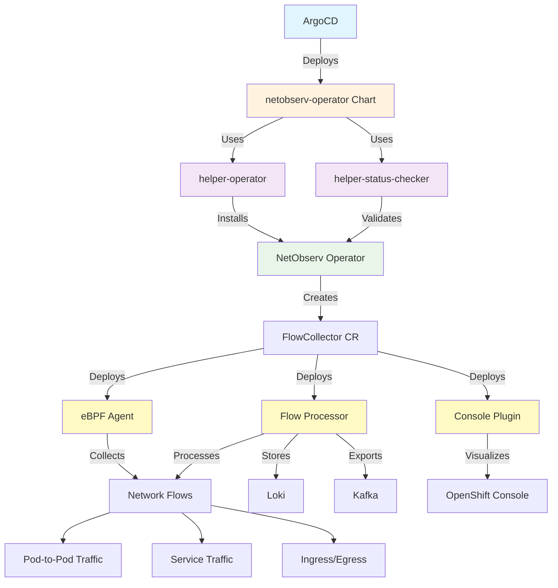

# Network Observability Operator Chart

## Overview

The `netobserv-operator` chart deploys the OpenShift Network Observability Operator (NetObserv), which provides comprehensive network flow monitoring, analysis, and visualization capabilities for OpenShift clusters. This operator enables deep network insights through eBPF-based flow collection, storage in Loki, and rich console integration for network troubleshooting and analysis.

## Prerequisites

- OpenShift Container Platform 4.12 or later
- Cluster administrator privileges
- Sufficient cluster resources for network monitoring workloads
- eBPF support in the kernel (for eBPF agent mode)
- Optional: Loki instance for flow storage
- Optional: Kafka cluster for flow export

## Architecture



## Installation

### Via ArgoCD (Recommended)
This chart is designed to be deployed through ArgoCD as part of the GitOps infrastructure pattern:

```yaml
# Add to cluster-config/*/infrastructure.yaml
infrastructure:
  - chart: netobserv-operator
    targetRevision: 0.1.0
    namespace: netobserv
    values:
      flowCollector:
        agent:
          sampling: 100
        loki:
          url: "https://loki-gateway-http.netobserv.svc:3100/"
        consolePlugin:
          enable: true
          register: true
      helper-operator:
        operators:
          netobserv-operator:
            subscription:
              channel: stable
              startingCSV: netobserv-operator.v1.4.0
```

### Manual Installation
```bash
# Add Helm repository
helm repo add rosa-hcp https://rosa-hcp-dedicated-vpc.github.io/helm-repository/
helm repo update

# Install the chart
helm install netobserv-operator rosa-hcp/netobserv-operator \
  --namespace netobserv \
  --create-namespace \
  --set flowCollector.consolePlugin.enable=true
```

## Configuration

### Chart Dependencies
This chart uses the following helper charts:
- **helper-operator** (~1.1.0): Manages operator installation and lifecycle
- **helper-status-checker** (~4.1.2): Validates operator deployment status

### Key Configuration Parameters

#### Flow Collection Settings
```yaml
flowCollector:
  enabled: true
  agent:
    type: "eBPF"                    # Agent type: eBPF or IPFIX
    sampling: 50                    # Sampling rate (1-1000, lower = more flows)
  processor:
    logLevel: "info"                # Log level: trace, debug, info, warn, error
    resources:
      limits:
        cpu: "800m"
        memory: "800Mi"
      requests:
        cpu: "100m"
        memory: "100Mi"
```

#### Loki Integration
```yaml
flowCollector:
  loki:
    enable: true
    url: "https://loki-gateway-http.netobserv.svc:3100/"
    tenantID: "netobserv"
    timeout: "10s"
    batchSize: 10240
    batchWait: "1s"
```

#### Console Plugin Configuration
```yaml
flowCollector:
  consolePlugin:
    enable: true                    # Enable console integration
    register: true                  # Auto-register with console
    imagePullPolicy: "IfNotPresent"
```

#### Export Configuration
```yaml
flowCollector:
  exporters:
    - type: "KAFKA"
      kafka:
        address: "kafka-cluster-kafka-bootstrap.netobserv"
        topic: "network-flows"
```

#### Operator Configuration
```yaml
helper-operator:
  operators:
    netobserv-operator:
      enabled: true
      namespace:
        name: netobserv
        create: true
      subscription:
        channel: stable             # Operator channel (stable/development)
        approval: Manual           # InstallPlan approval mode
        operatorName: netobserv-operator
        source: redhat-operators
```

## Generated Resources

This chart creates the following Kubernetes resources:

### Operator Resources (via helper-operator)
- **Namespace**: `netobserv` with cluster monitoring enabled
- **OperatorGroup**: For operator installation scope
- **Subscription**: NetObserv Operator subscription
- **InstallPlan**: Operator installation plan (auto-approved if configured)

### Network Observability Resources
- **FlowCollector**: Main custom resource for network flow collection configuration
- **eBPF Agent DaemonSet**: Deployed on all nodes for flow collection
- **Flow Processor Deployment**: Processes and enriches network flows
- **Console Plugin Deployment**: OpenShift console integration

### RBAC Resources (via helper-status-checker)
- **ServiceAccount**: For status checking operations
- **ClusterRole**: Permissions for operator validation
- **ClusterRoleBinding**: Binding service account to cluster role

## Features

### Network Flow Collection
- **eBPF-based Collection**: High-performance, low-overhead flow collection
- **IPFIX Support**: Alternative collection method for specific environments
- **Configurable Sampling**: Balance between detail and performance
- **Multi-interface Support**: Collect flows from all network interfaces

### Flow Processing & Enrichment
- **Kubernetes Metadata**: Enrich flows with pod, service, and namespace information
- **Conversation Tracking**: Group related flows into conversations
- **Protocol Detection**: Identify application protocols and services
- **Geographic Information**: Add location data for external IPs

### Storage & Export
- **Loki Integration**: Store flows in Loki for querying and analysis
- **Kafka Export**: Stream flows to Kafka for external processing
- **Configurable Retention**: Control how long flows are stored
- **Batch Processing**: Optimize storage and export performance

### Console Integration
- **Native UI**: Integrated network observability dashboard in OpenShift console
- **Flow Visualization**: Graphical representation of network traffic
- **Filtering & Search**: Advanced filtering capabilities for flow analysis
- **Quick Filters**: Pre-configured filters for common use cases
- **Topology View**: Visual network topology with flow overlays

## Monitoring & Verification

### Check Operator Status
```bash
# Verify operator installation
oc get csv -n netobserv

# Check operator pods
oc get pods -n netobserv

# Verify subscription status
oc get subscription netobserv-operator -n netobserv
```

### Verify Flow Collection
```bash
# Check FlowCollector resource
oc get flowcollector cluster -n netobserv

# Verify eBPF agent pods
oc get pods -n netobserv -l app=netobserv-ebpf-agent

# Check flow processor
oc get pods -n netobserv -l app=flowlogs-pipeline

# Verify console plugin
oc get pods -n netobserv -l app=netobserv-plugin
```

### Console Access
1. Navigate to OpenShift Console
2. Look for "Observe" → "Network Traffic" in the navigation menu
3. Access network flow dashboards and analysis tools

### Flow Data Verification
```bash
# Check Loki for stored flows (if Loki integration enabled)
oc exec -n netobserv deployment/flowlogs-pipeline -- \
  curl -s "http://loki:3100/loki/api/v1/query?query={app=\"netobserv\"}"

# Check flow metrics
oc get --raw /api/v1/namespaces/netobserv/services/flowlogs-pipeline:9090/proxy/metrics
```

## Troubleshooting

### Common Issues

#### eBPF Agent Issues
```bash
# Check eBPF agent logs
oc logs -n netobserv daemonset/netobserv-ebpf-agent

# Verify kernel eBPF support
oc debug node/<node-name> -- chroot /host bpftool prog list

# Check agent permissions
oc get securitycontextconstraints privileged -o yaml | grep netobserv
```

#### Flow Processing Issues
```bash
# Check processor logs
oc logs -n netobserv deployment/flowlogs-pipeline

# Verify processor configuration
oc get flowcollector cluster -n netobserv -o yaml

# Check resource usage
oc top pods -n netobserv
```

#### Console Plugin Issues
```bash
# Check plugin registration
oc get consoles.operator.openshift.io cluster -o yaml | grep netobserv

# Verify plugin pods
oc logs -n netobserv deployment/netobserv-plugin

# Check console operator logs
oc logs -n openshift-console-operator deployment/console-operator
```

#### Loki Integration Issues
```bash
# Test Loki connectivity
oc exec -n netobserv deployment/flowlogs-pipeline -- \
  curl -s "http://loki:3100/ready"

# Check Loki configuration
oc get flowcollector cluster -n netobserv -o jsonpath='{.spec.loki}'

# Verify flow ingestion
oc logs -n netobserv deployment/flowlogs-pipeline | grep loki
```

### Performance Tuning

#### Sampling Configuration
```yaml
# High detail (more CPU/memory usage)
flowCollector:
  agent:
    sampling: 1    # Collect all flows

# Balanced (recommended for most environments)
flowCollector:
  agent:
    sampling: 50   # Collect 1 in 50 flows

# Low overhead (less detail)
flowCollector:
  agent:
    sampling: 500  # Collect 1 in 500 flows
```

#### Resource Optimization
```yaml
# For large clusters
flowCollector:
  processor:
    resources:
      limits:
        cpu: "2000m"
        memory: "2Gi"
      requests:
        cpu: "500m"
        memory: "500Mi"
```

## Use Cases

### Network Troubleshooting
- **Connection Issues**: Identify failed connections and their causes
- **Performance Problems**: Analyze network latency and throughput
- **Security Incidents**: Detect unusual network patterns
- **Capacity Planning**: Understand network usage patterns

### Compliance & Auditing
- **Traffic Monitoring**: Monitor all network communications
- **Policy Validation**: Verify network policy effectiveness
- **Audit Trails**: Maintain records of network communications
- **Compliance Reporting**: Generate network compliance reports

### Application Insights
- **Service Dependencies**: Understand service-to-service communication
- **Traffic Patterns**: Analyze application traffic flows
- **Performance Optimization**: Identify network bottlenecks
- **Microservices Monitoring**: Monitor microservice interactions

## Security Considerations

### RBAC
- Operator requires cluster-admin privileges for installation
- eBPF agents run with privileged access for kernel interaction
- Console plugin follows OpenShift security model
- Flow data access controlled through namespace RBAC

### Network Policies
- Configure network policies to allow NetObserv components communication
- Ensure eBPF agents can access kernel interfaces
- Allow console plugin access to flow processor APIs
- Consider Loki and Kafka connectivity requirements

### Data Privacy
- Flow data may contain sensitive network information
- Configure appropriate retention policies
- Consider data encryption for stored flows
- Implement access controls for flow data

## Resource Requirements

### Minimum Requirements
- **CPU**: 2 cores (across all NetObserv components)
- **Memory**: 2 GiB (across all NetObserv components)
- **Storage**: 10 GiB (for flow storage, if using Loki)

### Recommended Requirements
- **CPU**: 4 cores (for high-traffic clusters)
- **Memory**: 4 GiB (for high-traffic clusters)
- **Storage**: 100 GiB (depending on retention and sampling)

### Scaling Considerations
- eBPF agents scale with node count (one per node)
- Flow processor may need scaling for high-traffic clusters
- Storage requirements scale with flow volume and retention
- Consider network bandwidth for flow export

## Related Charts

- **[helper-operator](../helper-operator/README.md)**: Operator installation automation
- **[helper-status-checker](../helper-status-checker/README.md)**: Operator status validation
- **[cluster-logging](../cluster-logging/README.md)**: Complementary logging solution
- **[cluster-observability-operator](../cluster-observability-operator/README.md)**: Cluster observability
- **[cluster-bootstrap](../cluster-bootstrap/README.md)**: Bootstrap orchestration

## Version History

- **v0.1.0**: Initial release with NetObserv operator deployment

## Support

For issues related to:
- **Chart functionality**: Create issues in the helm-repository
- **Operator functionality**: Consult Red Hat OpenShift documentation
- **Configuration**: Review this README and chart values documentation

## References

- [OpenShift Network Observability Documentation](https://docs.openshift.com/container-platform/latest/networking/network_observability/network-observability-overview.html)
- [NetObserv Operator GitHub](https://github.com/abavage/openshift-logging/tree/main/netobserv-operator)
- [Network Observability Operator Documentation](https://docs.openshift.com/container-platform/latest/networking/network_observability/installing-operators.html)


