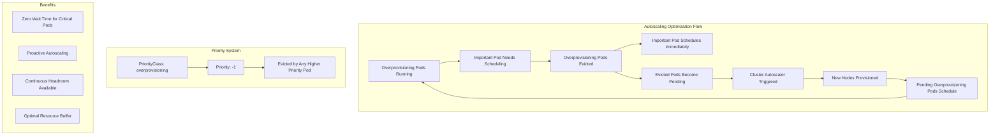

# Overprovisioning Helm Chart

A cluster autoscaling optimization chart that deploys low-priority placeholder pods to provide headroom for important workloads while triggering cluster autoscaling. This chart is deployed via ArgoCD as part of the infrastructure stack to ensure critical pods can schedule immediately without waiting for new nodes to provision.

## Overview

The Overprovisioning chart creates a strategic buffer of low-priority pods that serve two critical functions: providing immediate headroom for high-priority workloads and triggering cluster autoscaling before it's actually needed. When important pods need to be scheduled, these overprovisioning pods are immediately evicted to make room, while simultaneously signaling the cluster autoscaler to provision additional capacity.

This approach ensures that critical workloads never have to wait for new nodes to spin up, as there's always pre-allocated space available through the eviction of these placeholder pods. The evicted overprovisioning pods then remain in a pending state, triggering the autoscaler to add new nodes to accommodate them, creating a continuous cycle of available capacity for future workloads.

## Architecture



## Prerequisites

- OpenShift 4.x cluster
- ArgoCD/OpenShift GitOps operator installed
- Cluster Autoscaler configured (recommended)
- Sufficient cluster capacity for overprovisioning pods

## Installation

This chart is **deployed via ArgoCD** as part of the infrastructure stack. It is not intended for direct Helm installation.

### ArgoCD Deployment

The chart is deployed through the `gitops-payload` pattern as part of the cluster infrastructure:

```yaml
# Example from cluster-config/nonprod/np-os-ai/infrastructure.yaml
infrastructure:
  - chart: overprovisioning
    targetRevision: 0.0.5
    namespace: overprovisioning
    values:
      replicas: 10
      resources:
        requests:
          cpu: 1000m
          memory: 1000Mi
        limits:
          cpu: 2000m
          memory: 2000Mi
```

### Example ArgoCD Application

```yaml
apiVersion: argoproj.io/v1alpha1
kind: Application
metadata:
  name: cluster-config-overprovisioning
  namespace: openshift-gitops
  annotations:
    argocd.argoproj.io/sync-wave: "2"
spec:
  project: default
  source:
    repoURL: https://rosa-hcp-dedicated-vpc.github.io/helm-repository
    chart: overprovisioning
    targetRevision: 0.0.5
    helm:
      values: |
        replicas: 5
        resources:
          requests:
            cpu: 500m
            memory: 500Mi
          limits:
            cpu: 1000m
            memory: 1000Mi
  destination:
    namespace: overprovisioning
    server: https://kubernetes.default.svc
  syncPolicy:
    automated:
      prune: false
      selfHeal: true
    syncOptions:
    - CreateNamespace=true
    - ApplyOutOfSyncOnly=true
```

## Configuration

### Core Values

| Parameter | Description | Default | Required |
|-----------|-------------|---------|----------|
| `replicas` | Number of overprovisioning pods | `5` | ✅ |
| `image` | Container image for dummy pods | `quay.io/gnunn/tools` | ✅ |
| `tag` | Image tag | `latest` | ✅ |

### Resource Configuration

| Parameter | Description | Default |
|-----------|-------------|---------|
| `resources.requests.cpu` | CPU requests per pod | `500m` |
| `resources.requests.memory` | Memory requests per pod | `500Mi` |
| `resources.limits.cpu` | CPU limits per pod | `1000m` |
| `resources.limits.memory` | Memory limits per pod | `1000Mi` |

## Example Configurations

### Small Cluster Configuration
```yaml
replicas: 3
resources:
  requests:
    cpu: 250m
    memory: 256Mi
  limits:
    cpu: 500m
    memory: 512Mi
```

### Medium Cluster Configuration
```yaml
replicas: 5
resources:
  requests:
    cpu: 500m
    memory: 500Mi
  limits:
    cpu: 1000m
    memory: 1000Mi
```

### Large Cluster Configuration
```yaml
replicas: 10
resources:
  requests:
    cpu: 1000m
    memory: 1000Mi
  limits:
    cpu: 2000m
    memory: 2000Mi
```

## Features

### 🚀 **Immediate Scheduling**
- **Zero Wait Time**: Critical pods schedule instantly without waiting for node provisioning
- **Headroom Buffer**: Pre-allocated resources available for immediate use
- **Priority-Based Eviction**: Low-priority pods evicted instantly for important workloads

### 🔄 **Proactive Autoscaling**
- **Autoscaler Triggering**: Evicted pods trigger cluster autoscaler before capacity is needed
- **Continuous Scaling**: Maintains optimal buffer through continuous scaling cycles
- **Predictive Capacity**: New nodes provisioned based on overprovisioning pod demands

### ⚖️ **Priority-Based System**
- **Negative Priority**: Uses priority class with value -1 for immediate eviction
- **Smart Preemption**: Only evicted when higher-priority workloads need resources
- **Automatic Recovery**: Evicted pods automatically reschedule when capacity becomes available

### 🎯 **Strategic Benefits**
- **Cost Efficiency**: Optimal resource utilization without waste
- **Operational Excellence**: Reduces manual intervention in capacity planning
- **Workload Reliability**: Ensures critical applications never wait for resources

## How It Works

1. **Deployment**: Chart creates a deployment with configurable replica count of low-priority pods
2. **Resource Buffer**: Pods consume CPU/memory resources, creating headroom for critical workloads
3. **Priority Class**: Pods use negative priority (-1) ensuring they're evicted by any higher-priority pod
4. **Immediate Eviction**: When important pods need scheduling, overprovisioning pods are instantly evicted
5. **Instant Scheduling**: Critical workloads schedule immediately into the freed resources
6. **Autoscaler Trigger**: Evicted overprovisioning pods become pending, triggering cluster autoscaler
7. **Capacity Expansion**: New nodes are provisioned to accommodate the pending overprovisioning pods
8. **Cycle Continuation**: Overprovisioning pods reschedule on new nodes, maintaining the buffer

## Sizing Guidelines

### Cluster Size Recommendations

| Cluster Size | Nodes | Recommended Replicas | CPU Request | Memory Request |
|--------------|-------|---------------------|-------------|----------------|
| Small | 3-5 | 3-5 | 250m | 256Mi |
| Medium | 6-10 | 5-8 | 500m | 500Mi |
| Large | 11-20 | 8-15 | 1000m | 1000Mi |
| Extra Large | 20+ | 15-25 | 1000m | 1000Mi |

### Resource Calculation

```bash
# Calculate total overprovisioning resources
Total CPU = replicas × resources.requests.cpu
Total Memory = replicas × resources.requests.memory

# Example: 5 replicas × 500m CPU = 2.5 CPU cores
# Example: 5 replicas × 500Mi Memory = 2.5 GB RAM
```

## Monitoring and Observability

### Key Metrics to Monitor

```bash
# Check overprovisioning pod status
oc get pods -n overprovisioning

# Monitor resource usage
oc top pods -n overprovisioning

# Check pod evictions
oc get events -n overprovisioning --field-selector reason=Preempted

# Monitor cluster resource utilization
oc describe nodes | grep -A 5 "Allocated resources"
```

### Prometheus Metrics

Monitor these metrics to assess overprovisioning effectiveness:

- `kube_pod_container_resource_requests` - Resource requests by overprovisioning pods
- `kube_pod_status_phase` - Pod status (should be mostly Running)
- `kube_pod_container_status_restarts_total` - Restart count (should be low)
- `node_memory_MemAvailable_bytes` - Available memory on nodes
- `node_cpu_seconds_total` - CPU utilization

## Troubleshooting

### Common Issues

#### Overprovisioning Pods Not Starting
```bash
# Check pod status and events
oc get pods -n overprovisioning
oc describe pods -n overprovisioning

# Check resource availability
oc describe nodes | grep -A 10 "Allocated resources"

# Verify priority class
oc get priorityclass overprovisioning
```

#### Pods Not Being Evicted
```bash
# Check priority class configuration
oc describe priorityclass overprovisioning

# Verify pod priority assignment
oc get pods -n overprovisioning -o jsonpath='{.items[*].spec.priorityClassName}'

# Check for scheduling constraints
oc describe pods -n overprovisioning | grep -A 5 "Events"
```

#### Resource Sizing Issues
```bash
# Monitor actual resource usage
oc top pods -n overprovisioning

# Check cluster capacity
oc describe nodes | grep -E "(Capacity|Allocatable)"

# Review resource requests vs limits
oc get pods -n overprovisioning -o jsonpath='{range .items[*]}{.metadata.name}{"\t"}{.spec.containers[0].resources}{"\n"}{end}'
```

### Validation Commands

```bash
# Verify deployment status
oc get deployment overprovisioning -n overprovisioning

# Check pod distribution across nodes
oc get pods -n overprovisioning -o wide

# Validate priority class
oc get priorityclass overprovisioning -o yaml

# Test preemption behavior (create high-priority pod)
oc run test-preemption --image=nginx --restart=Never --overrides='{"spec":{"priorityClassName":"system-cluster-critical"}}'
```

### Performance Testing

```bash
# Test scheduling latency improvement
time oc run test-pod --image=nginx --restart=Never

# Monitor pod startup times
oc get events --sort-by='.lastTimestamp' | grep Scheduled

# Check resource fragmentation
oc describe nodes | grep -A 20 "Non-terminated Pods"
```

## Best Practices

### 🎯 **Sizing Strategy**
- Start with 10-20% of cluster capacity for overprovisioning
- Monitor actual workload patterns and adjust accordingly
- Consider peak usage times and scaling patterns

### 📊 **Monitoring**
- Set up alerts for overprovisioning pod failures
- Monitor cluster resource utilization trends
- Track pod scheduling latency improvements

### 🔄 **Maintenance**
- Regularly review and adjust replica counts
- Update resource requests based on cluster growth
- Monitor for resource waste or insufficient overprovisioning

### ⚡ **Optimization**
- Align overprovisioning resources with typical workload sizes
- Consider different overprovisioning profiles for different node types
- Use node affinity to distribute overprovisioning pods effectively

## Related Documentation

- **[Kubernetes Priority Classes](https://kubernetes.io/docs/concepts/scheduling-eviction/pod-priority-preemption/)**
- **[Cluster Autoscaler](https://github.com/kubernetes/autoscaler/tree/master/cluster-autoscaler)**
- **[Resource Management](https://kubernetes.io/docs/concepts/configuration/manage-resources-containers/)**

## Version History

| Version | Changes |
|---------|---------|
| 0.0.5 | Current stable version |
| 0.0.4 | Resource optimization improvements |
| 0.0.3 | Priority class enhancements |
| 0.0.2 | Initial ArgoCD integration |
| 0.0.1 | Initial release |

## Maintainer

- **Name**: Paul Foster
- **Email**: pafoster@redhat.com
- **Team**: Platform Engineering

## License

This chart is part of the ROSA HCP Dedicated VPC project and follows the project's licensing terms.
