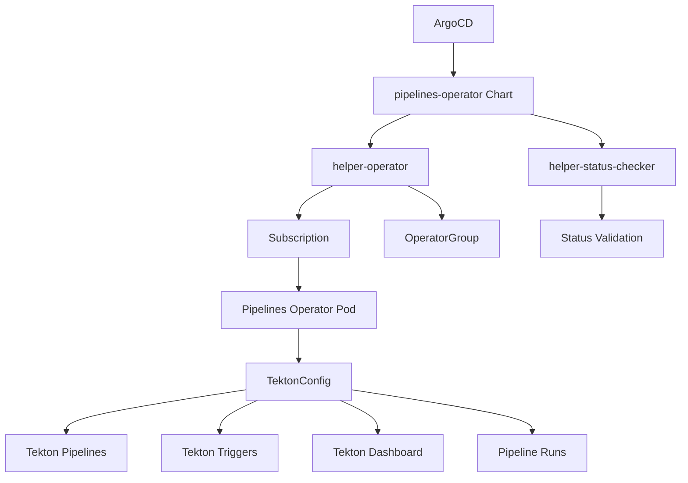

# Pipelines Operator

## Overview

The **Pipelines Operator** Helm chart deploys the Red Hat OpenShift Pipelines Operator, which provides cloud-native CI/CD capabilities based on Tekton. This operator enables the creation and management of scalable, containerized build and deployment pipelines directly within OpenShift.

## Introduction

Red Hat OpenShift Pipelines is based on the open-source Tekton project and provides Kubernetes-native CI/CD pipelines. The Pipelines Operator simplifies the deployment and management of CI/CD workflows, providing:

- **Cloud-Native Pipelines**: Kubernetes-native CI/CD with containerized tasks
- **Scalable Execution**: Parallel task execution and resource optimization
- **GitOps Integration**: Source-driven pipeline triggers and deployments
- **Multi-Platform Support**: Build and deploy across different architectures
- **Enterprise Security**: Integration with OpenShift security and RBAC

## Prerequisites

- OpenShift cluster with cluster-admin privileges
- ArgoCD or OpenShift GitOps installed
- Container registry access for image builds
- Git repository access for source code
- Sufficient cluster resources for pipeline workloads

## Deployment

This chart is deployed via **ArgoCD** as part of the GitOps infrastructure pattern.

### ArgoCD Application Example

```yaml
apiVersion: argoproj.io/v1alpha1
kind: Application
metadata:
  name: pipelines-operator
  namespace: openshift-gitops
  annotations:
    argocd.argoproj.io/sync-wave: '1'
spec:
  destination:
    namespace: openshift-operators
    server: https://kubernetes.default.svc
  project: default
  sources:
    - repoURL: https://rosa-hcp-dedicated-vpc.github.io/helm-repository/
      chart: pipelines-operator
      targetRevision: 0.1.0
      helm:
        valueFiles:
        - $values/cluster-config/nonprod/np-app-1/infrastructure.yaml
        values: |
          appTeam: pipelines-operator
    - repoURL: https://github.com/rosa-hcp-dedicated-vpc/cluster-config.git
      targetRevision: HEAD
      ref: values
  syncPolicy:
    automated:
      prune: false
      selfHeal: true
    syncOptions:
    - CreateNamespace=true
    - SkipDryRunOnMissingResource=true
```

## Configuration

### Key Configuration Options

| Parameter | Description | Default |
|-----------|-------------|---------|
| `operatorChannel` | Operator subscription channel | `latest` |
| `operatorNamespace` | Target namespace for operator | `openshift-operators` |
| `operatorInstallPlanApproval` | InstallPlan approval mode | `Automatic` |
| `helper-status-checker.enabled` | Enable status checking | `true` |
| `syncwave` | ArgoCD sync wave | `1` |

### Example Values

```yaml
# Pipelines Operator Configuration
pipelines-operator:
  operatorChannel: latest
  operatorNamespace: openshift-operators
  helper-status-checker:
    enabled: true
    maxWaitTime: 600
```

## Dependencies

This chart includes the following dependencies:

- **helper-operator** (~1.1.0): Manages operator subscription and installation
- **helper-status-checker** (~4.1.2): Validates operator deployment status

## Architecture



## Usage

After deployment, the operator automatically creates a TektonConfig instance. You can then create pipelines and tasks:

### Simple Pipeline Example

```yaml
apiVersion: tekton.dev/v1beta1
kind: Pipeline
metadata:
  name: build-and-deploy
  namespace: ci-cd
spec:
  params:
  - name: git-url
    type: string
    description: Git repository URL
  - name: git-revision
    type: string
    description: Git revision to build
    default: main
  - name: image-name
    type: string
    description: Container image name
  workspaces:
  - name: shared-data
    description: Shared workspace for pipeline tasks
  - name: git-credentials
    description: Git credentials
  tasks:
  - name: fetch-source
    taskRef:
      name: git-clone
      kind: ClusterTask
    workspaces:
    - name: output
      workspace: shared-data
    - name: ssh-directory
      workspace: git-credentials
    params:
    - name: url
      value: $(params.git-url)
    - name: revision
      value: $(params.git-revision)
  - name: build-image
    taskRef:
      name: buildah
      kind: ClusterTask
    runAfter:
    - fetch-source
    workspaces:
    - name: source
      workspace: shared-data
    params:
    - name: IMAGE
      value: $(params.image-name)
    - name: DOCKERFILE
      value: ./Dockerfile
  - name: deploy-app
    taskRef:
      name: openshift-client
      kind: ClusterTask
    runAfter:
    - build-image
    workspaces:
    - name: manifest-dir
      workspace: shared-data
    params:
    - name: SCRIPT
      value: |
        oc apply -f k8s/
        oc set image deployment/myapp myapp=$(params.image-name)
```

### Custom Task Example

```yaml
apiVersion: tekton.dev/v1beta1
kind: Task
metadata:
  name: security-scan
  namespace: ci-cd
spec:
  params:
  - name: image
    type: string
    description: Container image to scan
  steps:
  - name: scan
    image: aquasec/trivy:latest
    script: |
      #!/bin/sh
      trivy image --exit-code 1 --severity HIGH,CRITICAL $(params.image)
    securityContext:
      runAsNonRoot: true
      runAsUser: 1000
```

### Pipeline Trigger Example

```yaml
apiVersion: triggers.tekton.dev/v1beta1
kind: EventListener
metadata:
  name: github-webhook
  namespace: ci-cd
spec:
  serviceAccountName: pipeline-runner
  triggers:
  - name: github-push
    interceptors:
    - ref:
        name: github
      params:
      - name: secretRef
        value:
          secretName: github-webhook-secret
          secretKey: secretToken
      - name: eventTypes
        value: ["push"]
    bindings:
    - ref: github-push-binding
    template:
      ref: build-deploy-template
---
apiVersion: triggers.tekton.dev/v1beta1
kind: TriggerBinding
metadata:
  name: github-push-binding
  namespace: ci-cd
spec:
  params:
  - name: git-url
    value: $(body.repository.clone_url)
  - name: git-revision
    value: $(body.head_commit.id)
  - name: image-name
    value: registry.example.com/myapp:$(body.head_commit.id)
---
apiVersion: triggers.tekton.dev/v1beta1
kind: TriggerTemplate
metadata:
  name: build-deploy-template
  namespace: ci-cd
spec:
  params:
  - name: git-url
  - name: git-revision
  - name: image-name
  resourcetemplates:
  - apiVersion: tekton.dev/v1beta1
    kind: PipelineRun
    metadata:
      generateName: build-deploy-run-
    spec:
      pipelineRef:
        name: build-and-deploy
      params:
      - name: git-url
        value: $(tt.params.git-url)
      - name: git-revision
        value: $(tt.params.git-revision)
      - name: image-name
        value: $(tt.params.image-name)
      workspaces:
      - name: shared-data
        volumeClaimTemplate:
          spec:
            accessModes:
            - ReadWriteOnce
            resources:
              requests:
                storage: 1Gi
      - name: git-credentials
        secret:
          secretName: git-ssh-key
```

## Features

### Pipeline Capabilities

- **Parallel Execution**: Run tasks in parallel for faster builds
- **Conditional Execution**: Execute tasks based on conditions
- **Workspaces**: Share data between tasks
- **Parameters**: Parameterize pipelines for reusability
- **Results**: Pass data between tasks

### Trigger System

- **Webhook Support**: GitHub, GitLab, Bitbucket webhooks
- **Event Filtering**: Filter events based on criteria
- **Multi-Source**: Trigger from multiple event sources
- **Custom Interceptors**: Custom event processing logic

### Security Features

- **Service Accounts**: Fine-grained permissions for pipeline execution
- **Secret Management**: Secure handling of credentials
- **Pod Security**: Security contexts and policies
- **Image Signing**: Sign and verify container images

## Monitoring

OpenShift Pipelines provides comprehensive monitoring:

### Pipeline Metrics

```yaml
apiVersion: v1
kind: ConfigMap
metadata:
  name: config-observability
  namespace: openshift-pipelines
data:
  metrics.backend-destination: prometheus
  metrics.stackdriver-project-id: ""
  metrics.allow-stackdriver-custom-metrics: "false"
```

### Dashboard Access

The Tekton Dashboard is automatically deployed and accessible through the OpenShift console or directly:

```bash
# Get dashboard route
oc get route tekton-dashboard -n openshift-pipelines
```

## Troubleshooting

### Common Issues

1. **Operator Installation Failed**
   ```bash
   oc get subscription openshift-pipelines-operator-rh -n openshift-operators
   oc get installplan -n openshift-operators
   ```

2. **Pipeline Run Failures**
   ```bash
   oc get pipelinerun -n ci-cd
   oc describe pipelinerun <pipelinerun-name> -n ci-cd
   oc logs <pod-name> -n ci-cd
   ```

3. **Task Execution Issues**
   ```bash
   oc get taskrun -n ci-cd
   oc describe taskrun <taskrun-name> -n ci-cd
   ```

### Logs

```bash
# Operator logs
oc logs -n openshift-operators -l name=openshift-pipelines-operator

# Pipeline controller logs
oc logs -n openshift-pipelines -l app=tekton-pipelines-controller

# Webhook logs
oc logs -n openshift-pipelines -l app=tekton-pipelines-webhook
```

## Integration

### ArgoCD Integration

```yaml
apiVersion: tekton.dev/v1beta1
kind: Task
metadata:
  name: argocd-sync
spec:
  params:
  - name: application-name
    type: string
  - name: argocd-server
    type: string
  steps:
  - name: sync
    image: argoproj/argocd:latest
    script: |
      argocd app sync $(params.application-name) \
        --server $(params.argocd-server) \
        --auth-token $ARGOCD_TOKEN
    env:
    - name: ARGOCD_TOKEN
      valueFrom:
        secretKeyRef:
          name: argocd-token
          key: token
```

### Container Registry Integration

```yaml
apiVersion: v1
kind: Secret
metadata:
  name: registry-credentials
  namespace: ci-cd
  annotations:
    tekton.dev/docker-0: https://registry.example.com
type: kubernetes.io/dockerconfigjson
data:
  .dockerconfigjson: <base64-encoded-config>
```

## Security

The Pipelines Operator provides enterprise-grade security:

- **RBAC Integration**: Role-based access control for pipelines
- **Pod Security Standards**: Enforce security policies
- **Network Policies**: Control network access
- **Image Security**: Scan and sign container images

## Performance Tuning

### Resource Management

```yaml
apiVersion: tekton.dev/v1beta1
kind: Task
metadata:
  name: resource-optimized-task
spec:
  steps:
  - name: build
    image: maven:3.8-openjdk-11
    resources:
      requests:
        cpu: 500m
        memory: 1Gi
      limits:
        cpu: 2000m
        memory: 4Gi
```

### Parallel Execution

```yaml
apiVersion: tekton.dev/v1beta1
kind: Pipeline
metadata:
  name: parallel-pipeline
spec:
  tasks:
  - name: unit-tests
    taskRef:
      name: maven-test
  - name: security-scan
    taskRef:
      name: security-scan
  - name: lint-check
    taskRef:
      name: lint
  - name: build
    taskRef:
      name: maven-build
    runAfter:
    - unit-tests
    - security-scan
    - lint-check
```

## Support

For issues and support:

- Check operator and pipeline controller logs
- Review Red Hat OpenShift Pipelines documentation
- Contact Red Hat support for enterprise customers
- Community support through Tekton project forums

## Version History

| Version | Changes |
|---------|---------|
| 0.1.0 | Initial release with basic operator deployment |
