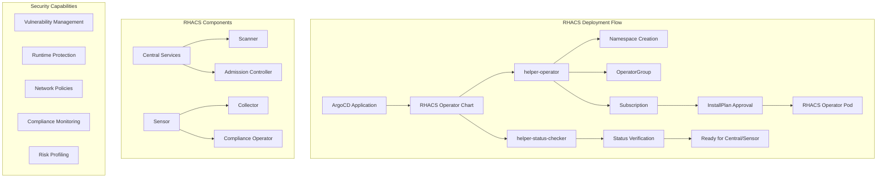

# RHACS Operator Helm Chart

A comprehensive Helm chart for deploying Red Hat Advanced Cluster Security (RHACS) operator on OpenShift clusters. This chart is deployed via ArgoCD as part of the infrastructure stack to provide enterprise-grade container and Kubernetes security capabilities.

## Overview

The RHACS Operator chart deploys Red Hat Advanced Cluster Security for Kubernetes, providing comprehensive security coverage across the entire container lifecycle. RHACS offers vulnerability management, configuration management, runtime protection, network segmentation, and compliance monitoring for containerized applications and Kubernetes infrastructure.

This chart uses the `helper-operator` and `helper-status-checker` dependency charts to ensure reliable operator deployment with automated InstallPlan approval and readiness verification. The chart is designed for GitOps deployment patterns and integrates seamlessly with ArgoCD workflows.

## Architecture



## Prerequisites

- OpenShift 4.12+ cluster
- ArgoCD/OpenShift GitOps operator installed
- Cluster admin privileges
- Sufficient cluster resources for RHACS components
- Network connectivity for vulnerability database updates

## Installation

This chart is **deployed via ArgoCD** as part of the infrastructure stack. It is not intended for direct Helm installation.

### ArgoCD Deployment

The chart is deployed through the `gitops-payload` pattern as part of the cluster infrastructure:

```yaml
# Example from cluster-config infrastructure.yaml
infrastructure:
  - chart: rhacs-operator
    targetRevision: 0.0.3
    namespace: rhacs-operator
    values:
      helper-operator:
        startingCSV: rhacs-operator.v4.7.4
```

### Example ArgoCD Application

```yaml
apiVersion: argoproj.io/v1alpha1
kind: Application
metadata:
  name: cluster-config-rhacs-operator
  namespace: openshift-gitops
  annotations:
    argocd.argoproj.io/sync-wave: "2"
spec:
  project: default
  source:
    repoURL: https://rosa-hcp-dedicated-vpc.github.io/helm-repository
    chart: rhacs-operator
    targetRevision: 0.0.3
    helm:
      values: |
        helper-operator:
          startingCSV: rhacs-operator.v4.7.4
        helper-status-checker:
          enabled: true
  destination:
    namespace: rhacs-operator
    server: https://kubernetes.default.svc
  syncPolicy:
    automated:
      prune: false
      selfHeal: true
    syncOptions:
    - CreateNamespace=true
    - ApplyOutOfSyncOnly=true
```

## Configuration

### Core Values

| Parameter | Description | Default | Required |
|-----------|-------------|---------|----------|
| `helper-operator.operators.rhacs-operator.enabled` | Enable RHACS operator | `true` | ✅ |
| `helper-operator.operators.rhacs-operator.namespace.name` | Operator namespace | `rhacs-operator` | ✅ |
| `helper-operator.operators.rhacs-operator.subscription.channel` | Subscription channel | `stable` | ✅ |
| `helper-operator.operators.rhacs-operator.subscription.approval` | InstallPlan approval | `Manual` | ✅ |

### Operator Configuration

| Parameter | Description | Default |
|-----------|-------------|---------|
| `helper-operator.operators.rhacs-operator.subscription.operatorName` | Operator name | `rhacs-operator` |
| `helper-operator.operators.rhacs-operator.subscription.source` | Operator source | `redhat-operators` |
| `helper-operator.operators.rhacs-operator.subscription.sourceNamespace` | Source namespace | `openshift-marketplace` |
| `helper-operator.operators.rhacs-operator.operatorgroup.create` | Create OperatorGroup | `true` |
| `helper-operator.operators.rhacs-operator.operatorgroup.notownnamespace` | Monitor all namespaces | `true` |

### Status Checker Configuration

| Parameter | Description | Default |
|-----------|-------------|---------|
| `helper-status-checker.enabled` | Enable status checking | `true` |
| `helper-status-checker.approver` | Enable InstallPlan approval | `true` |
| `helper-status-checker.checks[0].operatorName` | Operator to verify | `rhacs-operator` |
| `helper-status-checker.checks[0].namespace.name` | Verification namespace | `rhacs-operator` |
| `helper-status-checker.checks[0].serviceAccount.name` | Service account name | `status-checker` |

## Example Configurations

### Basic RHACS Operator Deployment
```yaml
helper-operator:
  operators:
    rhacs-operator:
      enabled: true
      namespace:
        name: rhacs-operator
      subscription:
        channel: stable
        approval: Manual
        operatorName: rhacs-operator
        source: redhat-operators
      operatorgroup:
        create: true
        notownnamespace: true

helper-status-checker:
  enabled: true
  approver: true
  checks:
    - operatorName: rhacs-operator
      namespace:
        name: rhacs-operator
      serviceAccount:
        name: status-checker
```

### Production Configuration with Specific CSV
```yaml
helper-operator:
  operators:
    rhacs-operator:
      enabled: true
      namespace:
        name: rhacs-operator
      subscription:
        channel: stable
        approval: Manual
        operatorName: rhacs-operator
        source: redhat-operators
        csv: rhacs-operator.v4.7.4
      operatorgroup:
        create: true
        notownnamespace: true

helper-status-checker:
  enabled: true
  approver: true
  checks:
    - operatorName: rhacs-operator
      namespace:
        name: rhacs-operator
      serviceAccount:
        name: status-checker
```

## Features

### 🛡️ **Comprehensive Security**
- **Vulnerability Management**: Continuous scanning of images and runtime environments
- **Runtime Protection**: Real-time threat detection and response
- **Network Segmentation**: Automated network policy generation and enforcement
- **Compliance Monitoring**: Built-in compliance frameworks (PCI, HIPAA, NIST, etc.)

### 🔍 **Visibility and Monitoring**
- **Risk Profiling**: Comprehensive risk assessment across deployments
- **Security Dashboard**: Centralized security posture visualization
- **Audit Logging**: Detailed security event logging and analysis
- **Alerting**: Configurable security alerts and notifications

### 🚀 **DevSecOps Integration**
- **CI/CD Integration**: Security scanning in build pipelines
- **Policy as Code**: Declarative security policy management
- **Admission Control**: Prevent deployment of non-compliant workloads
- **Developer Tools**: Security insights integrated into developer workflows

### ⚙️ **Operational Excellence**
- **Automated Deployment**: Reliable operator installation with status verification
- **GitOps Ready**: Designed for ArgoCD and GitOps workflows
- **Multi-Cluster**: Support for centralized multi-cluster security management
- **High Availability**: Enterprise-grade availability and scalability

## Post-Installation Steps

After the operator is successfully deployed, you'll need to configure RHACS components:

### 1. Deploy Central Services
```yaml
apiVersion: platform.stackrox.io/v1alpha1
kind: Central
metadata:
  name: stackrox-central-services
  namespace: rhacs-operator
spec:
  central:
    exposure:
      loadBalancer:
        enabled: false
      nodePort:
        enabled: false
      route:
        enabled: true
    persistence:
      persistentVolumeClaim:
        claimName: central-db
  scanner:
    analyzer:
      scaling:
        autoScaling: Enabled
        maxReplicas: 5
        minReplicas: 2
        replicas: 3
    scannerComponent: Enabled
```

### 2. Configure Secured Clusters
```yaml
apiVersion: platform.stackrox.io/v1alpha1
kind: SecuredCluster
metadata:
  name: production-cluster
  namespace: rhacs-operator
spec:
  clusterName: production-cluster
  centralEndpoint: central.rhacs-operator.svc:443
  admissionControl:
    listenOnCreates: true
    listenOnEvents: true
    listenOnUpdates: true
  sensor:
    resources:
      limits:
        cpu: 2000m
        memory: 4Gi
      requests:
        cpu: 1000m
        memory: 2Gi
```

## Monitoring and Observability

### Key Metrics to Monitor

```bash
# Check operator status
oc get csv -n rhacs-operator

# Verify operator pods
oc get pods -n rhacs-operator

# Check Central services
oc get central -n rhacs-operator

# Monitor secured clusters
oc get securedcluster -n rhacs-operator
```

### RHACS Dashboard Access

```bash
# Get Central route
oc get route central -n rhacs-operator

# Get admin password
oc get secret central-htpasswd -n rhacs-operator -o jsonpath='{.data.password}' | base64 -d
```

## Troubleshooting

### Common Issues

#### Operator Installation Failed
```bash
# Check subscription status
oc get subscription rhacs-operator -n rhacs-operator

# Check InstallPlan
oc get installplan -n rhacs-operator

# Check operator logs
oc logs -n rhacs-operator -l app=rhacs-operator
```

#### Central Services Not Starting
```bash
# Check Central resource
oc describe central stackrox-central-services -n rhacs-operator

# Check Central pods
oc get pods -n rhacs-operator -l app=central

# Check persistent volume claims
oc get pvc -n rhacs-operator
```

#### Scanner Issues
```bash
# Check scanner deployment
oc get deployment scanner -n rhacs-operator

# Check scanner logs
oc logs -n rhacs-operator -l app=scanner

# Verify scanner database connectivity
oc get secret scanner-db-password -n rhacs-operator
```

#### Admission Controller Problems
```bash
# Check admission controller webhook
oc get validatingwebhookconfiguration stackrox

# Check admission controller pods
oc get pods -n rhacs-operator -l app=admission-control

# Test admission controller
oc apply -f test-deployment.yaml --dry-run=server
```

### Validation Commands

```bash
# Verify operator installation
oc get csv -n rhacs-operator | grep rhacs-operator

# Check all RHACS resources
oc get all -n rhacs-operator

# Verify Central is accessible
curl -k https://$(oc get route central -n rhacs-operator -o jsonpath='{.spec.host}')

# Check secured cluster status
oc get securedcluster -o yaml
```

### Performance Tuning

```bash
# Monitor resource usage
oc top pods -n rhacs-operator

# Check Central database performance
oc exec -n rhacs-operator deployment/central -- pg_stat_activity

# Monitor scanner performance
oc logs -n rhacs-operator -l app=scanner | grep "scan completed"
```

## Security Considerations

### 🔐 **Access Control**
- Configure RBAC for RHACS components
- Implement least-privilege access principles
- Use service accounts with minimal permissions
- Enable audit logging for all RHACS activities

### 🌐 **Network Security**
- Configure network policies for RHACS components
- Secure Central-Sensor communication with TLS
- Implement egress controls for vulnerability database updates
- Use private container registries where possible

### 📊 **Data Protection**
- Encrypt RHACS database at rest
- Secure backup and restore procedures
- Implement data retention policies
- Configure secure log forwarding

## Integration Examples

### CI/CD Pipeline Integration
```yaml
# Jenkins pipeline example
pipeline {
    stages {
        stage('Security Scan') {
            steps {
                script {
                    sh 'roxctl image scan --image=${IMAGE_NAME}'
                    sh 'roxctl image check --image=${IMAGE_NAME}'
                }
            }
        }
    }
}
```

### Policy as Code
```yaml
# Example security policy
apiVersion: v1
kind: ConfigMap
metadata:
  name: security-policies
  namespace: rhacs-operator
data:
  high-severity-policy.yaml: |
    name: "Block High Severity Vulnerabilities"
    description: "Prevent deployment of images with high severity vulnerabilities"
    rationale: "High severity vulnerabilities pose significant security risks"
    remediation: "Update base images and dependencies to resolve vulnerabilities"
    categories:
      - "Vulnerability Management"
    lifecycleStages:
      - BUILD
      - DEPLOY
    exclusions: []
    severity: HIGH_SEVERITY
    policyVersion: "1.1"
    policySections:
      - sectionName: "Image vulnerabilities"
        policyGroups:
          - fieldName: "CVE"
            booleanOperator: OR
            negate: false
            values:
              - key: "SEVERITY"
                value: "CRITICAL|HIGH"
```

## Related Documentation

- **[Red Hat Advanced Cluster Security Documentation](https://docs.openshift.com/acs/)**
- **[RHACS Operator Guide](https://docs.openshift.com/container-platform/latest/security/acs-operator.html)**
- **[Security Best Practices](https://docs.openshift.com/container-platform/latest/security/index.html)**

## Version History

| Version | Changes |
|---------|---------|
| 0.0.3 | Current stable version with helper-status-checker integration |
| 0.0.2 | Added InstallPlan approval automation |
| 0.0.1 | Initial release with basic operator deployment |

## Maintainer

- **Name**: Paul Foster
- **Email**: pafoster@redhat.com
- **Team**: Platform Engineering

## License

This chart is part of the ROSA HCP Dedicated VPC project and follows the project's licensing terms.
