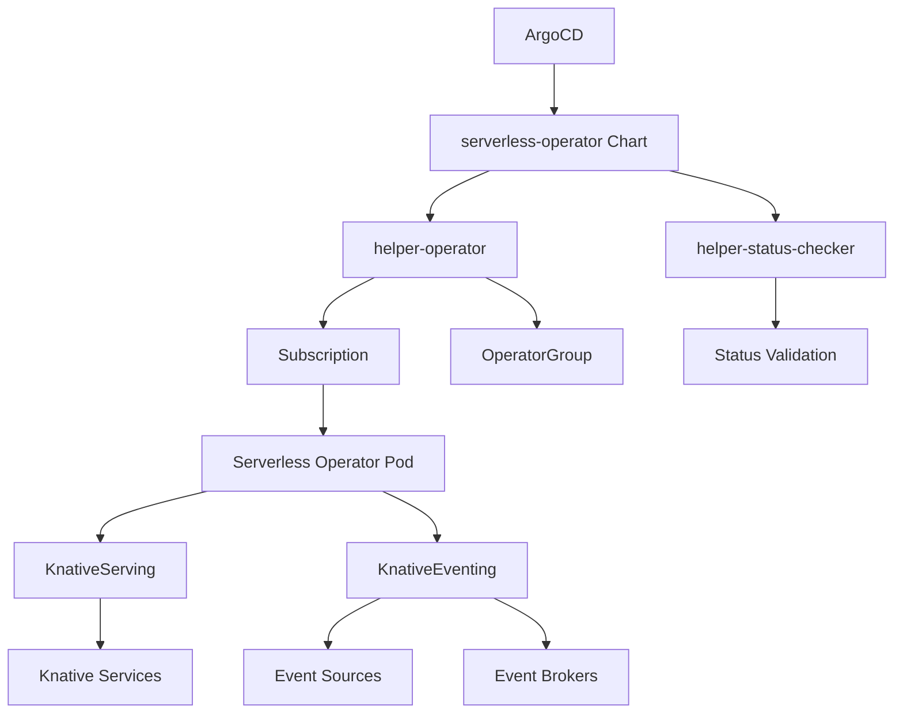

# Serverless Operator

## Overview

The **Serverless Operator** Helm chart deploys the Red Hat OpenShift Serverless Operator, which provides serverless computing capabilities based on Knative. This operator enables event-driven, scale-to-zero applications and functions that automatically scale based on demand.

## Introduction

Red Hat OpenShift Serverless is based on the open-source Knative project and provides serverless computing capabilities on OpenShift. The Serverless Operator simplifies the deployment and management of serverless workloads, providing:

- **Scale-to-Zero**: Automatically scale applications down to zero when not in use
- **Event-Driven Architecture**: React to events from various sources
- **Auto-scaling**: Scale up and down based on traffic and demand
- **Blue-Green Deployments**: Zero-downtime deployments with traffic splitting
- **Function-as-a-Service**: Deploy and run functions without managing infrastructure

## Prerequisites

- OpenShift cluster with cluster-admin privileges
- ArgoCD or OpenShift GitOps installed
- Sufficient cluster resources for serverless workloads
- Network connectivity for external event sources (optional)

## Deployment

This chart is deployed via **ArgoCD** as part of the GitOps infrastructure pattern.

### ArgoCD Application Example

```yaml
apiVersion: argoproj.io/v1alpha1
kind: Application
metadata:
  name: serverless-operator
  namespace: openshift-gitops
  annotations:
    argocd.argoproj.io/sync-wave: '1'
spec:
  destination:
    namespace: openshift-serverless
    server: https://kubernetes.default.svc
  project: default
  sources:
    - repoURL: https://rosa-hcp-dedicated-vpc.github.io/helm-repository/
      chart: serverless-operator
      targetRevision: 0.1.0
      helm:
        valueFiles:
        - $values/cluster-config/nonprod/np-app-1/infrastructure.yaml
        values: |
          appTeam: serverless-operator
    - repoURL: https://github.com/rosa-hcp-dedicated-vpc/cluster-config.git
      targetRevision: HEAD
      ref: values
  syncPolicy:
    automated:
      prune: false
      selfHeal: true
    syncOptions:
    - CreateNamespace=true
    - SkipDryRunOnMissingResource=true
```

## Configuration

### Key Configuration Options

| Parameter | Description | Default |
|-----------|-------------|---------|
| `operatorChannel` | Operator subscription channel | `stable` |
| `operatorNamespace` | Target namespace for operator | `openshift-serverless` |
| `operatorInstallPlanApproval` | InstallPlan approval mode | `Automatic` |
| `helper-status-checker.enabled` | Enable status checking | `true` |
| `syncwave` | ArgoCD sync wave | `1` |

### Example Values

```yaml
# Serverless Operator Configuration
serverless-operator:
  operatorChannel: stable
  operatorNamespace: openshift-serverless
  helper-status-checker:
    enabled: true
    maxWaitTime: 600
```

## Dependencies

This chart includes the following dependencies:

- **helper-operator** (~1.1.0): Manages operator subscription and installation
- **helper-status-checker** (~4.1.2): Validates operator deployment status

## Architecture



## Usage

After deployment, you need to create Knative Serving and Eventing instances:

### Knative Serving Configuration

```yaml
apiVersion: operator.knative.dev/v1beta1
kind: KnativeServing
metadata:
  name: knative-serving
  namespace: knative-serving
spec:
  ingress:
    kourier:
      enabled: true
  config:
    autoscaler:
      container-concurrency-target-default: "100"
      container-concurrency-target-percentage: "0.7"
      enable-scale-to-zero: "true"
      max-scale-up-rate: "1000"
      max-scale-down-rate: "2"
      panic-window-percentage: "10"
      panic-threshold-percentage: "200"
      scale-to-zero-grace-period: "30s"
      scale-to-zero-pod-retention-period: "0s"
      stable-window: "60s"
      target-burst-capacity: "200"
    deployment:
      registriesSkippingTagResolving: "kind.local,ko.local,dev.local"
    gc:
      stale-revision-create-delay: "24h"
      stale-revision-timeout: "15h"
      stale-revision-minimum-generations: "1"
```

### Knative Eventing Configuration

```yaml
apiVersion: operator.knative.dev/v1beta1
kind: KnativeEventing
metadata:
  name: knative-eventing
  namespace: knative-eventing
spec:
  config:
    br-default-channel:
      channelTemplateSpec: |
        apiVersion: messaging.knative.dev/v1
        kind: InMemoryChannel
    br-defaults:
      default-br-config: |
        clusterDefault:
          brokerClass: MTChannelBasedBroker
          apiVersion: v1
          kind: ConfigMap
          name: config-br-default-channel
          namespace: knative-eventing
    config-tracing:
      backend: "zipkin"
      zipkin-endpoint: "http://jaeger-collector.istio-system.svc.cluster.local:9411/api/v2/spans"
      debug: "false"
      sample-rate: "0.1"
```

### Simple Serverless Application

```yaml
apiVersion: serving.knative.dev/v1
kind: Service
metadata:
  name: hello-world
  namespace: serverless-apps
spec:
  template:
    metadata:
      annotations:
        autoscaling.knative.dev/minScale: "0"
        autoscaling.knative.dev/maxScale: "10"
        autoscaling.knative.dev/target: "50"
    spec:
      containers:
      - image: gcr.io/knative-samples/helloworld-go
        ports:
        - containerPort: 8080
        env:
        - name: TARGET
          value: "World"
        resources:
          requests:
            cpu: 100m
            memory: 128Mi
          limits:
            cpu: 1000m
            memory: 256Mi
```

### Event-Driven Application

```yaml
apiVersion: serving.knative.dev/v1
kind: Service
metadata:
  name: event-processor
  namespace: serverless-apps
spec:
  template:
    spec:
      containers:
      - image: registry.redhat.io/ubi8/nodejs-16:latest
        ports:
        - containerPort: 8080
        env:
        - name: NODE_ENV
          value: "production"
---
apiVersion: eventing.knative.dev/v1
kind: Trigger
metadata:
  name: event-processor-trigger
  namespace: serverless-apps
spec:
  broker: default
  filter:
    attributes:
      type: com.example.order.created
  subscriber:
    ref:
      apiVersion: serving.knative.dev/v1
      kind: Service
      name: event-processor
```

## Features

### Auto-scaling

- **Scale-to-Zero**: Reduce costs by scaling to zero when idle
- **Rapid Scale-Up**: Quickly scale up to handle traffic spikes
- **Concurrency-Based**: Scale based on concurrent requests
- **Custom Metrics**: Scale based on custom metrics

### Traffic Management

- **Blue-Green Deployments**: Zero-downtime deployments
- **Canary Releases**: Gradual traffic shifting
- **Traffic Splitting**: Percentage-based traffic routing
- **Revision Management**: Automatic revision creation and management

### Event Processing

- **Event Sources**: Connect to various event sources (Kafka, HTTP, etc.)
- **Event Brokers**: Reliable event delivery
- **Event Filtering**: Process only relevant events
- **Dead Letter Queues**: Handle failed event processing

## Monitoring

Serverless applications provide comprehensive monitoring:

### Metrics

```yaml
apiVersion: v1
kind: ConfigMap
metadata:
  name: config-observability
  namespace: knative-serving
data:
  metrics.backend-destination: prometheus
  metrics.request-metrics-backend-destination: prometheus
  metrics.stackdriver-project-id: ""
  profiling.enable: "false"
```

### Logging

```yaml
apiVersion: v1
kind: ConfigMap
metadata:
  name: config-logging
  namespace: knative-serving
data:
  zap-logger-config: |
    {
      "level": "info",
      "development": false,
      "outputPaths": ["stdout"],
      "errorOutputPaths": ["stderr"],
      "encoding": "json",
      "encoderConfig": {
        "timeKey": "timestamp",
        "levelKey": "severity",
        "nameKey": "logger",
        "callerKey": "caller",
        "messageKey": "message",
        "stacktraceKey": "stacktrace",
        "lineEnding": "",
        "levelEncoder": "",
        "timeEncoder": "iso8601",
        "durationEncoder": "",
        "callerEncoder": ""
      }
    }
```

## Troubleshooting

### Common Issues

1. **Operator Installation Failed**
   ```bash
   oc get subscription serverless-operator -n openshift-serverless
   oc get installplan -n openshift-serverless
   ```

2. **Knative Serving Issues**
   ```bash
   oc get knativeserving -n knative-serving
   oc describe knativeserving knative-serving -n knative-serving
   ```

3. **Service Scaling Issues**
   ```bash
   oc get ksvc -n serverless-apps
   oc describe ksvc hello-world -n serverless-apps
   ```

### Logs

```bash
# Operator logs
oc logs -n openshift-serverless -l name=knative-openshift

# Knative Serving logs
oc logs -n knative-serving -l app=controller

# Application logs
oc logs -n serverless-apps -l serving.knative.dev/service=hello-world
```

## Integration

### Service Mesh Integration

```yaml
apiVersion: v1
kind: ConfigMap
metadata:
  name: config-istio
  namespace: knative-serving
data:
  gateway.knative-serving.knative-ingress-gateway: "istio-system/knative-gateway"
  local-gateway.knative-serving.cluster-local-gateway: "istio-system/cluster-local-gateway"
```

### CI/CD Integration

```yaml
apiVersion: tekton.dev/v1beta1
kind: Pipeline
metadata:
  name: serverless-deploy
spec:
  params:
  - name: image-url
    type: string
  - name: service-name
    type: string
  tasks:
  - name: deploy-serverless
    taskRef:
      name: kn
    params:
    - name: ARGS
      value:
      - service
      - create
      - $(params.service-name)
      - --image=$(params.image-url)
      - --env=NODE_ENV=production
```

## Security

The Serverless Operator provides enterprise-grade security:

- **Pod Security Standards**: Enforce security policies
- **Network Policies**: Control network access
- **RBAC Integration**: Role-based access control
- **Secret Management**: Secure handling of sensitive data

## Performance Tuning

### Concurrency Settings

```yaml
apiVersion: serving.knative.dev/v1
kind: Service
metadata:
  name: high-concurrency-app
spec:
  template:
    metadata:
      annotations:
        autoscaling.knative.dev/target: "1000"
        autoscaling.knative.dev/targetUtilizationPercentage: "70"
    spec:
      containerConcurrency: 1000
```

### Resource Optimization

```yaml
spec:
  template:
    spec:
      containers:
      - image: my-app:latest
        resources:
          requests:
            cpu: 100m
            memory: 128Mi
          limits:
            cpu: 1000m
            memory: 512Mi
```

## Support

For issues and support:

- Check operator and Knative component logs
- Review Red Hat OpenShift Serverless documentation
- Contact Red Hat support for enterprise customers
- Community support through Knative project forums

## Version History

| Version | Changes |
|---------|---------|
| 0.1.0 | Initial release with basic operator deployment |
