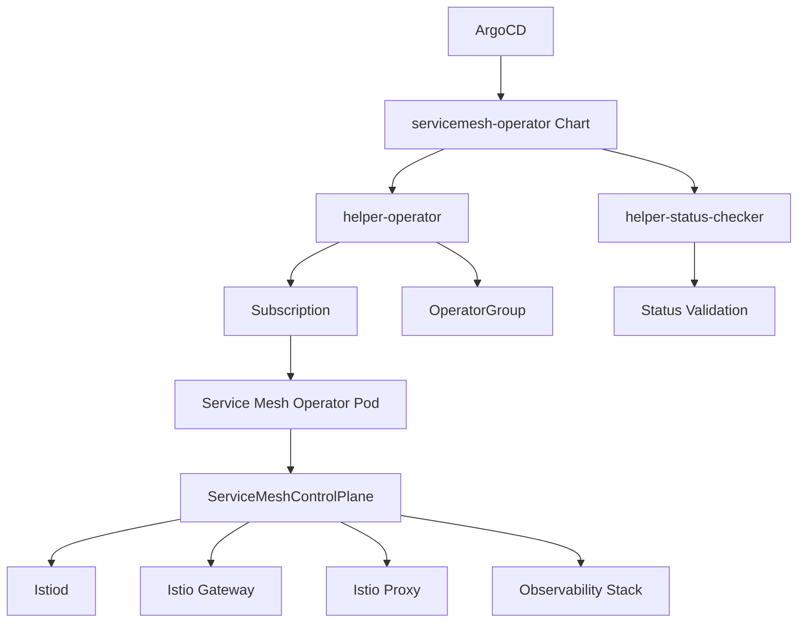

# Service Mesh Operator

## Overview

The **Service Mesh Operator** Helm chart deploys the Red Hat OpenShift Service Mesh Operator, which provides a comprehensive service mesh solution based on Istio. This operator enables secure service-to-service communication, traffic management, and observability for microservices architectures on OpenShift.

## Introduction

Red Hat OpenShift Service Mesh is based on the open-source Istio project and provides a uniform way to connect, manage, and observe microservices. The Service Mesh Operator simplifies the deployment and management of service mesh infrastructure, providing:

- **Traffic Management**: Advanced routing, load balancing, and traffic splitting
- **Security**: Mutual TLS, authentication, and authorization policies
- **Observability**: Distributed tracing, metrics, and logging
- **Policy Enforcement**: Rate limiting, circuit breaking, and fault injection
- **Multi-tenancy**: Isolated service mesh instances per namespace or team

## Prerequisites

- OpenShift cluster with cluster-admin privileges
- ArgoCD or OpenShift GitOps installed
- Sufficient cluster resources for service mesh components
- Elasticsearch Operator (for distributed tracing storage)
- Jaeger Operator (for distributed tracing)
- Kiali Operator (for service mesh visualization)

## Deployment

This chart is deployed via **ArgoCD** as part of the GitOps infrastructure pattern.

### ArgoCD Application Example

```yaml
apiVersion: argoproj.io/v1alpha1
kind: Application
metadata:
  name: servicemesh-operator
  namespace: openshift-gitops
  annotations:
    argocd.argoproj.io/sync-wave: '1'
spec:
  destination:
    namespace: openshift-operators
    server: https://kubernetes.default.svc
  project: default
  sources:
    - repoURL: https://rosa-hcp-dedicated-vpc.github.io/helm-repository/
      chart: servicemesh-operator
      targetRevision: 0.1.0
      helm:
        valueFiles:
        - $values/cluster-config/nonprod/np-app-1/infrastructure.yaml
        values: |
          appTeam: servicemesh-operator
    - repoURL: https://github.com/rosa-hcp-dedicated-vpc/cluster-config.git
      targetRevision: HEAD
      ref: values
  syncPolicy:
    automated:
      prune: false
      selfHeal: true
    syncOptions:
    - CreateNamespace=true
    - SkipDryRunOnMissingResource=true
```

## Configuration

### Key Configuration Options

| Parameter | Description | Default |
|-----------|-------------|---------|
| `operatorChannel` | Operator subscription channel | `stable` |
| `operatorNamespace` | Target namespace for operator | `openshift-operators` |
| `operatorInstallPlanApproval` | InstallPlan approval mode | `Automatic` |
| `helper-status-checker.enabled` | Enable status checking | `true` |
| `syncwave` | ArgoCD sync wave | `1` |

### Example Values

```yaml
# Service Mesh Operator Configuration
servicemesh-operator:
  operatorChannel: stable
  operatorNamespace: openshift-operators
  helper-status-checker:
    enabled: true
    maxWaitTime: 600
```

## Dependencies

This chart includes the following dependencies:

- **helper-operator** (~1.1.0): Manages operator subscription and installation
- **helper-status-checker** (~4.1.2): Validates operator deployment status

## Architecture



## Usage

After deployment, you can create Service Mesh Control Plane instances using the provided CRDs:

### Basic Service Mesh Control Plane

```yaml
apiVersion: maistra.io/v2
kind: ServiceMeshControlPlane
metadata:
  name: basic
  namespace: istio-system
spec:
  version: v2.5
  tracing:
    type: Jaeger
    sampling: 10000
  addons:
    jaeger:
      name: jaeger
      install:
        storage:
          type: Memory
    kiali:
      enabled: true
      name: kiali
    grafana:
      enabled: true
```

### Production Service Mesh Control Plane

```yaml
apiVersion: maistra.io/v2
kind: ServiceMeshControlPlane
metadata:
  name: production
  namespace: istio-system
spec:
  version: v2.5
  security:
    dataPlane:
      mtls: true
    controlPlane:
      mtls: true
  tracing:
    type: Jaeger
    sampling: 1000  # 10% sampling
  policy:
    type: Istiod
  telemetry:
    type: Istiod
  addons:
    jaeger:
      name: jaeger
      install:
        storage:
          type: Elasticsearch
          elasticsearch:
            nodeCount: 3
            storage:
              size: 50Gi
              storageClassName: gp3-csi
    kiali:
      enabled: true
      name: kiali
      install:
        dashboard:
          viewOnly: false
    grafana:
      enabled: true
      install:
        persistence:
          enabled: true
          storageClassName: gp3-csi
          accessMode: ReadWriteOnce
          capacity:
            requests:
              storage: 5Gi
  gateways:
    ingress:
      enabled: true
      runtime:
        deployment:
          replicas: 3
        container:
          resources:
            requests:
              cpu: 100m
              memory: 128Mi
            limits:
              cpu: 2000m
              memory: 1024Mi
    egress:
      enabled: true
      runtime:
        deployment:
          replicas: 2
```

### Service Mesh Member Roll

```yaml
apiVersion: maistra.io/v1
kind: ServiceMeshMemberRoll
metadata:
  name: default
  namespace: istio-system
spec:
  members:
  - production
  - staging
  - development
  - bookinfo
```

## Features

### Traffic Management

- **Virtual Services**: Define routing rules for services
- **Destination Rules**: Configure load balancing and connection pooling
- **Gateways**: Manage ingress and egress traffic
- **Service Entries**: Add external services to the mesh

### Security

- **Mutual TLS**: Automatic encryption between services
- **Authorization Policies**: Fine-grained access control
- **Request Authentication**: JWT validation and OIDC integration
- **Security Policies**: Network and application-level security

### Observability

- **Distributed Tracing**: End-to-end request tracing with Jaeger
- **Metrics Collection**: Prometheus metrics for all mesh traffic
- **Access Logging**: Detailed logs for all service interactions
- **Service Topology**: Visual representation with Kiali

## Monitoring

Service Mesh provides comprehensive monitoring capabilities:

### Metrics

```yaml
apiVersion: telemetry.istio.io/v1alpha1
kind: Telemetry
metadata:
  name: default
  namespace: istio-system
spec:
  metrics:
  - providers:
    - name: prometheus
  - overrides:
    - match:
        metric: ALL_METRICS
      tagOverrides:
        request_protocol:
          value: "%{REQUEST_PROTOCOL}"
```

### Tracing

```yaml
apiVersion: telemetry.istio.io/v1alpha1
kind: Telemetry
metadata:
  name: tracing-default
  namespace: istio-system
spec:
  tracing:
  - providers:
    - name: jaeger
```

## Troubleshooting

### Common Issues

1. **Operator Installation Failed**
   ```bash
   oc get subscription servicemeshoperator -n openshift-operators
   oc get installplan -n openshift-operators
   ```

2. **Control Plane Creation Issues**
   ```bash
   oc get smcp -n istio-system
   oc describe smcp basic -n istio-system
   ```

3. **Member Roll Issues**
   ```bash
   oc get smmr -n istio-system
   oc describe smmr default -n istio-system
   ```

### Logs

```bash
# Operator logs
oc logs -n openshift-operators -l name=istio-operator

# Control plane logs
oc logs -n istio-system -l app=istiod
```

## Integration

### Application Integration

To include applications in the service mesh:

1. **Add namespace to ServiceMeshMemberRoll**
2. **Enable sidecar injection**:
   ```bash
   oc label namespace production maistra.io/member-of=istio-system
   ```

3. **Deploy application with sidecar**:
   ```yaml
   apiVersion: apps/v1
   kind: Deployment
   metadata:
     name: productpage
     namespace: production
   spec:
     template:
       metadata:
         annotations:
           sidecar.istio.io/inject: "true"
   ```

### External Services

```yaml
apiVersion: networking.istio.io/v1beta1
kind: ServiceEntry
metadata:
  name: external-database
  namespace: production
spec:
  hosts:
  - database.external.com
  ports:
  - number: 5432
    name: postgres
    protocol: TCP
  location: MESH_EXTERNAL
  resolution: DNS
```

## Security

The Service Mesh Operator provides enterprise-grade security:

- **Zero Trust Networking**: Default deny with explicit allow policies
- **Certificate Management**: Automatic certificate rotation
- **Policy Enforcement**: Centralized security policy management
- **Compliance**: Support for various compliance frameworks

## Performance Tuning

### Resource Optimization

```yaml
spec:
  runtime:
    components:
      pilot:
        container:
          resources:
            requests:
              cpu: 500m
              memory: 2048Mi
            limits:
              cpu: 1000m
              memory: 4096Mi
```

### Scaling Configuration

```yaml
spec:
  runtime:
    components:
      pilot:
        deployment:
          replicas: 3
        pod:
          affinity:
            podAntiAffinity:
              requiredDuringSchedulingIgnoredDuringExecution:
              - labelSelector:
                  matchLabels:
                    app: istiod
                topologyKey: kubernetes.io/hostname
```

## Support

For issues and support:

- Check operator and control plane logs
- Review Red Hat OpenShift Service Mesh documentation
- Contact Red Hat support for enterprise customers
- Community support through Istio project forums

## Version History

| Version | Changes |
|---------|---------|
| 0.1.0 | Initial release with basic operator deployment |
